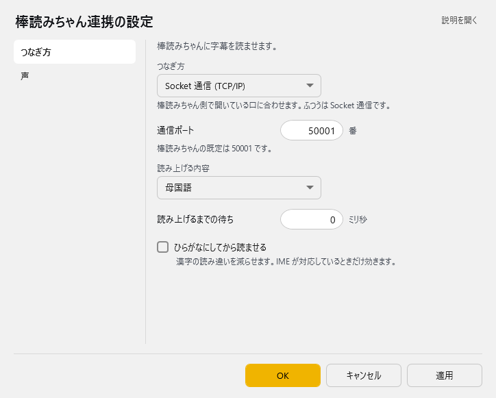
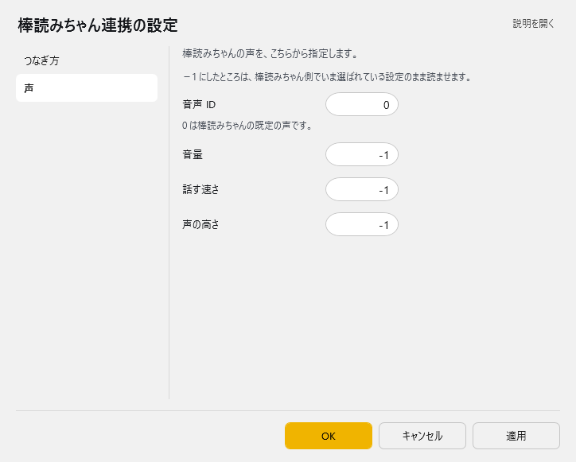

<!-- version-banner -->
!!! info ""
    ゆかコネNEO **v3.0** のドキュメントです。v2.3 をお使いの方は [v2.3 版のこのページ](../../v2.3/plugin/plugin_bouyomi.md) を、違いを知りたい方は [v2.3 から v3.0 への移行](../../mig/mig_neo_v3.0.md) をご覧ください。

!!! Info "前提条件"
    * 棒読みちゃんの通信ポートがひらいていること
    * 棒読みちゃんが起動していること

## このプラグインで出来ること

* 棒読みちゃんをつかって音声認識結果を読み上げできます。

##　有効化

* プラグインを使うチェックをONにしてください。

## 設定

プラグイン一覧で、このプラグインの名前の右にある **「設定」** を押すと開きます。
画面は **2 ページ**に分かれていて、左の一覧で切り替えます（つなぎ方／声）。

!!! info "閉じるときの 3 択"
    設定は**下書き**として持たれ、「OK」か「適用」を押すまで動いているプラグインには効きません。
    変更したまま閉じようとすると「変更が保存されていません」と聞かれ、**［はい］保存して閉じる／［いいえ］破棄して閉じる／［キャンセル］閉じるのをやめる** から選べます。

### つなぎ方

棒読みちゃんに字幕を読ませます。

| 項目 | 説明 |
|:--|:--|
| つなぎ方 | 棒読みちゃん側で開いている口に合わせます。ふつうは Socket 通信です。（選択肢：Socket 通信 (TCP/IP)／HTTP 通信。既定：Socket 通信 (TCP/IP)） |
| 通信ポート | 棒読みちゃんの既定は 50001 です。（1～65535番。既定：50001） |
| 読み上げる内容 | 選択肢：母国語／翻訳 1／翻訳 2／翻訳 3／翻訳 4。既定：母国語 |
| 読み上げるまでの待ち | 0～60000ミリ秒。既定：0 |
| ☑ ひらがなにしてから読ませる | 漢字の読み違いを減らせます。IME が対応しているときだけ効きます。（既定：OFF） |

### 声

棒読みちゃんの声を、こちらから指定します。

> −1 にしたところは、棒読みちゃん側でいま選ばれている設定のまま読ませます。

| 項目 | 説明 |
|:--|:--|
| 音声 ID | 0 は棒読みちゃんの既定の声です。（-1～1000。既定：0） |
| 音量 | -1～100。既定：-1 |
| 話す速さ | -1～200。既定：-1 |
| 声の高さ | -1～200。既定：-1 |

### 補足

#### 棒読みちゃん側の設定に任せたいとき

v2.3 の「Default」ボタンは無くなりました。**「声」ページの音量・話す速さ・声の高さを −1 にする**と、
棒読みちゃん側でいま選ばれている設定のまま読ませます（既定値は −1 です）。

#### ひらがなにしてから読ませる

* ON にすると、IME の辞書で漢字をひらがなに直してから棒読みちゃんへ送ります
* UD トークと併用しているときは、認識時のひらがな読みをそのまま使います
* 読み間違いを減らしたいときに効きます

## 使うとき

1. 棒読みちゃんを立ち上げます。
1. ゆかコネNEOで音声認識をしましょう。
1. 文章が確定すると同時に棒読みちゃんで読み上げが行われます。
