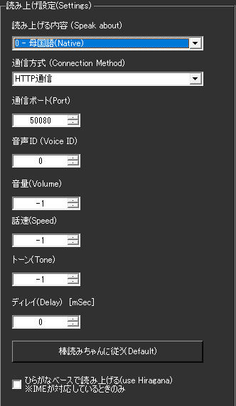

<!-- version-banner -->
!!! info ""
    ゆかコネNEO **v3.0** のドキュメントです。v2.3 をお使いの方は [v2.3 版のこのページ](../../v2.3/plugin/plugin_bouyomi.md) を、違いを知りたい方は [v2.3 から v3.0 への移行](../../mig/mig_neo_v3.0.md) をご覧ください。

!!! Info "前提条件"
    * 棒読みちゃんの通信ポートがひらいていること
    * 棒読みちゃんが起動していること

## このプラグインで出来ること

* 棒読みちゃんをつかって音声認識結果を読み上げできます。

##　有効化

* プラグインを使うチェックをONにしてください。

<!-- wpf-settings-note -->
!!! info "v3.0 で設定画面が新しくなりました"
    見た目がほかのプラグインと揃い、**表示言語に合わせて日本語・英語などで出る**ようになりました。
    各項目には「何を入れる欄なのか」「空のままだとどうなるのか」の説明が付いています。
    つなぎ方・ポート／声 の 2 ページに分かれました。「声の番号」は **-1 で棒読みちゃん側の設定に従う**ことが、説明として画面に書かれるようになりました。

    設定は**下書き**として持たれます。閉じるときに「適用」「破棄」「続ける」の 3 択が出るので、
    試して気に入らなければ破棄できます。
    新しい画面が開けなかったときは、従来の画面が代わりに開きます。
    → [プラグインの有効化](enabled.md)

## 設定

### 読み上げ設定

|設定項目|説明|設定値|デフォルト|
|:--|:---|:---|:---|
|読み上げる内容|何を読み上げさせるか選択|原文のみ/翻訳のみ/両方|原文のみ|
|通信方式|棒読みちゃんとの通信方法|HTTP/TCP|HTTP推奨|
|ポート|棒読みちゃんの通信ポート|数値|50001|
|音声ID|使用する音声の種類|数値|0（デフォルト音声）|
|音量|再生音量|0-100 または -1|50 （-1で棒読みちゃん設定優先）|
|話速|読み上げ速度|0-200 または -1|100 （-1で棒読みちゃん設定優先）|
|トーン|音声のトーン（高さ）|0-200 または -1|100 （-1で棒読みちゃん設定優先）|
|ディレイ|読み上げ開始の遅延時間|ミリ秒|0|

### 特殊機能

#### 棒読みちゃんに従う（Defaultボタン）
* 全ての音声設定を棒読みちゃんのデフォルト値に一括設定
* 音量・話速・トーンが全て -1 に設定される
* 棒読みちゃん側の設定で音声を統一制御したい場合に便利

#### ひらがなベースで読み上げ
* **チェック時**: IME辞書で漢字を全てひらがなに変換してから送信
* **UDトーク併用時**: 認識時のひらがな読みを直接使用
* 読み間違いの軽減に効果的

## 使うとき

1. 棒読みちゃんを立ち上げます。
1. ゆかコネNEOで音声認識をしましょう。
1. 文章が確定すると同時に棒読みちゃんで読み上げが行われます。
