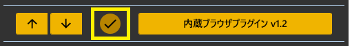
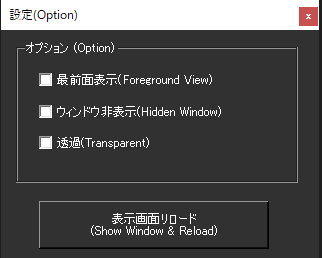

<!-- version-banner -->
!!! info ""
    ゆかコネNEO **v3.0** のドキュメントです。v2.3 をお使いの方は [v2.3 版のこのページ](../../v2.3/plugin/plugin_browser.md) を、違いを知りたい方は [v2.3 から v3.0 への移行](../../mig/mig_neo_v3.0.md) をご覧ください。

!!! Info "前提条件"
    * 特になし

## このプラグインで出来ること

* **内蔵ブラウザ（WebView2）**でWebページを表示
* 字幕レイアウトの専用表示ウィンドウとして活用
* 外部ブラウザに依存しない独立した表示環境
* 透過表示やウィンドウカスタマイズに対応

### 主な用途
* ゆかコネNEOの字幕レイアウト専用表示
* 外部ブラウザでの省エネモードや全画面表示による字幕停止を回避
* 配信用オーバーレイ表示
* 独立したWebコンテンツ表示

!!! warning "システム要件"
    * **WebView2 ランタイム**が必要です。Windows 11 は標準で入っています。
      Windows 10 も Microsoft Edge が入っていれば一緒に入っています
    * 入っていない場合は、その旨を知らせるメッセージが出ます
    * 複雑なWebページ表示時は CPU 負荷がかかる場合があります

!!! info "v3.0 で描画エンジンが変わりました"
    v2.3 までは Chromium 埋め込み（CefSharp）でしたが、**v3.0 から WebView2（Edge）**になりました。

    * 配布物が約 1GB 小さくなりました
    * ブラウザを使うプラグインを複数 ON にしたときの、どれが使われるか分からない不安定さが無くなりました
    * **フォントの見え方が変わることがあります。**v2.3 は CEF の都合で
      インストール済みフォントを登録し直していましたが、WebView2 では不要になったためです。
      違って見える場合は、レイアウトデザインの「文字」で指定し直してください

##　有効化

* プラグインを使うチェックをONにしてください。

## 設定

|設定|意味|
|:--|:---|
|最前面表示|ウィンドウを全面に持っていきます|
|ウィンドウ非表示|ウィンドウ枠を消します|
|透過|背景を透過します|

## 使うとき

* 起動時にウィンドウが表示されます。特に設定せずとも画面がでます。
* ウィンドウを閉じた場合は設定画面から再表示してください
