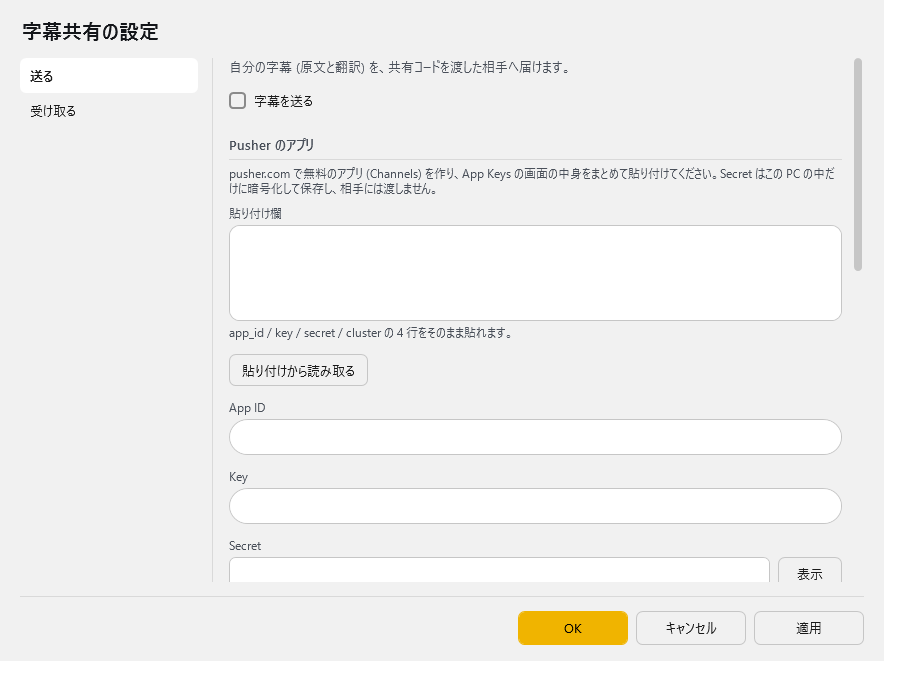
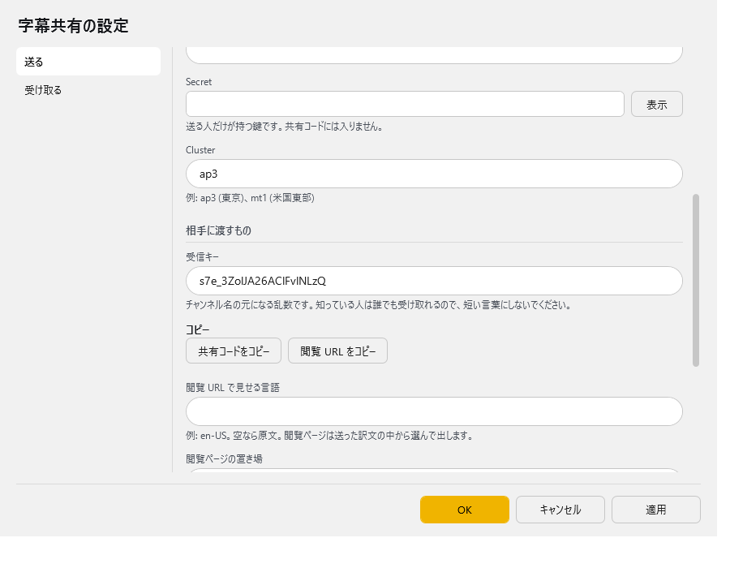
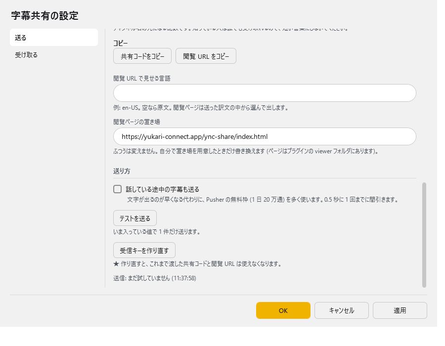
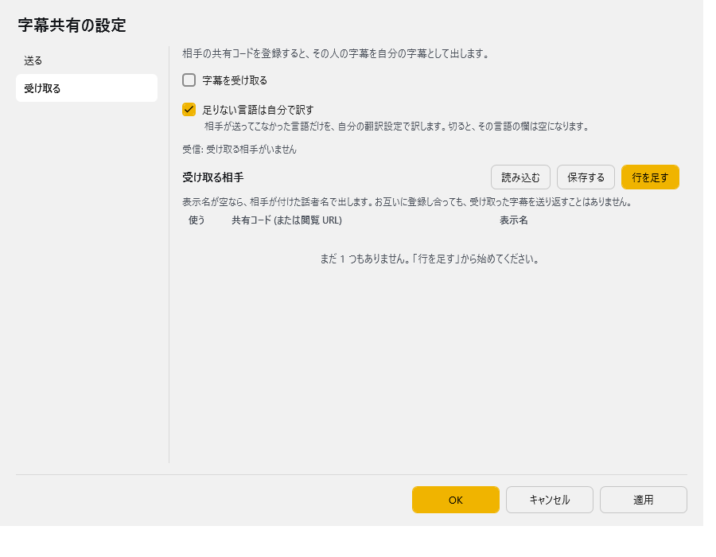

<!-- version-banner -->
!!! info ""
    ゆかコネNEO **v3.0** のドキュメントです。このプラグインは **v3.0 で新しく入ったもの**（ゆかコネNEO v3.0.0 beta 24 から、プラグインの版は v1.0）で、v2.3 にはありません。v2.3 との違いは [v2.3 から v3.0 への移行](../../mig/mig_neo_v3.0.md) をご覧ください。

!!! Info "前提条件"
    * **送る人だけ**、[Pusher](https://pusher.com/) のアカウントと、Channels のアプリ 1 つ（無料の Sandbox で足ります）が要ります
    * 受け取る人は、Pusher の登録も設定も要りません

## このプラグインで出来ること

* 自分の字幕（**原文・翻訳・話者名**）を、**共有コード**を渡した相手へリアルタイムに届けられます
* 相手の字幕を受け取って、**自分の字幕と同じように表示・読み上げ**できます。受け取る相手（共有コード）は**複数登録**できます
* 相手が送ってこなかった言語だけを、**受け取る側の翻訳設定で訳して**埋められます
* ゆかコネNEO を使っていない相手には **閲覧 URL** を渡せば、ブラウザや OBS のブラウザソースで字幕を見てもらえます（`lang=` で言語、`name=1` で話者名）
* お互いに共有コードを登録し合えば、輪になって話せます。受け取った字幕は送り返さないので、**字幕が回り続けることはありません**

!!! Tips "しくみ"
    中継には Pusher の Channels を使います。自分でサーバーを用意する必要はありません。
    送る人が自分の Secret で署名して字幕を送り、受け取る人は公開チャンネルを購読するだけです。
    チャンネル名は「受信キー」から作られ、共有コードや閲覧 URL の中に入っています。

!!! warning "共有コード（閲覧 URL）を知っている人は、誰でも字幕を読めます"
    チャンネルは公開です。公開したくない会話では、渡す相手を選んでください。
    もし広まってしまったら、「受信キーを作り直す」で、それまでに渡したコードと URL を使えなくできます。

## 準備（送る人だけ） { #prepare }

1. [pusher.com](https://pusher.com/) でアカウントを作り、**Channels** のアプリを 1 つ作ります。
2. アプリの **App Keys** の画面を開きます。`app_id` / `key` / `secret` / `cluster` の 4 つが並んでいます。
3. この画面の中身をまとめてコピーしておきます（あとで設定画面の「貼り付け欄」に貼ります）。

!!! Info "Secret の扱い"
    Secret は**この PC の中だけ**に、Windows の DPAPI で暗号化して別のファイルに保存します。
    **設定ファイルにも、共有コードにも、閲覧 URL にも入りません。** 相手に渡るのは Key と Cluster とチャンネル名だけです。
    暗号化はこの Windows ユーザーに結び付いているので、設定を別の PC や別のユーザーへ持って行ったときは、Secret だけ入れ直してください。

!!! Info "Pusher の無料枠の目安"
    無料の Sandbox は **1 日 20 万通・同時接続 100** までです。送った 1 通に加えて、受け取った先 1 か所ごとに 1 通と数えます。

    * 既定では、**確定した字幕だけ**を送ります。5 秒に 1 回話し続けると 1 時間に約 720 回送り、受け手が 3 か所なら 1 時間で約 2,900 通です
    * 「話している途中の字幕も送る」を入れると途中経過も送るため、数倍に増えます。途中経過は **0.5 秒に 1 回まで**に間引きます

!!! Info "全員が送り合う「グループモード」はありません"
    全員が同じ Pusher アプリで送るには、Secret を全員に配ることになるためです。
    輪になって話したいときは、それぞれが自分の Pusher アプリで送り、お互いの共有コードを登録し合ってください。

## 有効化

プラグイン一覧で **字幕共有プラグイン** の「プラグインを使う」チェックを ON にしてください。手順は [プラグインの有効化](enabled.md) をご覧ください。

## 設定

プラグイン一覧で、このプラグインの名前の右にある **「設定」** を押すと開きます。
画面は **2 ページ**に分かれていて、左の一覧で切り替えます（送る／受け取る）。

!!! info "閉じるときの 3 択"
    設定は**下書き**として持たれ、「OK」か「適用」を押すまで動いているプラグインには効きません。
    変更したまま閉じようとすると「変更が保存されていません」と聞かれ、**［はい］保存して閉じる／［いいえ］破棄して閉じる／［キャンセル］閉じるのをやめる** から選べます。

### 送る

自分の字幕 (原文と翻訳) を、共有コードを渡した相手へ届けます。

| 項目 | 説明 |
|:--|:--|
| ☑ 字幕を送る | 入れると、自分の字幕を送ります。（既定：OFF） |

**Pusher のアプリ**

pusher.com で作った無料のアプリ (Channels) の値を入れます。App Keys の画面の中身をまとめて貼り付けるのが簡単です。

| 項目 | 説明 |
|:--|:--|
| 貼り付け欄 | App Keys の画面の中身をそのまま貼ります。app_id / key / secret / cluster の 4 行をそのまま貼れます。 |
| 「貼り付けから読み取る」ボタン | 貼り付け欄から App ID・Key・Secret・Cluster を読み取って、下の欄に入れます。読み取ったら貼り付け欄は空になります（Secret が入っているため）。OK で保存します。 |
| App ID | Pusher のアプリの app_id。 |
| Key | Pusher のアプリの key。共有コードに入り、相手に渡ります。 |
| Secret | 送る人だけが持つ鍵です。共有コードには入りません。右の「表示」で中身を見られます。英数字以外が混ざっていると保存しません。 |
| Cluster | 例: ap3 (東京)、mt1 (米国東部)。（既定：「ap3」） |

**相手に渡すもの**

| 項目 | 説明 |
|:--|:--|
| 受信キー | チャンネル名の元になる乱数です。初めて開いたときに自動で作られます。知っている人は誰でも受け取れるので、短い言葉にしないでください。 |
| 「共有コードをコピー」ボタン | YNC_Neo（ゆかコネNEO）を使う相手に渡すコードをクリップボードへコピーします。Key と Cluster が入っていないとコピーできません。 |
| 「閲覧 URL をコピー」ボタン | ブラウザや OBS で見る相手に渡す URL をクリップボードへコピーします。 |
| 閲覧 URL で見せる言語 | 例: en-US。空なら原文。閲覧ページは送った訳文の中から選んで出します。（閲覧 URL に `lang=` として付きます） |
| 閲覧ページの置き場 | ふつうは変えません。自分で置き場を用意したときだけ書き換えます (ページはプラグインの viewer フォルダにあります)。（既定：「https://yukari-connect.app/ync-share/index.html」） |

**送り方**

| 項目 | 説明 |
|:--|:--|
| ☑ 話している途中の字幕も送る | 文字が出るのが早くなる代わりに、Pusher の無料枠 (1 日 20 万通) を多く使います。0.5 秒に 1 回までに間引きます。（既定：OFF） |
| 「テストを送る」ボタン | いま入っている値で 1 件だけ送ります（まだ OK を押していない値でも試せます）。「送れました。○ か所で受け取っています。」のように結果が出ます。 |
| 「受信キーを作り直す」ボタン | ★ 作り直すと、これまで渡した共有コードと閲覧 URL は使えなくなります。OK で保存したあと、共有コードと閲覧 URL を配り直してください。 |

いちばん下の行には、送信の様子（「送信: OK  受け手 2 (12:34:56)」や「送信: まだ試していません」など）が出ます。

### 受け取る

相手の共有コードを登録すると、その人の字幕を自分の字幕として出します。

| 項目 | 説明 |
|:--|:--|
| ☑ 字幕を受け取る | 入れると、下の表の相手の字幕を受け取ります。（既定：OFF） |
| ☑ 足りない言語は自分で訳す | 相手が送ってこなかった言語だけを、自分の翻訳設定で訳します。切ると、その言語の欄は空になります。（既定：ON） |

その下の行には、受信の様子（「受信: 受け取る相手がいません」など）が出ます。

**受け取る相手**（表）

列：使う／共有コード (または閲覧 URL)／表示名

表示名が空なら、相手が付けた話者名で出します。お互いに登録し合っても、受け取った字幕を送り返すことはありません。「共有コード」の欄には、閲覧 URL をそのまま貼っても読み取れます。「使う」を切った行は受け取りません。

表の右上の **「行を足す」** で行を増やします。行の右端のボタンは ▲▼＝1 つ上へ／下へ、＋＝この下に足す、×＝この行を消す です。**「保存する」** はいまの中身を CSV へ書き出します（控え用）。**「読み込む」** は CSV から読み込んで、いまの中身と入れ替えます。

## 使うとき

### 送る側

1. [準備](#prepare) のとおり、Pusher のアプリを作って App Keys の画面の中身をコピーします。
2. 設定の「送る」ページで、**貼り付け欄** に貼って **「貼り付けから読み取る」** を押します。
3. **☑ 字幕を送る** を入れます。
4. **「テストを送る」** を押すと、届くか確かめられます（OK を押す前の値でも試せます）。
5. OK を押して保存し、相手に渡します。
    * ゆかコネNEO を使う相手には **「共有コードをコピー」** で取ったコード
    * ブラウザや OBS で見る相手には **「閲覧 URL をコピー」** で取った URL（「閲覧 URL で見せる言語」に `en-US` などを入れておくと、その訳文で出ます）

送るのは、**翻訳が終わったあとの確定した字幕**です（原文と、翻訳 1〜4 の訳文と、話者名）。
このプラグインが受け取った相手の字幕は送りません。

### 受け取る側（ゆかコネNEO）

1. 設定の「受け取る」ページの表で **「行を足す」** を押し、もらった共有コード（閲覧 URL でも可）を貼ります。必要なら表示名も入れます。
2. **☑ 字幕を受け取る** を入れて OK を押します。

受け取った字幕は、自分の字幕と同じように表示・読み上げされます。相手（送り手）ごとに話者の色が分かれます。

* 母国語と翻訳 1〜4 の欄には、**相手が送ってきた訳文のうち、自分の設定と同じ言語**をそのまま使います（`en` と `en-US` のような書き方の違いは同じ言語とみなします。中国語は簡体字と繁体字を分けます）
* 相手が送ってこなかった言語だけを、自分の翻訳設定で訳します（「足りない言語は自分で訳す」が ON のとき）
* 相手の言語が自分の母国語と違うときは、母国語の欄（と読み上げ）にも自分の母国語にしたものが出ます
* 自分が送っているチャンネルの共有コードを登録しても、自分の字幕が二重に出ることはありません

!!! Tips "お互いに登録し合っても回り続けません"
    受け取って出した字幕には目印が付いていて、「送る」側はそれを送りません。
    A さんと B さんがお互いの共有コードを登録しても、字幕が行ったり来たりすることはありません。

### 閲覧ページ（ブラウザ・OBS）

「閲覧 URL をコピー」で取った URL を、ブラウザで開くか、OBS のブラウザソースに貼ります。

* **背景は透過**です。ブラウザで直接開くと真っ白に見えますが、それで正しい動きです。確かめたいときは `&bg=222` などを付けます
* 話している途中の行は、確定するまで消えません

URL の後ろに `&名前=値` を付けると、見せ方を変えられます。

| 引数 | 意味 |
|:--|:--|
| `lang` | 出す言語（例 `lang=en-US`）。送り手の訳文から選び、無ければ原文。既定：原文 |
| `name` | `1` で話者名を行の頭に出す。既定：出さない |
| `sec` | 1 行が消えるまでの秒数。既定：5 |
| `maxline` | 同時に出す最大行数。既定：10 |
| `style` | 文字の見た目。normal（既定）／shadow／glow／neon／outline／bevel／engrave／gradient／depth／reflection |
| `effect` | 行が出てくるときの動き。normal（既定）／fade／slideup／drop／slidein／pop／zoom／flip／blur／shake／wipe／type |
| `plate` | 行の下に敷く座布団の色と濃さ。既定は黒の 45%（reflection だけ既定で無し）。`plate=0` で無し、`plate=70` で濃さ、`plate=001a33` で色 |
| `demo` | 見本の行を出す。style を見比べるとき用（`demo=1`／`demo=好きな文字`／`demo=0` で無し） |
| `bg` | 地の色。確認用（例 `bg=222`／`bg=black`） |
| `status` | `1` で接続の様子を隅に出す。配信画面に映るので既定は出さない |

`lang` を送り手が送っていない言語にすると、原文が出ます。閲覧ページ側では翻訳しません。

## 困ったとき

「テストを送る」の結果や、「送る」ページのいちばん下の行に理由が出ます。

| 出る文言 | 確かめること |
|:--|:--|
| App ID・Key・Cluster・Secret・受信キーをすべて入れてください。 | 空の欄がないか。 |
| Pusher に断られました。App Key と Secret、それと PC の時計を確かめてください。 | Key と Secret の写し間違い。PC の時計が大きくずれていないか。 |
| App ID が違うようです。 | App ID の写し間違い。 |
| Pusher のアプリが使える状態ではありません (上限を超えているかもしれません)。 | Pusher の管理画面で、アプリの状態と無料枠の使用量を確認します。 |
| Pusher の受け付け上限に達しました。 | 送る量が多すぎます。「話している途中の字幕も送る」を切ると減ります。 |
| 送れました。ただし、まだ誰も受け取っていません。 | 送信はできています。相手が共有コードを登録して「字幕を受け取る」を入れているか、閲覧ページを開いているかを確かめます。 |

!!! Info "そのほか"
    * 受信キーを作り直したあとは、相手に**新しい**共有コード・閲覧 URL を渡し直してください。古いものでは受け取れません
    * 閲覧ページに `status=1` を付けると、接続の様子（「接続しました」「送信元から ○ 秒 応答がありません」など）が隅に出ます
    * 受け取った字幕の読み上げだけを止める設定は、まだありません
