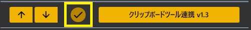
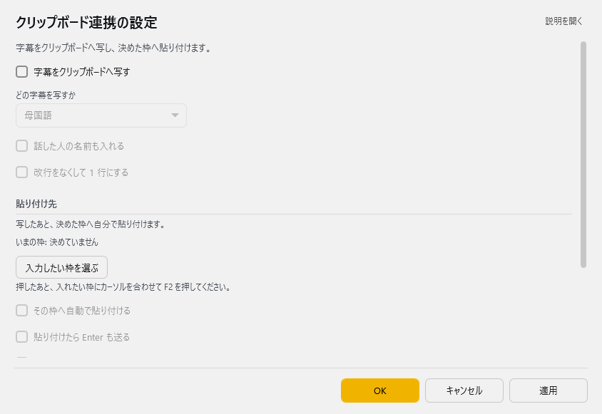

<!-- version-banner -->
!!! info ""
    ゆかコネNEO **v3.0** のドキュメントです。v2.3 をお使いの方は [v2.3 版のこのページ](../../v2.3/plugin/plugin_clipboard.md) を、違いを知りたい方は [v2.3 から v3.0 への移行](../../mig/mig_neo_v3.0.md) をご覧ください。

!!! Info "前提条件"
    * Windwosのクリップボードにアクセスできる場合のみ使用可能

## このプラグインで出来ること

* **音声認識結果のクリップボード転送**：確定したテキストを自動的にクリップボードに送信
* **高度な自動入力機能**：特定のアプリケーションに直接テキストを自動入力
* **双方向クリップボード連携**：クリップボードからゆかコネNEOへの受信も可能
* **話者名付き転送**：認識したテキストに話者名を自動付加
* **ウィンドウ指定機能**：対象アプリケーションを指定した確実な入力

##　有効化



* プラグインを使うチェックをONにしてください。

## 設定

プラグイン一覧で、このプラグインの名前の右にある **「設定」** を押すと開きます。

!!! info "閉じるときの 3 択"
    設定は**下書き**として持たれ、「OK」か「適用」を押すまで動いているプラグインには効きません。
    変更したまま閉じようとすると「変更が保存されていません」と聞かれ、**［はい］保存して閉じる／［いいえ］破棄して閉じる／［キャンセル］閉じるのをやめる** から選べます。

字幕をクリップボードへ写し、決めた枠へ貼り付けます。



| 項目 | 説明 |
|:--|:--|
| ☑ 字幕をクリップボードへ写す | 既定：OFF |
| どの字幕を写すか | 選択肢：母国語／翻訳 1／翻訳 2／翻訳 3／翻訳 4／母国語 + 翻訳 1。既定：母国語 |
| ☑ 話した人の名前も入れる | 既定：OFF |
| ☑ 改行をなくして 1 行にする | 既定：OFF |

**貼り付け先**　写したあと、決めた枠へ自分で貼り付けます。

| 項目 | 説明 |
|:--|:--|
| 「入力したい枠を選ぶ」ボタン | 押したあと、入れたい枠にカーソルを合わせて F2 を押してください。 |
| ☑ その枠へ自動で貼り付ける | 既定：OFF |
| ☑ 貼り付けたら Enter も送る | 既定：OFF |
| ☑ 前に貼ったものを置き換える | 切にすると、話すたびに後ろへ足していきます。（既定：OFF） |

**受け取る**

| 項目 | 説明 |
|:--|:--|
| ☑ クリップボードの文字を取り込む | ほかのソフトでコピーした文字が、そのまま字幕になります。（既定：OFF） |

### 補足

* 「貼り付け先」の **「入力したい枠を選ぶ」** を押したあと、貼り付けたい入力欄にカーソルを合わせて **F2** を押すと、その枠が決まります。
* 決めた枠は「いまの枠」に表示されます。**「その枠へ自動で貼り付ける」** を ON にすると、写すたびに貼り付けます。

## 高度な使用例

### 1. ライブ配信でのコメント自動入力
```
設定：
- 送信内容：母国語
- 自動貼り付け：有効
- 確定時にエンター送信：有効
- 対象ウィンドウ：配信ソフトのコメント欄を指定
```

### 2. 翻訳結果の文書作成
```
設定：
- 送信内容：母国語+翻訳1
- 名前も送る：有効
- 全選択してから貼り付け：無効（追記モード）
- 対象ウィンドウ：テキストエディタを指定
```

### 3. チャットアプリケーション連携
```
設定：
- 送信内容：翻訳1
- 自動貼り付け：有効
- 確定時にエンター送信：有効
- 改行を無視：有効（チャット用）
```

### タイミング制御
* クリップボード設定後の待機：50ms
* ウィンドウフォーカス後の待機：250ms
* 段階的なキー送信で確実な入力を実現

## トラブルシューティング

### 自動入力が失敗する場合
1. **ウィンドウ指定の確認**：「特定」ボタンで正しいウィンドウを選択
2. **アプリケーション権限**：管理者権限で実行が必要な場合あり
3. **入力フォーカス**：対象アプリがアクティブになっているか確認

### クリップボードが更新されない場合  
1. **Windows設定**：クリップボード履歴が有効になっているか確認
2. **他アプリとの競合**：クリップボード管理ツールとの競合を確認
3. **権限問題**：セキュリティソフトによるクリップボードアクセス制限
