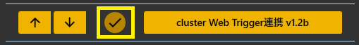
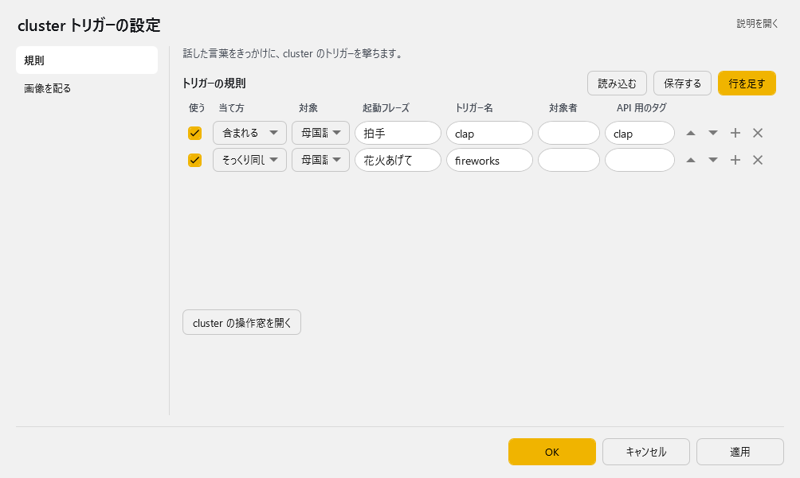
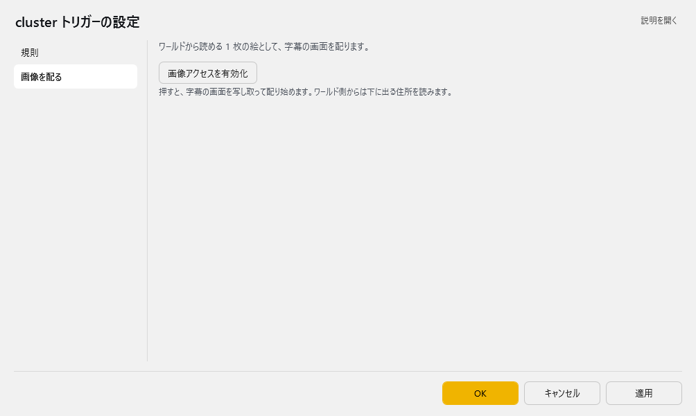
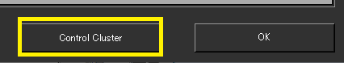
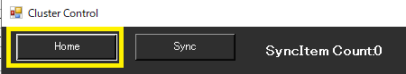
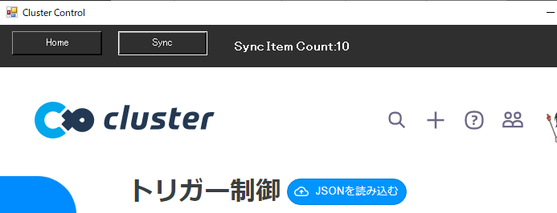
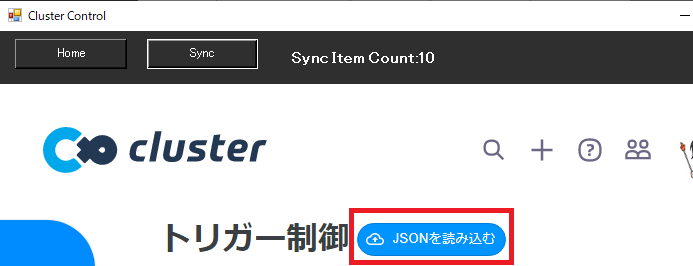
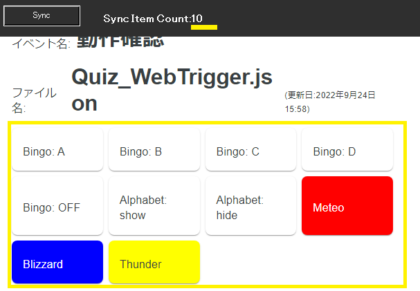
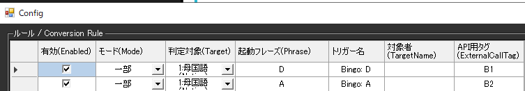
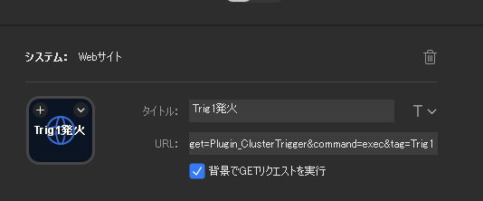

<!-- version-banner -->
!!! info ""
    ゆかコネNEO **v3.0** のドキュメントです。v2.3 をお使いの方は [v2.3 版のこのページ](../../v2.3/plugin/plugin_cluster_wtrig.md) を、違いを知りたい方は [v2.3 から v3.0 への移行](../../mig/mig_neo_v3.0.md) をご覧ください。

!!! Info "前提条件"
    * cluster イベントの設定が必要です。
    * ワールドにWebTriggerギミックがあることが必要です。
    * WebTriggerの管理ページを開けることが必要です。
    * 使用するための JSONファイルが必要です。

!!! Warning "この機能について"
    * cluster公認の機能ではありません。
    * 何か問題・課題がある場合は、ゆかコネDiscordのサポートフォーラムに質問してください。

## このプラグインで出来ること

* clusterのWebトリガーボタンを音声認識や翻訳された言葉をキーワードに発火できます
* APIをつかえば、StreamDeckなどのツールからも呼び出せます

##　有効化

* プラグインを使うチェックをONにしてください。

## 設定

プラグイン一覧で、このプラグインの名前の右にある **「設定」** を押すと開きます。
画面は **2 ページ**に分かれていて、左の一覧で切り替えます（規則／画像を配る）。

!!! info "閉じるときの 3 択"
    設定は**下書き**として持たれ、「OK」か「適用」を押すまで動いているプラグインには効きません。
    変更したまま閉じようとすると「変更が保存されていません」と聞かれ、**［はい］保存して閉じる／［いいえ］破棄して閉じる／［キャンセル］閉じるのをやめる** から選べます。

### 規則

**トリガーの規則**（表）

列：使う／当て方／対象／トリガー名／対象者

表の右上の **「行を足す」** で行を増やします。行の右端のボタンは ▲▼＝1 つ上へ／下へ、＋＝この下に足す、×＝この行を消す です。**「保存する」** はいまの中身を CSV へ書き出します（控え用）。**「読み込む」** は CSV から読み込んで、いまの中身と入れ替えます。

| 項目 | 説明 |
|:--|:--|
| 「cluster の操作窓を開く」ボタン | — |

### 画像を配る

ワールドから読める 1 枚の絵として、字幕の画面を配ります。

| 項目 | 説明 |
|:--|:--|
| 「画像アクセスを有効化」ボタン | 押すと、字幕の画面を写し取って配り始めます。ワールド側からは下に出る住所を読みます。 |

### 補足

* 「規則」ページの **「cluster の操作窓を開く」** から、cluster のイベント管理画面を内蔵ブラウザ（WebView2）で開けます。
* 「画像を配る」ページの **「画像アクセスを有効化」** を押すと、字幕の画面を写し取って配り始めます。ワールド側からは下に出る住所で読みます。
* 外からの呼び出し（`/api/screenshot` など）は [プラグイン系API](../tech/tech_api_plugin.md#api-cluster-wtrig) を参照してください。

## ルール

* ルールは、条件に一致したときにそのデータを送付することができる「仕掛け」です

|設定|意味|
|:--|:---|
|有効(Enabled)|この条件を有効化します|
|モード(Mode)|条件の判断モードを指定します|
|対象|対象にする言語を決めます（母国語、翻訳１～４）|
|起動フレーズ|判断に使う起動キーワードです|
|トリガー名|発火するWebトリガーの名前を設定します|
|対象者|話者名に指定文字が含まれているときに反応します。空欄の場合は全員が対象です|
|APIタグ|APIから呼び出すときにつかうタグ名です|

!!! Info "パラメータの記述"
    * 発話がきっかけで呼び出される場合は、トリガー名の中に下記パラメータが使えます

    |パラメータ|意味|
    |:--------|:---|
    |{talker}|発話者名|

## 使い方

1. Clusterでイベントを作ります。
2. ゆかコネNEOの画面からコントロール画面に入ります。

3. コントロール画面で「HOME」ボタンを押します。

4. ClusterのWebTrigger画面を出します

5. ワールドに対応する JSONファイルを読み込みます

6. 読み込んだら、同期をとります。

    同期がとれると、「Sync Item Count」の数が更新されます。表示されているトリガーの数と同じ数字になっていれば、同期がとれています。

7. 発火条件を入力します。

8. 音声認識などをさせて、発火状態を確認してください。

## StreamDeckと連動させるとき

!!! info "このプラグインにはAPIがあります"
    * このプラグインを有効にすると、[clusterウェブトリガープラグインAPI](../tech/tech_api_plugin.md#api-cluster-wtrig)の機能を使えます。

StreamDeckのアプリケーションに、下記のように設定することで、ボタンによる発火が可能になります。

設定例：
``http://localhost:11900/api/command?target=Plugin_ClusterTrigger&command=exec&tag=Trig1``

