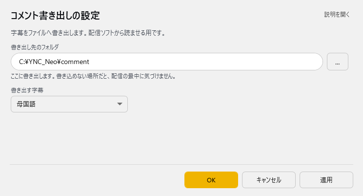

<!-- version-banner -->
!!! info ""
    ゆかコネNEO **v3.0** のドキュメントです。v2.3 をお使いの方は [v2.3 版のこのページ](../../v2.3/plugin/plugin_commentgen.md) を、違いを知りたい方は [v2.3 から v3.0 への移行](../../mig/mig_neo_v3.0.md) をご覧ください。

!!! Info "前提条件"
    * [HTML5コメントジェネレータ](https://www.kilinbox.net/2016/01/HCG.html) もしくは [HTML5コメントジェネレータ改](http://twinstraycat.kagome-kagome.com/commegene/commentgenerator_kai) を使用していること

## このプラグインで出来ること

* HTML5コメントジェネレータを使って字幕を表示できます。

##　有効化

* プラグインを使うチェックをONにしてください。

## 設定

プラグイン一覧で、このプラグインの名前の右にある **「設定」** を押すと開きます。

!!! info "閉じるときの 3 択"
    設定は**下書き**として持たれ、「OK」か「適用」を押すまで動いているプラグインには効きません。
    変更したまま閉じようとすると「変更が保存されていません」と聞かれ、**［はい］保存して閉じる／［いいえ］破棄して閉じる／［キャンセル］閉じるのをやめる** から選べます。

字幕をファイルへ書き出します。配信ソフトから読ませる用です。

| 項目 | 説明 |
|:--|:--|
| 書き出し先のフォルダ | ここに書き出します。書き込めない場所だと、配信の最中に気づけません。（右の「…」で選べます） |
| 書き出す字幕 | 選択肢：母国語／翻訳 1／翻訳 2／翻訳 3／翻訳 4／母国語と翻訳 1 の両方／読み上げ API へ送ったもの。既定：母国語 |

### 補足

#### 書き出し先設定

!!! Info "書き出し先について"
    * 指定したフォルダに `comment.xml` を出力します
    * 既存ファイルは自動的に上書きされます（通常問題なし）
    * コメントジェネレータと同じフォルダを指定してください

##### 自動更新機能

* **リアルタイム更新**: 音声認識結果が1秒ごとに字幕ファイルに反映
* **履歴管理**: 過去の音声認識結果から最新40件を自動管理
* **配信対応**: OBSなどの配信ソフトでそのまま表示可能
    

## 使い方
1. コメントジェネレータを入手します
1. CommentGenerator.html　を　配信ソフトなどで読み込みます
    * 具体的には、OBSのブラウザソースの設定でファイルを指定します
1. ゆかコネNEOで音声認識をすると表示されます
