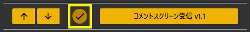
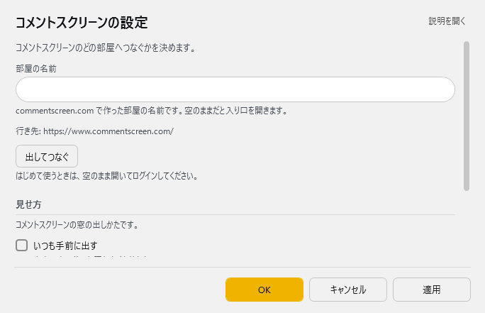

<!-- version-banner -->
!!! info ""
    ゆかコネNEO **v3.0** のドキュメントです。v2.3 をお使いの方は [v2.3 版のこのページ](../../v2.3/plugin/plugin_comscr.md) を、違いを知りたい方は [v2.3 から v3.0 への移行](../../mig/mig_neo_v3.0.md) をご覧ください。

!!! Info "前提条件"
    * なし

## このプラグインで出来ること

* [コメントスクリーン](https://www.commentscreen.com/)のコメントをゆかコネに自動転送
* リアルタイムでコメントを音声認識画面に表示
* 内蔵ブラウザ（WebView2）でコメントスクリーンを表示
* ウィンドウの表示カスタマイズ（最前面・透過・フレーム非表示）
* 配信画面への字幕オーバーレイとして活用可能

!!! note "コメントスクリーンについて"
    * [コメントスクリーン](https://www.commentscreen.com/)は無料で使えるコメント表示サービス
    * URLを共有するだけで視聴者がコメントを投稿できる
    * パスワード付きルームにも対応

!!! Warning "この機能について"

    * CommentScreen社公認の機能ではありません。
    * 何か問題・課題がある場合は、ゆかコネDiscordのサポートフォーラムに質問してください。
    * 本件に関して、CommentScreen社にサポートを求めないでください。

!!! note "この機能について"
    * わんコメ連携プラグインをつかうことで、わんコメ画面に転送ができます。

##　有効化

* プラグインを使うチェックをONにしてください。

## 設定

プラグイン一覧で、このプラグインの名前の右にある **「設定」** を押すと開きます。

!!! info "閉じるときの 3 択"
    設定は**下書き**として持たれ、「OK」か「適用」を押すまで動いているプラグインには効きません。
    変更したまま閉じようとすると「変更が保存されていません」と聞かれ、**［はい］保存して閉じる／［いいえ］破棄して閉じる／［キャンセル］閉じるのをやめる** から選べます。

コメントスクリーンのどの部屋へつなぐかを決めます。

| 項目 | 説明 |
|:--|:--|
| 部屋の名前 | commentscreen.com で作った部屋の名前です。空のままだと入り口を開きます。 |
| 「出してつなぐ」ボタン | はじめて使うときは、空のまま開いてログインしてください。 |

**見せ方**　コメントスクリーンの窓の出しかたです。

| 項目 | 説明 |
|:--|:--|
| ☑ いつも手前に出す | ほかの窓の後ろに隠れなくなります。（既定：OFF） |
| ☑ 枠を出さない | 題名の帯と枠が消えます。動かすときは枠を戻してください。（既定：OFF） |
| ☑ 背景を透かす | 本体で決めた背景色のところが抜けます。配信に重ねるときに使います。（既定：OFF） |

### 補足

!!! info "v3.0 で内蔵ブラウザが WebView2 になりました"
    描画エンジンが CefSharp（Chromium）から **WebView2（Edge）**へ変わりました。
    **WebView2 ランタイム**が必要です（Windows 11 は標準、Windows 10 も Edge が入っていれば入っています）。
    ログイン状態は WebView2 側に保存されるため、**入り直しが必要になることがあります**。

* 「部屋の名前」を空のままにして **「出してつなぐ」** を押すと、コメントスクリーンの入り口が開きます。はじめて使うときはそこでログインしてください。

## 制約・仕様

* コメントスクリーンのチャットルームにパスワードがかかっている場合は、パスワード入力が必要です。
* ブラウザ画面に表示されないものは表示されません。
* 一番最初に入室したタイミングで受信したものは行の並びが逆になることがありますが現段階では仕様です。

## 使い方手順

### 初回設定
1. **コメントスクリーンでルームを作成**
   - [コメントスクリーン](https://www.commentscreen.com/)にアクセス
   - 「新しいルーム作成」をクリック
   - ルーム名を決定（任意の文字列）
   - パスワード設定（必要に応じて）

2. **ゆかコネ側の設定**
   - プラグインを有効化
   - ルーム名を入力（URLの末尾部分のみ）
   - 必要に応じてウィンドウカスタマイズを設定

3. **接続開始**
   - 「ログイン」ボタンをクリック
   - パスワード設定している場合はパスワード入力
   - 内蔵ブラウザでコメントスクリーンが表示される

### 配信での活用

#### 基本的な使い方
1. **コメントルームのURLを視聴者に共有**
2. **視聴者がコメントを投稿**
3. **リアルタイムでゆかコネに転送される**
4. **音声合成で自動読み上げ（PlayVoiceプラグイン使用時）**

#### 配信画面への組み込み
- **透過設定ON**: OBSでウィンドウキャプチャしてオーバーレイ
- **最前面表示ON**: 配信中にコメントを確認
- **フレーム非表示**: 見た目をスッキリさせる

## よくある問題と解決方法

### 接続エラー

| 症状 | 原因 | 解決方法 |
|:---|:---|:---|
| **「ルームが見つかりません」** | ルーム名が間違い | コメントスクリーンURLの末尾部分を正確に入力 |
| **ブラウザが表示されない** | ネットワークエラー | インターネット接続を確認 |
| **パスワード入力画面が出ない** | ルーム設定問題 | コメントスクリーン側でパスワード設定確認 |

### コメント取得の問題

| 症状 | 原因 | 解決方法 |
|:---|:---|:---|
| **コメントがゆかコネに転送されない** | ブラウザ表示エラー | プラグインを再起動 |
| **一部コメントのみ取得** | ページ読み込み不完全 | ブラウザウィンドウを更新（F5） |
| **古いコメントが逆順表示** | 初回接続時仕様 | しばらく待つと正常な順序になる |

### 表示の問題

| 症状 | 原因 | 解決方法 |
|:---|:---|:---|
| **透過が効かない** | Windows設定 | Windowsのテーマ設定確認 |
| **最前面表示されない** | 他アプリの設定 | 他の最前面アプリを確認 |
| **文字が読みづらい** | フォント・色設定 | コメントスクリーン側で文字設定調整 |

### 設定確認チェックリスト

#### コメントスクリーン側
- [ ] ルームが正常に作成されている
- [ ] ルームURLが正しく共有されている
- [ ] パスワード設定が正しい（設定している場合）
- [ ] 文字色・背景色が見やすく設定されている

#### ゆかコネ側
- [ ] プラグインが有効になっている
- [ ] ルーム名が正確に入力されている
- [ ] インターネット接続が正常
- [ ] 他のプラグインとの競合がない

## わんコメ連携について

### 連携のメリット
- **わんコメの高機能な表示**とコメントスクリーンの手軽さを両立
- **複数のコメントソース**を統合表示
- **フィルタリング機能**でコメント管理

### 連携手順
1. **わんコメプラグインを有効化**
2. **ComScrプラグインも同時に有効化** 
3. **両方のプラグインでコメントを受信**
4. **わんコメ画面で統合表示される**
