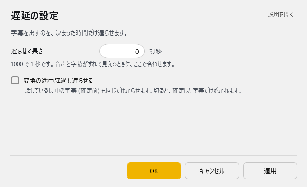

<!-- version-banner -->
!!! info ""
    ゆかコネNEO **v3.0** のドキュメントです。v2.3 をお使いの方は [v2.3 版のこのページ](../../v2.3/plugin/plugin_delay.md) を、違いを知りたい方は [v2.3 から v3.0 への移行](../../mig/mig_neo_v3.0.md) をご覧ください。

!!! Info "前提条件"
    * なし

## このプラグインで出来ること

* 表示を遅らせることができます
* 読み上げ音声に合わせて字幕のタイミングを調整できます
* 配信の遅延に合わせて表示タイミングを調整できます

##　有効化

* プラグインを使うチェックをONにしてください。

## 設定

プラグイン一覧で、このプラグインの名前の右にある **「設定」** を押すと開きます。

!!! info "閉じるときの 3 択"
    設定は**下書き**として持たれ、「OK」か「適用」を押すまで動いているプラグインには効きません。
    変更したまま閉じようとすると「変更が保存されていません」と聞かれ、**［はい］保存して閉じる／［いいえ］破棄して閉じる／［キャンセル］閉じるのをやめる** から選べます。

字幕を出すのを、決まった時間だけ遅らせます。

| 項目 | 説明 |
|:--|:--|
| 遅らせる長さ | 1000 で 1 秒です。音声と字幕がずれて見えるときに、ここで合わせます。（0～600000ミリ秒） |
| ☑ 変換の途中経過も遅らせる | 話している最中の字幕 (確定前) も同じだけ遅らせます。切ると、確定した字幕だけが遅れます。 |

## 使うとき
* 遅延時間を設定しプラグインを使うチェックをONにするだけで遅延が反映されます。

!!! Warning "プラグインの位置について"
    * 遅延プラグインの後が遅れていきます。
    * 一般的には発話プラグインより後ろ側に遅延プラグインを置きます。

## よくある質問

### 字幕が表示されない場合
- 遅延時間が長すぎる可能性があります。短く設定してみてください
- プラグインが有効（チェックON）になっているか確認してください

### 音声と字幕のタイミングが合わない場合
- スライダーで遅延時間を細かく調整してください
- 読み上げプラグインがある場合は、このプラグインを読み上げプラグインより後に配置してください

### 配信での使い方
- 配信ソフトの遅延時間を確認して、それに合わせて遅延時間を設定してください
- YouTube Live、Twitch等、プラットフォームによって遅延時間が異なります