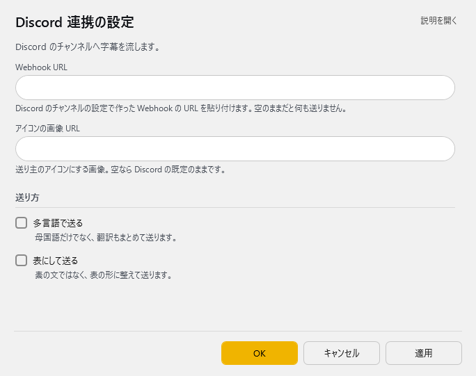

<!-- version-banner -->
!!! info ""
    ゆかコネNEO **v3.0** のドキュメントです。v2.3 をお使いの方は [v2.3 版のこのページ](../../v2.3/plugin/plugin_dicordwebhook.md) を、違いを知りたい方は [v2.3 から v3.0 への移行](../../mig/mig_neo_v3.0.md) をご覧ください。

!!! Info "前提条件"
    * Webhook URL登録するためには Discord アカウントが必要です。

## このプラグインで出来ること

* 音声認識結果をDiscordチャットチャネル転送することができます

##　有効化

* プラグインを使うチェックをONにしてください。

## 設定

プラグイン一覧で、このプラグインの名前の右にある **「設定」** を押すと開きます。

!!! info "閉じるときの 3 択"
    設定は**下書き**として持たれ、「OK」か「適用」を押すまで動いているプラグインには効きません。
    変更したまま閉じようとすると「変更が保存されていません」と聞かれ、**［はい］保存して閉じる／［いいえ］破棄して閉じる／［キャンセル］閉じるのをやめる** から選べます。

Discord のチャンネルへ字幕を流します。

| 項目 | 説明 |
|:--|:--|
| Webhook URL | Discord のチャンネルの設定で作った Webhook の URL を貼り付けます。空のままだと何も送りません。 |
| アイコンの画像 URL | 送り主のアイコンにする画像。空なら Discord の既定のままです。 |

**送り方**

| 項目 | 説明 |
|:--|:--|
| ☑ 多言語で送る | 母国語だけでなく、翻訳もまとめて送ります。（既定：OFF） |
| ☑ 表にして送る | 素の文ではなく、表の形に整えて送ります。（既定：OFF） |

### 補足

!!! Info "アイコンの画像について"
    * インターネット側から読める場所（URL）を指定してください
    * 画像は 100 × 100 ピクセル程度がおすすめです

## 具体的な使い方
* [実践的なチートシート](../cs/cs_colab_discord.md) をなぞらえてみてください