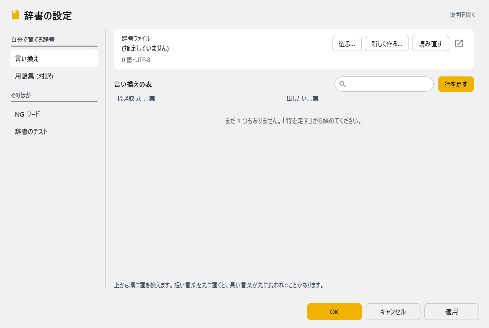
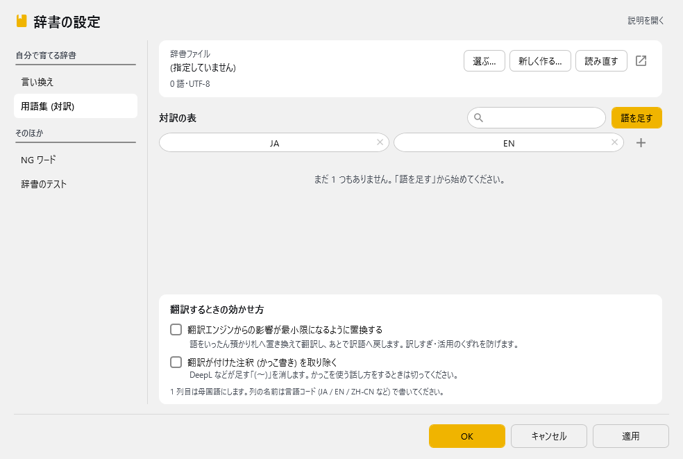
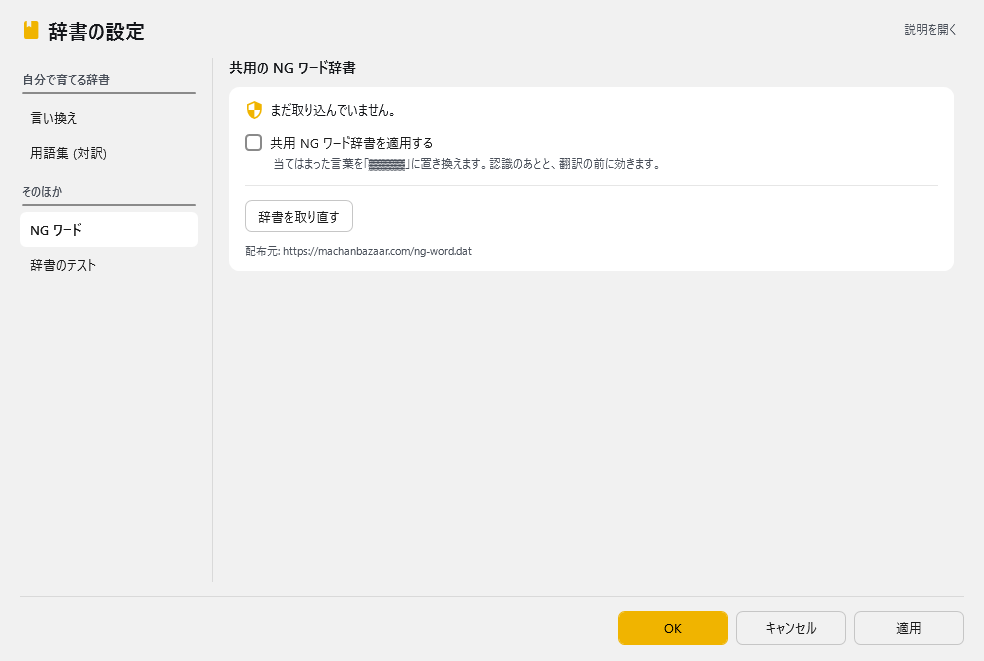
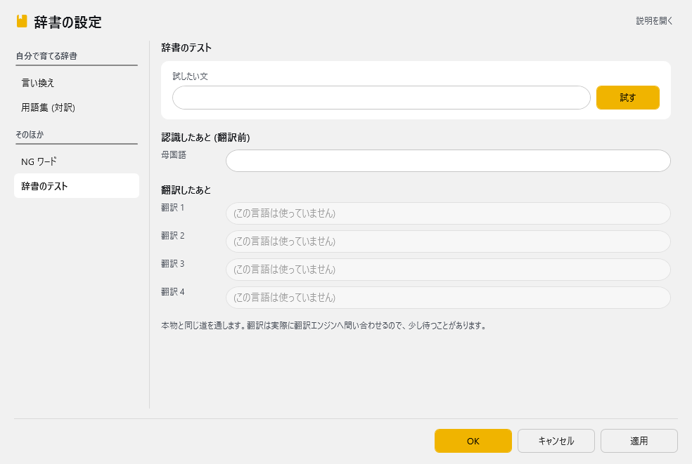

<!-- version-banner -->
!!! info ""
    ゆかコネNEO **v3.0** のドキュメントです。v2.3 をお使いの方は [v2.3 版のこのページ](../../v2.3/plugin/plugin_dictionary.md) を、違いを知りたい方は [v2.3 から v3.0 への移行](../../mig/mig_neo_v3.0.md) をご覧ください。

!!! Info "前提条件"
    * なし

## このプラグインで出来ること

* 認識後の文字を強制的に置き換えることができます
* 3層の辞書システム（母国語辞書、対訳辞書、除外辞書）
* 正規表現による高度なパターンマッチング
* DeepL注記の自動削除機能
* 共用の NG ワード辞書で、伏せたい言葉を伏せ字にする（v3.0～）


##　有効化


* プラグインを使うチェックをONにしてください。

## 設定

プラグイン一覧で、このプラグインの名前の右にある **「設定」** を押すと開きます。
左の一覧で 4 ページを切り替えます。

| まとまり | ページ | 中身 |
|:--|:--|:--|
| 自分で育てる辞書 | **言い換え** | 聞き取った言葉を、正しい表記へ置き換えます。母国語の字幕にそのまま効きます |
| | **用語集（対訳）** | 名前や専門用語を、決まった訳語で出します。翻訳するときだけ効きます |
| そのほか | NG ワード | 配布されている共用の辞書で、伏せたい言葉を伏せ字にします |
| | 辞書のテスト | 入れた文が、辞書を通るとどうなるかを試します |

!!! info "配信中に開いても字幕は変わりません"
    設定（ファイルの場所とスイッチ）も辞書の中身も、**「OK」か「適用」を押すまで動いている辞書に触りません**。
    開いて眺めるだけなら、配信中の字幕は変わりません。「適用 → キャンセル」で戻せるよう、書いたファイルの控えも取っています。

### 辞書ファイルの扱い（言い換え・用語集で共通）

ページの上に、いま使っている辞書ファイルの欄があります。

| 項目 | 説明 |
|:--|:--|
| 「選ぶ…」ボタン | 使う辞書ファイル（`*.csv`）を選びます |
| 「新しく作る…」ボタン | 空の辞書ファイルを作ります |
| 「読み直す」ボタン | ファイルを外で書き換えたときに読み直します。保存していない変更があるときは確認が出ます |
| 「Excel / メモ帳で開く」ボタン | 辞書ファイルをほかのソフトで開きます |

* ファイル名の下に、語の数と文字コード（UTF-8）が出ます。**Shift-JIS のファイルも読めます**（保存は UTF-8 になります）。
* まだ存在しないファイルを指定したときは、OK を押したときに作ります。
* 言い換えと用語集に**同じファイルを指定すると保存できません**（その場で注意が出ます）。
* 辞書を切り替えるとき、書いていない変更があれば「先に書いてから切り替える／変更を捨てる／切り替えない」を聞かれます。

### 言い換え

聞き取った言葉を、正しい表記へ置き換えます。母国語の字幕にそのまま効きます。



**言い換えの表**

| 列 | 説明 |
|:--|:--|
| 聞き取った言葉 | 音声認識が出してくる言葉（置き換えたい言葉） |
| 出したい言葉 | 字幕に出したい言葉 |

* **「行を足す」** で行を増やします。行の × で消せます。
* 右上の **「表の中を探す」** で、表の中を絞り込めます。
* **同じ言葉が 2 つ以上あると、その場で注意が出ます。**
* 上から順に置き換えます。**短い言葉を先に置くと、長い言葉が先に食われることがあります。**

### 用語集（対訳）

名前や専門用語を、決まった訳語で出します。翻訳するときだけ効きます。



**対訳の表**

* 見出しの欄が、そのまま**言語の列**になっています。**1 列目は母国語**にします。
* 列の名前は言語コード（`JA` / `EN` / `ZH-CN` など）で書きます。読めないコードや、同じ言語の列が 2 つあると注意が出ます。
* 見出しの右の **＋（言語を足す）** で言語の列を増やし、列の × で消します（その言語の訳語はファイルからも消えます）。
* **「語を足す」** で行を増やします。**「表の中を探す」** で絞り込めます。

**翻訳するときの効かせ方**

| 項目 | 説明 |
|:--|:--|
| ☑ 翻訳エンジンからの影響が最小限になるように置換する | 語をいったん預かり札へ置き換えて翻訳し、あとで訳語へ戻します。訳しすぎ・活用のくずれを防げます |
| ☑ 翻訳が付けた注釈（かっこ書き）を取り除く | DeepL などが足す「(〜)」を消します。かっこを使う話し方をするときは切ってください |

!!! tip "v2.3 から変わったこと"
    v2.3 まで、用語集は**アプリの中に編集手段がありませんでした**。
    ファイルの場所を指定して Excel で開き、「1 行目に言語コード、2 行目以降に対訳」という決まりを自分で覚えている必要がありました。
    v3.0 では言語の増減も含めて画面の中で終わります。これまでどおり CSV を外で作って読ませることもできます。

!!! warning "「言い換えの表で上書きされている可能性があります」と出たとき"
    用語集のファイルが 2 列しかない（言い換えの表の形になっている）ときに出ます。
    中身を確かめて、必要ならファイルを選び直してください。

#### 用語集ファイルの作り方（外で作る場合）

1 行目に言語コード、2 行目以降に対訳を書いた CSV（UTF-8）です。

```
JA,EN,FR
ゆかコネ,Yukarinette-Connector,Yukarinette-Connector
ハローラ,Hello-la!,Hello-la!
おつあめ,OTSUAME!,OTSUAME!
```

Excel で作る場合は「CSV UTF-8（コンマ区切り）」で保存してください。

### NG ワード

配布されている共用の辞書で、伏せたい言葉を伏せ字にします。



| 項目 | 説明 |
|:--|:--|
| ☑ 共用 NG ワード辞書を適用する | 当てはまった言葉を「▒▒▒」に置き換えます。認識のあとと、翻訳の前に効きます |
| 「辞書を取り直す」ボタン | 配布元から最新の辞書を取り直します。取れなかったときは元の辞書のままです |

いま取り込んでいる語の数と、配布元の URL がその場に出ます。

### 辞書のテスト

入れた文が、辞書を通るとどうなるかを試します。



1. **試したい文** を入れて **「試す」** を押します
2. **認識したあと（翻訳前）** に母国語の結果、**翻訳したあと** に翻訳 1〜4 の結果が出ます（使っていない言語は「この言語は使っていません」）

* 本物と同じ道を通します。翻訳は実際に翻訳エンジンへ問い合わせるので、少し待つことがあります。
* 表の変更は、試す前にファイルへ書き込みます。

!!! Info "辞書の指定が空になっていたら"
    * 設定画面を開いたときに辞書の指定が空でも、同じフォルダに辞書ファイルが残っていれば、自動で候補を埋めます。(v2.3.128～)
    * 自動で埋めた内容は ``OK`` を押すまで保存されません。中身を確かめてから ``OK`` を押してください。

## 使うとき

1. 音声認識と同時に置換されます。
