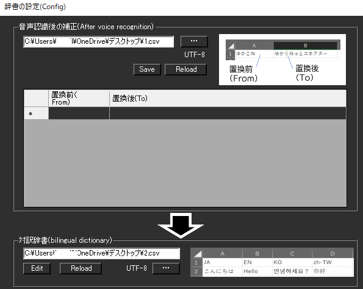
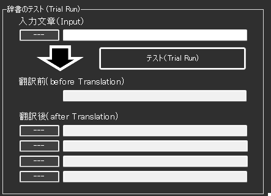
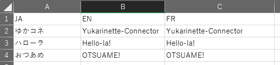
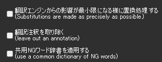

<!-- version-banner -->
!!! info ""
    ゆかコネNEO **v3.0** のドキュメントです。v2.3 をお使いの方は [v2.3 版のこのページ](../../v2.3/plugin/plugin_dictionary.md) を、違いを知りたい方は [v2.3 から v3.0 への移行](../../mig/mig_neo_v3.0.md) をご覧ください。

!!! Info "前提条件"
    * なし

## このプラグインで出来ること

* 認識後の文字を強制的に置き換えることができます
* 3層の辞書システム（母国語辞書、対訳辞書、除外辞書）
* 正規表現による高度なパターンマッチング
* DeepL注記の自動削除機能


##　有効化


* プラグインを使うチェックをONにしてください。

<!-- wpf-settings-note -->
!!! info "v3.0 で設定画面が新しくなりました"
    見た目がほかのプラグインと揃い、**表示言語に合わせて日本語・英語などで出る**ようになりました。
    各項目には「何を入れる欄なのか」「空のままだとどうなるのか」の説明が付いています。
    **用語集を表で編集できるようになりました。**

    設定は**下書き**として持たれます。閉じるときに「適用」「破棄」「続ける」の 3 択が出るので、
    試して気に入らなければ破棄できます。
    新しい画面が開けなかったときは、従来の画面が代わりに開きます。

    規則の表を編集したあと**別のページに切り替えると、その時点で表が書き出されます**。
    「キャンセル」で戻したいときは、表のページを離れる前に操作してください。
    表のファイルの形式は v2.3 と同じなので、**v2.3 に戻しても読めます**。
    → [プラグインの有効化](enabled.md)

## 設定

#### 母国語側の辞書



|設定|意味|
|:--|:---|
|置換前|字幕として表示されている「置き換えたい言葉」を指定します|
|置換後|その言葉の代わりに表示したいこと言葉をしています|

#### 翻訳時の辞書


|設定|意味|
|:--|:---|
|対訳辞書|対訳辞書ファイルを指定します。|

!!! Info "辞書の指定が空になっていたら"
    * 設定画面を開いたときに辞書の指定が空でも、同じフォルダに辞書ファイルが残っていれば、自動で候補を埋めます。(v2.3.128～)
    * 自動で埋めた内容は ``OK`` を押すまで保存されません。中身を確かめてから ``OK`` を押してください。

### 対訳辞書の作り方

!!! Info "編集方法"
    * Excel もしくは メモ帳で実施します。
    * １列目に言語コード、２列目以降に対訳データをいれます

=== "Case1:Excelの場合"

    

    1. Excelでデータを作ります。

    2. CSVファイルとして保存します。

    

=== "Case2:メモ帳の場合"

    1. 下記のようなファイルを作ります。

    ``` 
    JA,EN,FR
    ゆかコネ,Yukarinette-Connector,Yukarinette-Connector
    ハローラ,Hello-la!,Hello-la!
    おつあめ,OTSUAME!,OTSUAME!
    ```
    2. CSV（UTF8エンコード)で保存します。

    

##　テスト


* テストしたい文章をいれて、テストボタンを押します
* どのように置き換わるかが表示されます。

## オプション



|設定|意味|
|:--|:---|
|影響を最小限に| 翻訳時に置換ミスしにくいように処理します |
|注訳を取り除く| DeepLのカッコ表記を取り除きます |
## 使うとき

1. 音声認識と同時に置換されます。
