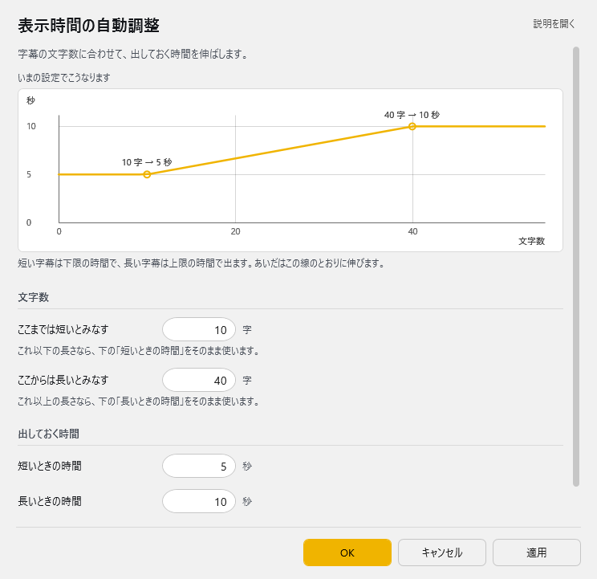

<!-- version-banner -->
!!! info ""
    ゆかコネNEO **v3.0** のドキュメントです。v2.3 をお使いの方は [v2.3 版のこのページ](../../v2.3/plugin/plugin_dynamickeeptime.md) を、違いを知りたい方は [v2.3 から v3.0 への移行](../../mig/mig_neo_v3.0.md) をご覧ください。

!!! Info "前提条件"
    * なし

## このプラグインで出来ること

* 文字数に応じて字幕の表示時間を動的に調整します
* 短い文章は短時間、長い文章は長時間表示するよう自動調整します
* 読みやすさを考慮した最適な表示時間を実現します

## 有効化

<!-- TODO: スクリーンショット未撮影。撮ったら images/plugin_dynamickeeptime_p1.png として置き、次の行を有効にする -->
<!--  -->

* プラグインを使うチェックをONにしてください。

## 動作の仕組み

このプラグインは、認識された文字列の長さに基づいて、字幕の表示時間（KeepTime）を自動的に調整します。

### 計算ロジック

* 文字数が最小文字数以下の場合：最小表示時間
* 文字数が最大文字数以上の場合：最大表示時間
* その間の文字数の場合：比例計算で表示時間を決定

グラフイメージ：
<!-- TODO: スクリーンショット未撮影。撮ったら images/plugin_dynamickeeptime_graph.png として置き、次の行を有効にする -->
<!--  -->

## 設定

プラグイン一覧で、このプラグインの名前の右にある **「設定」** を押すと開きます。

!!! info "閉じるときの 3 択"
    設定は**下書き**として持たれ、「OK」か「適用」を押すまで動いているプラグインには効きません。
    変更したまま閉じようとすると「変更が保存されていません」と聞かれ、**［はい］保存して閉じる／［いいえ］破棄して閉じる／［キャンセル］閉じるのをやめる** から選べます。

字幕の文字数に合わせて、出しておく時間を伸ばします。



**文字数**

| 項目 | 説明 |
|:--|:--|
| ここまでは短いとみなす | これ以下の長さなら、下の「短いときの時間」をそのまま使います。（1～1000字。既定：10） |
| ここからは長いとみなす | これ以上の長さなら、下の「長いときの時間」をそのまま使います。（1～1000字。既定：40） |

**出しておく時間**

| 項目 | 説明 |
|:--|:--|
| 短いときの時間 | 1～600秒。既定：5 |
| 長いときの時間 | 1～600秒。既定：10 |

> あいだの長さのときは、この 2 つを直線でつないだ時間になります。

### 補足

* 画面の上のグラフは、**いまの設定で何文字のときに何秒出るか**を表しています。数字を変えるとすぐにグラフも変わります。
* 短いときの時間〜長いときの時間のあいだは、グラフの線のとおりに伸びます。

## 使用例

### 配信での活用

ライブ配信で視聴者が読みやすい字幕表示を実現：

* 短い挨拶「こんにちは」→ 5秒表示
* 中程度の文章「今日は天気が良いですね」→ 7秒表示
* 長い説明文「本日はゲーム配信をしていきます。初見の方も歓迎です」→ 10秒表示

### プレゼンテーションでの活用

* スライドの内容に合わせて字幕表示時間を自動調整
* 箇条書きは短く、説明文は長く表示

## 詳細設定のコツ

### 速い会話向け設定
```
最小文字数: 5
最大文字数: 20
最小表示時間: 3秒
最大表示時間: 6秒
```

### ゆっくり読みたい場合の設定
```
最小文字数: 10
最大文字数: 50
最小表示時間: 7秒
最大表示時間: 15秒
```

## トラブルシューティング

!!! Warning "注意事項"
    * 他のプラグインで表示時間を設定している場合、競合する可能性があります
    * 最小値が最大値より大きい設定はできません

## 関連プラグイン

* [遅延](plugin_delay.md) - 字幕表示のタイミング調整
* [強制整形](plugin_forcestyle.md) - 字幕の文字数制限
* [表示拡張(スタンプ)](plugin_viewextend.md) - 字幕の装飾