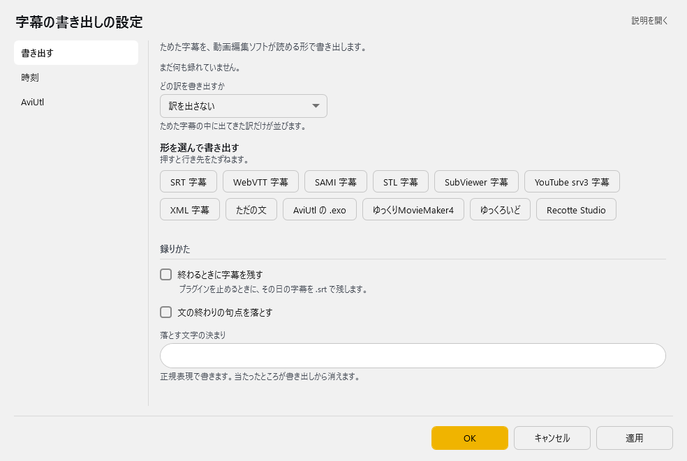
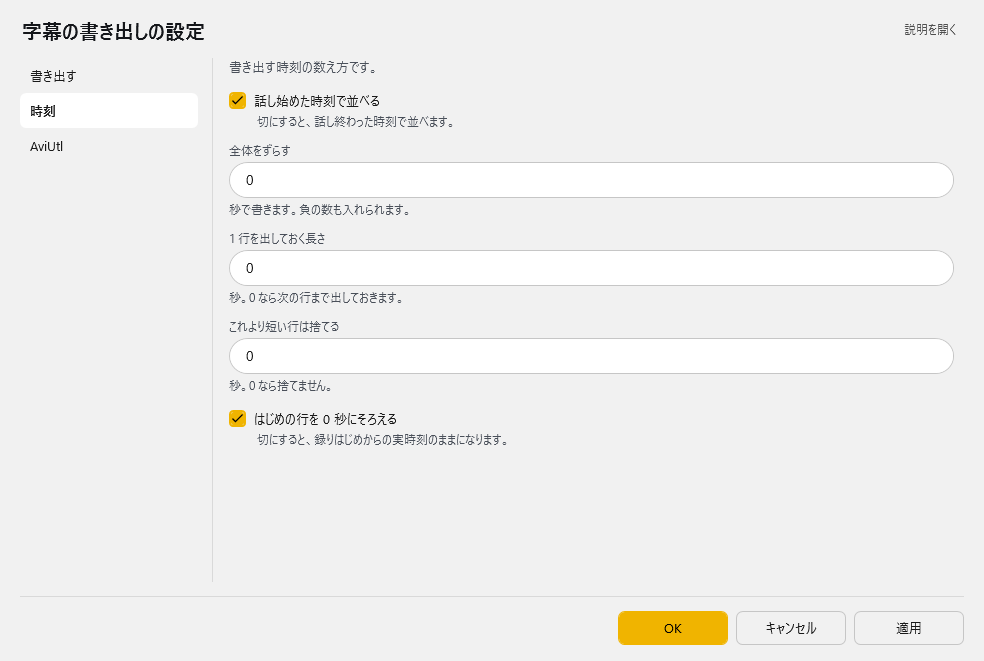
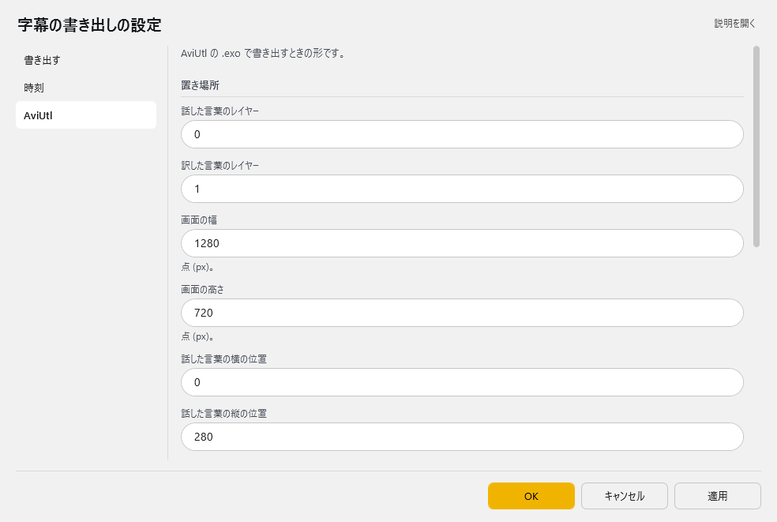

<!-- version-banner -->
!!! info ""
    ゆかコネNEO **v3.0** のドキュメントです。v2.3 をお使いの方は [v2.3 版のこのページ](../../v2.3/plugin/plugin_exporter.md) を、違いを知りたい方は [v2.3 から v3.0 への移行](../../mig/mig_neo_v3.0.md) をご覧ください。

!!! Info "前提条件"
    * なし

## このプラグインで出来ること

* 後編集工程に字幕を持っていくことができます。
* 12種類の字幕フォーマットに対応（SRT、STL、XML、Okosuke、AviUtl、SAMI、VTT等）
* 高度なタイミング制御とオフセット調整
* 動画編集ツールとの直接連携
* リアルタイム字幕データ収集と自動保存
* 正規表現による高度な文字置換機能

##　有効化

* プラグインを使うチェックをONにしてください。

## 設定

プラグイン一覧で、このプラグインの名前の右にある **「設定」** を押すと開きます。
画面は **3 ページ**に分かれていて、左の一覧で切り替えます（書き出す／時刻／AviUtl）。

!!! info "閉じるときの 3 択"
    設定は**下書き**として持たれ、「OK」か「適用」を押すまで動いているプラグインには効きません。
    変更したまま閉じようとすると「変更が保存されていません」と聞かれ、**［はい］保存して閉じる／［いいえ］破棄して閉じる／［キャンセル］閉じるのをやめる** から選べます。

### 書き出す

ためた字幕を、動画編集ソフトが読める形で書き出します。

| 項目 | 説明 |
|:--|:--|
| どの訳を書き出すか | ためた字幕の中に出てきた訳だけが並びます。 |
| 「形を選んで書き出す」ボタン | 押すと行き先をたずねます。 |

**録りかた**

| 項目 | 説明 |
|:--|:--|
| ☑ 終わるときに字幕を残す | プラグインを止めるときに、その日の字幕を .srt で残します。（既定：OFF） |
| ☑ 文の終わりの句点を落とす | 既定：OFF |
| 落とす文字の決まり | 正規表現で書きます。当たったところが書き出しから消えます。 |

### 時刻

書き出す時刻の数え方です。

| 項目 | 説明 |
|:--|:--|
| ☑ 話し始めた時刻で並べる | 切にすると、話し終わった時刻で並べます。（既定：ON） |
| 全体をずらす | 秒で書きます。負の数も入れられます。（既定：「0」） |
| 1 行を出しておく長さ | 秒。0 なら次の行まで出しておきます。（既定：「0」） |
| これより短い行は捨てる | 秒。0 なら捨てません。（既定：「0」） |
| ☑ はじめの行を 0 秒にそろえる | 切にすると、録りはじめからの実時刻のままになります。（既定：ON） |

### AviUtl

AviUtl の .exo で書き出すときの形です。

**置き場所**

| 項目 | 説明 |
|:--|:--|
| 話した言葉のレイヤー | 既定：「0」 |
| 訳した言葉のレイヤー | 既定：「1」 |
| 画面の幅 | 点 (px)。（既定：「1280」） |
| 画面の高さ | 点 (px)。（既定：「720」） |
| 話した言葉の横の位置 | 既定：「0」 |
| 話した言葉の縦の位置 | 既定：「280」 |
| 訳した言葉の横の位置 | 既定：「0」 |
| 訳した言葉の縦の位置 | 既定：「320」 |

**文字**

| 項目 | 説明 |
|:--|:--|
| 話した言葉の書体 | 既定：「ＭＳ ゴシック」 |
| 話した言葉の大きさ | 既定：「22」 |
| 訳した言葉の書体 | 既定：「ＭＳ ゴシック」 |
| 訳した言葉の大きさ | 既定：「22」 |
| 文字の色 | 既定：「#FFFFFF」 |
| 縁取りの色 | 既定：「#000000」 |

### 補足

!!! Info "「終わるときに字幕を残す」について"
    * ON にすると、**プラグインを止めたとき**（ゆかコネNEO を終了したときを含む）に、その日の字幕を `.srt` で残します。
    * 保存先は設定フォルダの中の `VoiceLog` フォルダで、`MessageLog_（日付）_（連番）.srt` という名前になります。
    * 同じ日に何度も保存した場合は連番が増えていきます。上書きはされません。

* どの訳を書き出すかは「書き出す」ページの **「どの訳を書き出すか」** で選びます（v2.3 は翻訳 1 に固定でした）。

## サポート出力フォーマット

### 対応形式一覧（12種類）

| フォーマット | 用途 | 特徴 |
|:-----------|:----|:-----|
| SRT | SubRip Subtitle | 最も一般的な字幕形式 |
| STL | DVD Studio Pro | DVDオーサリング用 |
| XML | Generic XML | 汎用XML字幕データ |
| Okosuke (OXK) | 日本の字幕ツール | 日本語字幕制作に特化 |
| Plain Text | プレーンテキスト | シンプルなテキスト出力 |
| AviUtl | 日本の動画編集ソフト | レイヤー対応の詳細設定 |
| SAMI | Microsoft SAMI | Windows Media Player対応 |
| VTT | WebVTT | Web動画字幕形式 |
| SubViewer | SubViewer形式 | 一部の動画プレイヤー対応 |
| Recotte Studio | 画面録画ソフト | 画面録画時の字幕 |
| SRV3 | 字幕フォーマット | 特定アプリケーション用 |
| YMM4 | Yukkuri Movie Maker 4 | ゆっくり動画制作ツール |

!!! Info "翻訳文は別ファイルとして同時に出力されます"
    * 母国語のファイルとは別に、翻訳文のファイルが同時に書き出されます。

    |形式|翻訳文のファイル名|
    |:--|:--|
    |SRT|``（指定した名前）_tr.srt``|
    |STL|``（指定した名前）_tr.stl``|
    |XML|``（指定した名前）_tr.xml``|
    |VTT|``（指定した名前）_tr.vtt``|
    |SubViewer|``（指定した名前）_tr.sbv``|
    |SRV3|``（指定した名前）_tr.srv3``|
    |AviUtl|``（指定した名前）_lang_1.exo`` / ``_lang_2.exo``（言語ごと）|
    |YMM4|``（指定した名前）_lang_1.ymmp`` / ``_lang_2.ymmp``（言語ごと）|

### 詳細設定項目

#### タイミング制御
| 設定項目 | 範囲 | 説明 |
|:--------|:-----|:-----|
| 全体オフセット | -1000～+1000秒 | 全字幕の時間調整 |
| 最低表示時間 | 可変 | 字幕の最短表示時間 |
| 不明時表示時間 | 可変 | タイミング不明時のデフォルト |
| ゼロオフセット出力 | ON/OFF | 最初の字幕を基準時間とする |

#### 動画編集連携（AviUtl等）
| 設定項目 | デフォルト | 説明 |
|:--------|:----------|:-----|
| 画面解像度 | 1280x720 | 出力対象の画面サイズ |
| 字幕座標（母国語） | 設定可能 | X,Y座標の個別設定 |
| 字幕座標（翻訳） | 設定可能 | 翻訳テキストの位置 |
| レイヤー番号 | 設定可能 | マルチトラック編集対応 |
| フォント設定 | システム検出 | 利用可能フォント自動検出 |
| 前景色・影色 | カスタム | 色の個別設定 |

### 高度な機能

#### 文字処理オプション
* **ピリオド除去**: 出力テキストからピリオドを自動削除
* **正規表現置換**: 複雑なパターンマッチング置換
* **多言語対応**: 母国語＋翻訳1-4の同時出力

#### 自動化機能
* **リアルタイムデータ収集**: 音声認識と翻訳の自動キャプチャ
* **自動保存**: プラグイン無効化時の自動エクスポート
* **履歴管理**: 過去の出力設定の保持

## 使うとき

1. プラグインをONにした状態で、音声認識を始めます。
1. 発話がおわったら、出力設定を調整します
1. 出力したい形式のボタンをおしてデータを保存します。

