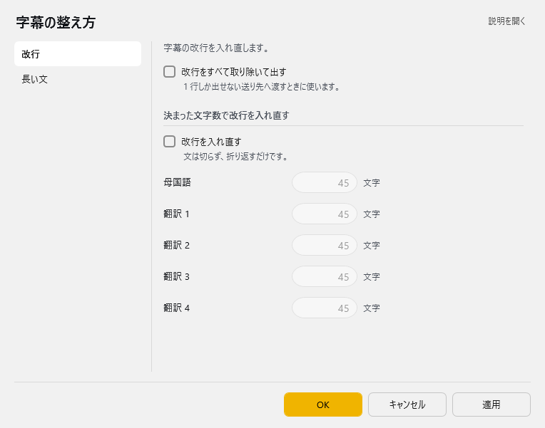
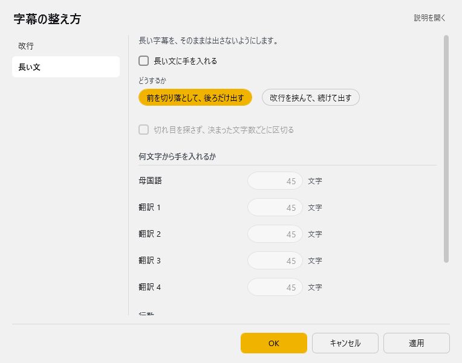

<!-- version-banner -->
!!! info ""
    ゆかコネNEO **v3.0** のドキュメントです。v2.3 をお使いの方は [v2.3 版のこのページ](../../v2.3/plugin/plugin_forcestyle.md) を、違いを知りたい方は [v2.3 から v3.0 への移行](../../mig/mig_neo_v3.0.md) をご覧ください。

!!! Info "前提条件"
    * なし

## このプラグインで出来ること

* 認識後の文字を強制的に整形することができます
* 多言語対応の文字数制限とクロッピング
* 高度な行数制御と履歴表示
* Ruby記法の自動HTML変換
* リアルタイム会話履歴管理
* 複数翻訳レイヤーの個別制御

##　有効化

* プラグインを使うチェックをONにしてください。

## 設定

プラグイン一覧で、このプラグインの名前の右にある **「設定」** を押すと開きます。
画面は **2 ページ**に分かれていて、左の一覧で切り替えます（改行／長い文）。

!!! info "閉じるときの 3 択"
    設定は**下書き**として持たれ、「OK」か「適用」を押すまで動いているプラグインには効きません。
    変更したまま閉じようとすると「変更が保存されていません」と聞かれ、**［はい］保存して閉じる／［いいえ］破棄して閉じる／［キャンセル］閉じるのをやめる** から選べます。

### 改行

字幕の改行を入れ直します。

| 項目 | 説明 |
|:--|:--|
| ☑ 改行をすべて取り除いて出す | 1 行しか出せない送り先へ渡すときに使います。（既定：OFF） |

**決まった文字数で改行を入れ直す**

| 項目 | 説明 |
|:--|:--|
| ☑ 改行を入れ直す | 文は切らず、折り返すだけです。（既定：OFF） |
| 母国語 | 1～2000文字。既定：45 |
| 翻訳 1 | 1～2000文字。既定：45 |
| 翻訳 2 | 1～2000文字。既定：45 |
| 翻訳 3 | 1～2000文字。既定：45 |
| 翻訳 4 | 1～2000文字。既定：45 |

### 長い文

長い字幕を、そのままは出さないようにします。

| 項目 | 説明 |
|:--|:--|
| ☑ 長い文に手を入れる | 既定：OFF |
| どうするか | 選択肢：前を切り落として、後ろだけ出す／改行を挟んで、続けて出す。既定：改行を挟んで、続けて出す |
| ☑ 切れ目を探さず、決まった文字数ごとに区切る | 既定：OFF |

**何文字から手を入れるか**

| 項目 | 説明 |
|:--|:--|
| 母国語 | 1～2000文字。既定：45 |
| 翻訳 1 | 1～2000文字。既定：45 |
| 翻訳 2 | 1～2000文字。既定：45 |
| 翻訳 3 | 1～2000文字。既定：45 |
| 翻訳 4 | 1～2000文字。既定：45 |

**行数**

| 項目 | 説明 |
|:--|:--|
| ☑ 決まった行数を超えたら、古い行から省く | 既定：OFF |
| 残す行数 | 1～100行まで。既定：3 |

## 詳細機能

### 文字数制限（多言語対応）

各言語レイヤーごとに個別の文字数制限を設定可能：

| 対象 | 範囲 | 説明 |
|:----|:-----|:-----|
| 母国語 | 1-300文字 | 音声認識の原文 |
| 翻訳1 | 1-300文字 | 第1翻訳言語 |
| 翻訳2 | 1-300文字 | 第2翻訳言語 |
| 翻訳3 | 1-300文字 | 第3翻訳言語 |
| 翻訳4 | 1-300文字 | 第4翻訳言語 |

### 処理方式の詳細

#### クロッピング方式
1. **先頭クロップ**: 文字数超過時に先頭から削除し「…」を付加
2. **ブロック単位**: 指定文字数でブロック分割してクロップ
3. **改行挿入**: 指定文字数で自動改行を挿入

#### 行数制御
- **最大行数設定**: 1-300行まで設定可能
- **履歴表示**: 過去の会話も含めて行数制御
- **文脈保持**: 会話の流れを保持しながら表示制限

## 使うとき

1. 音声認識と同時に置換されます。
