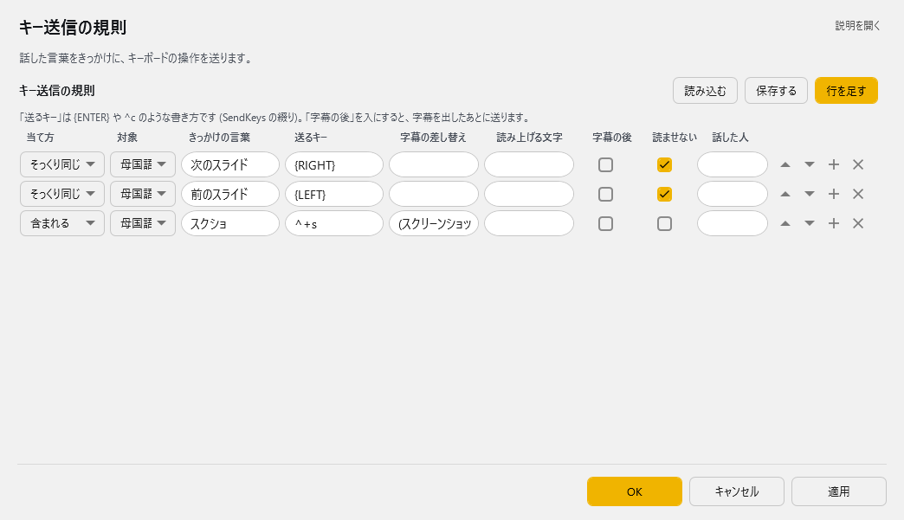

<!-- version-banner -->
!!! info ""
    ゆかコネNEO **v3.0** のドキュメントです。v2.3 をお使いの方は [v2.3 版のこのページ](../../v2.3/plugin/plugin_hotkey.md) を、違いを知りたい方は [v2.3 から v3.0 への移行](../../mig/mig_neo_v3.0.md) をご覧ください。

!!! Info "前提条件"
    * ゆかコネNEO v2.0より使用可能

## このプラグインで出来ること

* 言葉に反応してキーボード信号を送出できます
* キーをうまく使うと、モーションソフトなどに表情信号が送れます
* 4つのマッチングモード（完全一致・部分一致・削除時・無効）
* 高度なテキスト置換機能
* 処理タイミングの詳細制御（前処理・後処理）
* CSV形式でのルール一括管理
* 話者フィルタリング機能

##　有効化


* プラグインを使うチェックをONにしてください。

## 設定

プラグイン一覧で、このプラグインの名前の右にある **「設定」** を押すと開きます。

!!! info "閉じるときの 3 択"
    設定は**下書き**として持たれ、「OK」か「適用」を押すまで動いているプラグインには効きません。
    変更したまま閉じようとすると「変更が保存されていません」と聞かれ、**［はい］保存して閉じる／［いいえ］破棄して閉じる／［キャンセル］閉じるのをやめる** から選べます。

話した言葉をきっかけに、キーボードの操作を送ります。



**キー送信の規則**（表）

列：当て方／対象／きっかけの言葉／送るキー／字幕の差し替え／読み上げる文字／字幕の後／読ませない／話した人

「送るキー」は {ENTER} や ^c のような書き方です (SendKeys の綴り)。「字幕の後」を入にすると、字幕を出したあとに送ります。

表の右上の **「行を足す」** で行を増やします。行の右端のボタンは ▲▼＝1 つ上へ／下へ、＋＝この下に足す、×＝この行を消す です。**「保存する」** はいまの中身を CSV へ書き出します（控え用）。**「読み込む」** は CSV から読み込んで、いまの中身と入れ替えます。

### 補足

!!! Info "送付キー"
    * Microsoftの[キー表現](https://docs.microsoft.com/ja-jp/dotnet/api/system.windows.forms.sendkeys.send?view=windowsdesktop-6.0)に従ってください。
    * キーによってはうまくいかないものがあります。

## 記述例

|表記      | 意味          |
|:---------|:--------------|
|{Enter}   |改行キー       |
|{F1}      |F1キー         |
|+{F4}     |Shift+F4キー   |
|^C        |Ctrl+Cキー     |
|%F        |Alt+Fキー      |
|{f 4}     |Fキーを4連打   |
|+(EC)     |Shift押しながらE,Cを押す  |


## 使うとき

1. 音声認識をすれば自動的に処理されます。

## 特性等

* エンターキーなどを扱う場合は、意図しない決定が起こる場合があるので使い方に気を付けて下さい。

## 高度な機能

### マッチングモード詳細

| モード | 説明 | 動作タイミング |
|:------|:-----|:-------------|
| 完全 | テキストが完全一致 | 音声認識確定時 |
| 一部 | テキストに含まれる | 音声認識確定時 |
| 消去時 | テキスト削除時に実行 | 削除操作時 |
| 無効 | ルールを一時停止 | 実行されない |

### 処理タイミング制御

#### 前処理モード（デフォルト）
* **実行タイミング**: 音声認識直後（PostRecognition）
* **適用対象**: 原文テキスト
* **用途**: 基本的なキー送信、即座の反応が必要な場合

#### 後処理モード
* **実行タイミング**: 翻訳処理後（PostTranslation）
* **適用対象**: 翻訳後テキスト
* **用途**: 翻訳結果に基づく処理、字幕表示後の操作

### テキスト置換システム

#### 置換機能の詳細
* **置換対象**: マッチしたテキスト全体
* **置換タイミング**: キー送信後
* **影響範囲**: 字幕表示、後続プラグイン、TTS
* **置換文字**: 任意のテキストに変更可能

#### TTS制御
* **TTS無効化**: マッチした場合の読み上げ停止
* **用途例**: 
  - 秘密情報の音声化防止
  - 効果音キーワードの読み上げスキップ
  - モーション用コマンドの音声化回避

!!! Info "このプラグインはAPIから操作できません"
    ``/api/command`` には対応していないため、外部からホットキーを発火させることはできません。

### CSV管理機能

#### ファイル操作
* **読み込み**: 既存CSVファイルからルール一括インポート
* **保存**: 現在の設定をCSVファイルに出力
* **クリア**: 全ルールの一括削除
* **自動リロード**: ファイル変更時の自動更新

#### CSV形式
```csv
"Mode","Keyword","SendKey","ReplaceText","TargetName","JudgeTarget","Post","NoSpeak"
"完全","こんにちは","{F1}","挨拶しました","","1","False","False"
```

### 判定対象システム

| 対象番号 | 対象テキスト | 用途 |
|:---------|:-------------|:-----|
| 1 | 母国語 | 音声認識の原文 |
| 2 | 翻訳1 | 第1翻訳言語 |
| 3 | 翻訳2 | 第2翻訳言語 |
| 4 | 翻訳3 | 第3翻訳言語 |
| 5 | 翻訳4 | 第4翻訳言語 |

### 話者フィルタリング

* **機能**: 特定話者の発言のみに反応
* **設定**: `TargetName` フィールドに話者名の一部を指定
* **マッチング**: 部分一致で判定
* **空欄時**: すべての話者が対象

### トラブルシューティング

#### キーが送信されない
* **確認事項**:
  - 対象アプリケーションがアクティブか
  - キー記法が正しいか（Microsoft SendKeys形式）
  - セキュリティソフトがブロックしていないか

#### タイミングがずれる
* **対処法**:
  - 前処理/後処理モードを適切に選択
  - 判定対象を正しく設定
  - 処理順序を考慮したプラグイン配置

#### テキスト置換が反映されない
* **確認事項**:
  - 「文字差し替え」がチェックされているか
  - 置換文字が正しく入力されているか
  - 後続プラグインの処理順序

### 実用例

#### VRChat表情制御
```csv
"完全","笑顔","{F1}","😊","","1","False","True"
"完全","悲しい","{F2}","😢","","1","False","True"
```

#### OBS シーン切り替え
```csv
"一部","画面切り替え","{F5}","","","1","True","False"
"一部","終了画面","{F6}","","","1","True","False"
```

#### 秘密情報フィルタ
```csv
"一部","パスワード","","[秘密情報]","","1","False","True"
"一部","住所","","[非公開]","","1","False","True"
```
