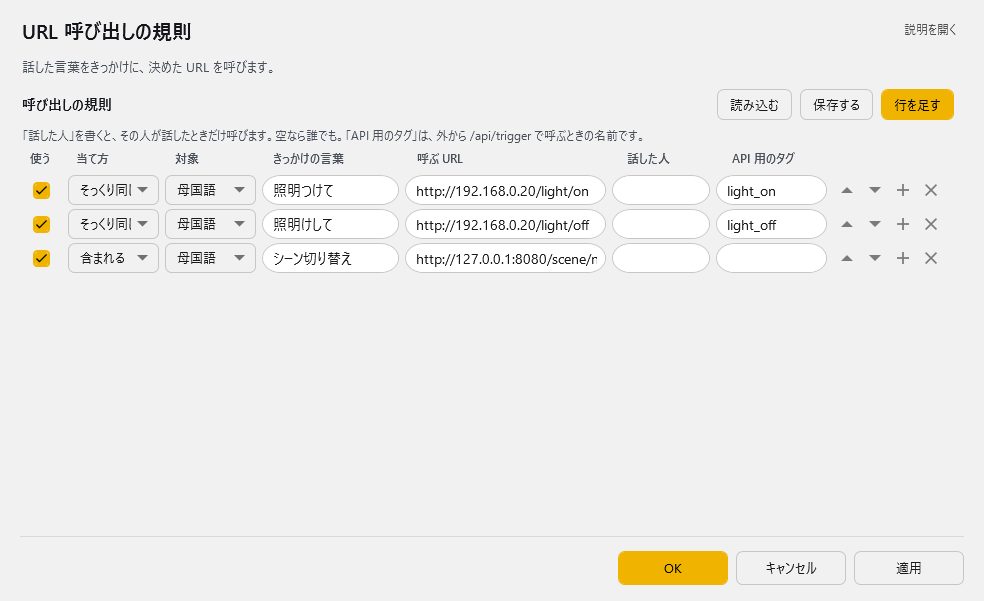

<!-- version-banner -->
!!! info ""
    ゆかコネNEO **v3.0** のドキュメントです。v2.3 をお使いの方は [v2.3 版のこのページ](../../v2.3/plugin/plugin_httpcall.md) を、違いを知りたい方は [v2.3 から v3.0 への移行](../../mig/mig_neo_v3.0.md) をご覧ください。

!!! Info "前提条件"
    * HTTPで呼び出されてつかえる機能（相手）が必要です

## このプラグインで出来ること

* 特定の条件でHTTPの通信を呼び出すことができます。
* CSV形式での柔軟なルール管理
* URL内での動的変数置換（テキスト・言語・話者情報）
* 外部APIからのプログラマティック実行
* 高度なセキュリティ機能（TLS 1.2、プロキシ対応）
* 複数のマッチングモード（完全一致・部分一致）

## 有効化


* プラグインを使うチェックをONにしてください。

## 設定

プラグイン一覧で、このプラグインの名前の右にある **「設定」** を押すと開きます。

!!! info "閉じるときの 3 択"
    設定は**下書き**として持たれ、「OK」か「適用」を押すまで動いているプラグインには効きません。
    変更したまま閉じようとすると「変更が保存されていません」と聞かれ、**［はい］保存して閉じる／［いいえ］破棄して閉じる／［キャンセル］閉じるのをやめる** から選べます。

話した言葉をきっかけに、決めた URL を呼びます。



**呼び出しの規則**（表）

列：使う／当て方／対象／きっかけの言葉／呼ぶ URL／話した人／API 用のタグ

「話した人」を書くと、その人が話したときだけ呼びます。空なら誰でも。「API 用のタグ」は、外から /api/trigger で呼ぶときの名前です。

表の右上の **「行を足す」** で行を増やします。行の右端のボタンは ▲▼＝1 つ上へ／下へ、＋＝この下に足す、×＝この行を消す です。**「保存する」** はいまの中身を CSV へ書き出します（控え用）。**「読み込む」** は CSV から読み込んで、いまの中身と入れ替えます。

## ルール

* ルールは、条件に一致したときにそのデータを送付することができる「仕掛け」です

|設定|意味|
|:--|:---|
|有効(Enabled)|この条件を有効化します|
|モード(Mode)|条件の判断モードを指定します|
|対象|対象にする言語を決めます（母国語、翻訳１～４）|
|起動フレーズ|判断に使う起動キーワードです|
|アドレス|HTTPコールするときの送付先です (httpやhttpsで始まるアドレスになります) |
|対象者|話者名に指定文字が含まれているときに反応します。空欄の場合は全員が対象です|
|APIタグ|APIから呼び出すときにつかうタグ名です|

!!! Info "パラメータの記述"
    * 発話がきっかけで呼び出される場合は、URLの中に下記パラメータが使えます

    |パラメータ|意味|
    |:--------|:---|
    |{text0}|母国語（文）|
    |{text1}|翻訳１（文）|
    |{text2}|翻訳２（文）|
    |{text3}|翻訳３（文）|
    |{text4}|翻訳４（文）|
    |{lang0}|母国語（言語名）|
    |{lang1}|翻訳１（言語名）|
    |{lang2}|翻訳２（言語名）|
    |{lang3}|翻訳３（言語名）|
    |{lang4}|翻訳４（言語名）|
    |{talker}|発話者名|

!!! Warning "パラメータは自動でURLエンコードされます"
    * 差し込まれる値は URLエンコード（パーセントエンコード）されます。日本語は ``%E3%81%82`` のような形になります。
    * 受け取る側でデコードが必要です。

!!! Warning "APIタグで呼び出した場合は空になります"
    * APIタグ経由（``/api/command``）で発火したときは、発話にひもづいていないため**すべてのパラメータが空文字**になります。
    * パラメータを使いたい場合は、起動フレーズによって発火するルールとして設定してください。

!!! Tips "URLの設定例"
    * たとえば、下記のような設定をすると、条件一致時に棒読みちゃんが読み上げます
    ```http://localhost:50080/talk?text={talker}さん、ゆっくりしていってね！```

!!! Tips "URLの設定例"
    * たとえば、下記のような設定をすると、[テロップアシスタント](https://machanbazaar.com/telop-assistants/)をつかって、[プレイバック](https://machanbazaar.com/stream-deck-control/)するなどができます。
    ```http://127.0.0.1:15501/start_playback?ago=0```

## 高度な機能

### ルール管理インターフェース

#### データグリッド機能
* **7列の詳細設定**: 有効/無効、モード、判定対象、キーワード、URL、対象者、APIタグ
* **コンテキストメニュー**:
  - 行の上/下に挿入（Alt+Up/Down）
  - 行の交換（Ctrl+Up/Down） 
  - CSVファイルからのインポート
* **キーボードナビゲーション**: フル対応の表形式編集

#### CSVファイル連携
* **形式**: カンマ区切り値（CSV）での設定保存・読み込み
* **文字エンコーディング**: UTF-8対応
* **外部編集**: Excel等での一括編集が可能

### 判定モード詳細

| モード | 説明 | 使用例 |
|:------|:-----|:-------|
| 完全 | テキストが完全に一致 | 「こんにちは」→完全一致時のみ実行 |
| 一部 | テキストが含まれる | 「こんにちは」→「こんにちは、みなさん」でも実行 |


### トラブルシューティング

#### よくある問題
* **HTTP呼び出しが失敗する**:
  - URLが正しく設定されているか確認
  - ファイアウォール設定をチェック
  - プロキシ環境の場合は設定を確認

* **変数が置換されない**:
  - URLに正しい変数記法（{text0}等）が使用されているか確認
  - 対象言語が正しく設定されているか確認

* **ルールが動作しない**:
  - 「有効」チェックボックスがONになっているか確認
  - マッチングモードが適切に設定されているか確認
  - 対象者フィルターが設定されている場合、話者名が一致しているか確認


