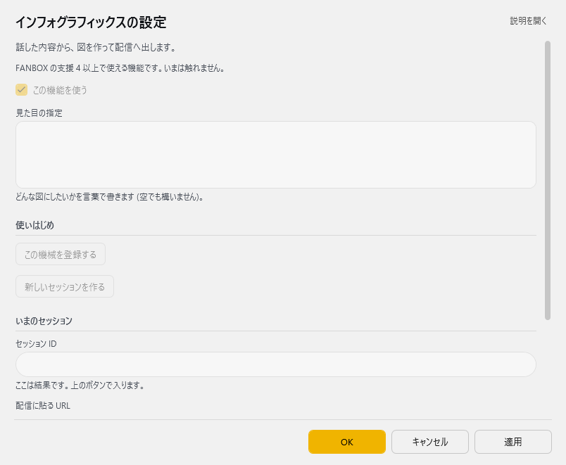

<!-- version-banner -->
!!! info ""
    ゆかコネNEO **v3.0** のドキュメントです。v2.3 をお使いの方は [v2.3 版のこのページ](../../v2.3/plugin/plugin_infographics.md) を、違いを知りたい方は [v2.3 から v3.0 への移行](../../mig/mig_neo_v3.0.md) をご覧ください。

!!! Warning "実験的な機能です"
    * このプラグインは、外部のインフォグラフィックス生成サービスと連携する**開発中の機能**です。
    * サービスの利用登録が必要で、仕様や画面は予告なく変わります。
    * うまく動かない場合はプラグインをOFFにしてください。ゆかコネNEOの通常の動作には影響しません。

!!! Info "前提条件"
    * インターネット接続
    * 連携サービスへの利用登録（プラグインの画面から行います）

## このプラグインで出来ること

* 会話の内容を、外部サービスで図（インフォグラフィックス）に変換します
* できあがった図を、配信ソフトのブラウザソースなどで表示するためのURLが得られます

## 有効化

* プラグイン一覧から「InfoGraphics」のチェックをONにしてください。

<!-- TODO: スクリーンショット未撮影。撮ったら images/plugin_infographics_p1.png として置き、ここに追加する -->

## 設定

プラグイン一覧で、このプラグインの名前の右にある **「設定」** を押すと開きます。

!!! info "閉じるときの 3 択"
    設定は**下書き**として持たれ、「OK」か「適用」を押すまで動いているプラグインには効きません。
    変更したまま閉じようとすると「変更が保存されていません」と聞かれ、**［はい］保存して閉じる／［いいえ］破棄して閉じる／［キャンセル］閉じるのをやめる** から選べます。

話した内容から、図を作って配信へ出します。



| 項目 | 説明 |
|:--|:--|
| ☑ この機能を使う | 既定：ON |
| 見た目の指定 | どんな図にしたいかを言葉で書きます (空でも構いません)。 |

**使いはじめ**

| 項目 | 説明 |
|:--|:--|
| 「この機械を登録する」ボタン | — |
| 「新しいセッションを作る」ボタン | — |

**いまのセッション**

| 項目 | 説明 |
|:--|:--|
| セッション ID | — |
| 配信に貼る URL | — |
| 「いま作らせる」ボタン | — |
| 「貼る URL を取り直す」ボタン | — |

## 使うとき

1. 「登録」を押して、連携サービスの利用登録をします。
2. 「セッション開始」を押します。
3. 「確定文の送信を有効化」をONにします。
4. 「埋め込みURLをコピー」でアドレスを取得し、配信ソフトのブラウザソースに貼り付けます。
5. 話すと、内容にあわせて図が更新されます。

!!! Info "図が更新されないとき"
    * 「手動レンダ」を押すと、いまの内容で作り直せます。
    * 表示が止まっている場合は「埋め込み更新」でアドレスを取り直してから、ブラウザソースを更新してください。

## 外部から操作する

* ``/api/command`` から操作することもできます。

|command|内容|
|:--|:--|
|``status``（省略時）|いまの状態を取得します|
|``auth.register``|利用登録を行います|
|``session.start``|セッションを開始します|
|``render``|図を作り直します|
|``embed.refresh``|表示用のアドレスを作り直します|

=== "状態の取得"
    ```js
        http://localhost:11900/api/command?target=Plugin_InfoGraphics&command=status
    ```

* ``status`` は、有効かどうか・登録済みかどうか・セッションID・表示用アドレスをJSONで返します。
* 詳しくは [プラグイン系API](../tech/tech_api_plugin.md) をご覧ください。

!!! Warning "会話の内容が外部サービスに送られます"
    * このプラグインを有効にすると、確定した字幕が連携サービスへ送信されます。
    * 話す内容に配慮が必要な場面では、「確定文の送信を有効化」をOFFにするか、プラグインを無効にしてください。
