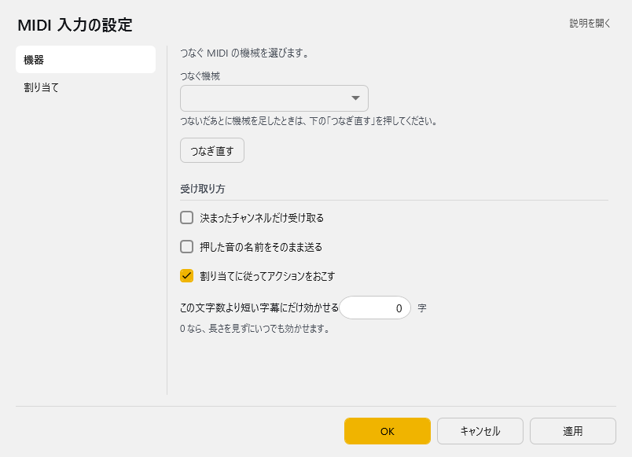

<!-- version-banner -->
!!! info ""
    ゆかコネNEO **v3.0** のドキュメントです。v2.3 をお使いの方は [v2.3 版のこのページ](../../v2.3/plugin/plugin_midiinput.md) を、違いを知りたい方は [v2.3 から v3.0 への移行](../../mig/mig_neo_v3.0.md) をご覧ください。

!!! Info "前提条件"
    * WindwosのMIDI入力デバイスにアクセスできる場合のみ使用可能

## このプラグインで出来ること

* MIDIデバイスから入力された音程コードを表示します。
* リアルタイムMIDI入力処理
* 音楽記号表記での音階表示（[C4], [G#3]等）
* カスタムテキストマッピング機能
* MIDIチャンネルフィルタリング
* 押下ノート状態の可視化
* CSV形式でのマッピング管理

!!! Info "この機能はWindows側の安定度にかなり左右されます"
    * WindowsのMIDIインタフェイス周りが不安定な場合、通信が途切れることがあります

##　有効化


* プラグインを使うチェックをONにしてください。

## 設定

プラグイン一覧で、このプラグインの名前の右にある **「設定」** を押すと開きます。
画面は **2 ページ**に分かれていて、左の一覧で切り替えます（機器／割り当て）。

!!! info "閉じるときの 3 択"
    設定は**下書き**として持たれ、「OK」か「適用」を押すまで動いているプラグインには効きません。
    変更したまま閉じようとすると「変更が保存されていません」と聞かれ、**［はい］保存して閉じる／［いいえ］破棄して閉じる／［キャンセル］閉じるのをやめる** から選べます。

### 機器

つなぐ MIDI の機械を選びます。



| 項目 | 説明 |
|:--|:--|
| つなぐ機械 | つないだあとに機械を足したときは、下の「つなぎ直す」を押してください。 |
| 「つなぎ直す」ボタン | — |

**受け取り方**

| 項目 | 説明 |
|:--|:--|
| ☑ 決まったチャンネルだけ受け取る | 既定：OFF |
| ☑ 押した音の名前をそのまま送る | 既定：OFF |
| ☑ 割り当てに従ってアクションをおこす | 既定：ON |
| この文字数より短い字幕にだけ効かせる | 0 なら、長さを見ずにいつでも効かせます。（0～1000字。既定：0） |

### 割り当て

押した音に、おこしたいアクションを当てます。

| 項目 | 説明 |
|:--|:--|
| 割り当ての置き場 | 空なら … を使います。置き場を変えたときは、いったん閉じて開き直してください(下の表は開いたときの置き場を見ています)。（右の「…」で選べます） |

**音とアクションの割り当て**（表）

列：音 (ノート)／アクション／送る文字や設定値

「音」は C4 のような名前で書きます ([C4] と括弧で囲んでも構いません)。「ゆかコネに送る」は設定値の文字を字幕として送り、「WordParty を起動」は設定値に入れた ID の WordParty をわんコメで起動します。

表の右上の **「行を足す」** で行を増やします。行の右端のボタンは ▲▼＝1 つ上へ／下へ、＋＝この下に足す、×＝この行を消す です。**「保存する」** はいまの中身を CSV へ書き出します（控え用）。**「読み込む」** は CSV から読み込んで、いまの中身と入れ替えます。

### 補足

* 「機器」ページで使う MIDI 機器を選び、**「つなぎ直す」** を押してください。あとから機器を足したときも同じです。
* 「割り当て」ページの **割り当ての置き場** を空のままにすると、設定フォルダの中の `midimap.csv` を使います。
  置き場を変えたときは、いったん設定画面を閉じて開き直してください（表は開いたときの置き場を見ています）。
* 「音」は `C4` のような名前で書きます（`[C4]` と括弧で囲んでも構いません）。

## 高度な機能

### MIDI デバイス管理

#### デバイス選択・接続
* **デバイス一覧**: システム内の利用可能MIDIデバイスを自動検出
* **リアルタイム接続**: プラグイン動作中のデバイス接続・切断
* **デバイス更新**: 「デバイス再読込」ボタンで最新状況を反映
* **接続状態表示**: 現在の接続状況をリアルタイム表示

#### 対応デバイス
* **ハードウェア**: MIDI キーボード、コントローラー
* **ソフトウェア**: 仮想MIDIポート、DAWアプリケーション
* **USB MIDI**: USB接続のMIDIデバイス全般

### 音階処理システム

#### 音楽記号表記
* **表記形式**: `[音名]オクターブ番号`
* **音名表記**: C, C#, D, D#, E, F, F#, G, G#, A, A#, B
* **オクターブ**: 0-10 (MIDI仕様準拠)
* **例**: C4 (中央ハ), G#3 (ソのシャープ), F5 (高音域ファ)

#### ノート状態管理
* **押下ノート追跡**: 現在押されているノートのリスト表示
* **同時押し対応**: 複数ノート同時押下の検出・表示
* **リリース検出**: ノート離し（Note Off）の適切な処理

### テキストマッピング機能

#### カスタムテキスト変換
* **ノート→テキスト**: MIDIノート番号を任意のテキストに変換
* **用途例**: 
  - C4 → "ド"
  - G#3 → "ソのシャープ"
  - C5 → "高いド"

#### CSV マッピング管理
* **ファイル形式**: UTF-8エンコードCSV
* **フォーマット**: "MIDIノート, 出力テキスト"
* **例**:
```csv
60,"中央ハ"
67,"ト音"
72,"高音ハ"
```

#### グリッドエディタ
* **インターフェース**: DataGridView による直接編集
* **リアルタイム更新**: 編集内容の即座反映
* **保存・読込**: CSV ファイルでの設定管理

### MIDIチャンネル制御

#### チャンネルフィルタリング
* **機能**: 特定MIDIチャンネルのみを処理対象にする
* **チャンネル範囲**: 1-16 (MIDI標準)
* **用途**: マルチチャンネル機器での特定パートのみ抽出
* **設定**: チャンネル番号指定または全チャンネル受信

### 送信モード設定

#### 出力オプション
| モード | 出力内容 | 用途 |
|:------|:---------|:-----|
| 音楽記号送信 | [C4], [G#3] 等 | 音楽理論学習、楽譜読み |
| マッピング送信 | カスタムテキスト | 歌詞、効果音、コマンド |

### 技術仕様

#### MIDI処理
* **ライブラリ**: NAudio.Midi
* **対応範囲**: MIDI 1.0 標準準拠
* **ノート範囲**: 0-127 (C-1 ～ G9)
* **フィルタリング**: MIDIクロック除去（248, 254, >30000）

### トラブルシューティング

#### デバイスが認識されない
* **確認事項**: デバイスの接続とドライバ状況
* **対処法**: デバイス再読込ボタンの使用
* **システム設定**: Windows MIDIデバイス設定の確認

#### 音が出力されない
* **送信モード**: 適切な送信モードの選択確認
* **チャンネル設定**: MIDIチャンネル制限の確認
* **マッピング**: カスタムマッピングの設定状況確認

## 使い方
1. MIDI入力があると、音程信号が入力として送付されます
