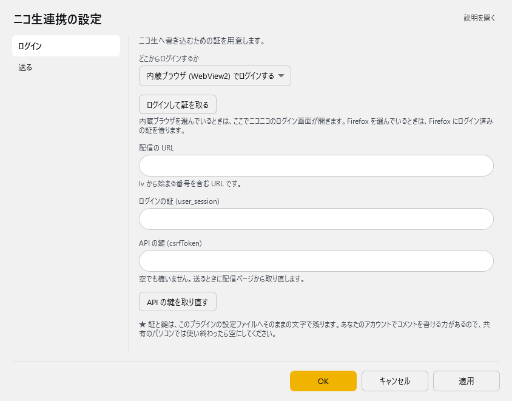
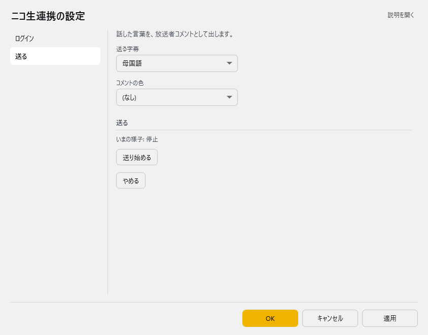

<!-- version-banner -->
!!! info ""
    ゆかコネNEO **v3.0** のドキュメントです。v2.3 をお使いの方は [v2.3 版のこのページ](../../v2.3/plugin/plugin_niconama.md) を、違いを知りたい方は [v2.3 から v3.0 への移行](../../mig/mig_neo_v3.0.md) をご覧ください。

!!! Info "前提条件"
    * ニコニコ生放送で配信をしていること
    * 配信中の番組のURL（``https://live.nicovideo.jp/watch/lv…``）

## このプラグインで出来ること

* 音声認識した字幕を、ニコニコ生放送のコメントとして送信できます
* 送信する言語（母国語・翻訳1～4）を選べます
* コメントの色を指定できます

## 有効化

* プラグイン一覧から「ニコニコ生放送連携」のチェックをONにしてください。

<!-- TODO: スクリーンショット未撮影。撮ったら images/plugin_niconama_p1.png として置き、ここに追加する -->

## 設定

プラグイン一覧で、このプラグインの名前の右にある **「設定」** を押すと開きます。
画面は **2 ページ**に分かれていて、左の一覧で切り替えます（ログイン／送る）。

!!! info "閉じるときの 3 択"
    設定は**下書き**として持たれ、「OK」か「適用」を押すまで動いているプラグインには効きません。
    変更したまま閉じようとすると「変更が保存されていません」と聞かれ、**［はい］保存して閉じる／［いいえ］破棄して閉じる／［キャンセル］閉じるのをやめる** から選べます。

### ログイン

ニコ生へ書き込むための証を用意します。

| 項目 | 説明 |
|:--|:--|
| どこからログインするか | 選択肢：Firefox に入っている証を借りる／内蔵ブラウザ (WebView2) でログインする。既定：内蔵ブラウザ (WebView2) でログインする |
| 「ログインして証を取る」ボタン | 内蔵ブラウザを選んでいるときは、ここでニコニコのログイン画面が開きます。Firefox を選んでいるときは、Firefox にログイン済みの証を借ります。 |
| 配信の URL | lv から始まる番号を含む URL です。 |
| ログインの証 (user_session) | — |
| API の鍵 (csrfToken) | 空でも構いません。送るときに配信ページから取り直します。 |
| 「API の鍵を取り直す」ボタン | — |

> ★ 証と鍵は、このプラグインの設定ファイルへそのままの文字で残ります。あなたのアカウントでコメントを書ける力があるので、共有のパソコンでは使い終わったら空にしてください。

### 送る

話した言葉を、放送者コメントとして出します。

| 項目 | 説明 |
|:--|:--|
| 送る字幕 | 選択肢：母国語／翻訳 1／翻訳 2／翻訳 3／翻訳 4。既定：母国語 |
| コメントの色 | 既定：0 |

**送る**

> いまの様子: …

| 項目 | 説明 |
|:--|:--|
| 「送り始める」ボタン | — |
| 「やめる」ボタン | — |

### 補足

!!! info "v3.0 で内蔵ブラウザが WebView2 になりました"
    v2.3 では内蔵ブラウザとして CefSharp（Chromium）と WebView2 を選べましたが、
    v3.0 では **WebView2 だけ**になりました。
    **WebView2 ランタイム**が必要です（Windows 11 は標準、Windows 10 も Edge が入っていれば入っています）。
    ログイン状態は WebView2 側に保存されるため、**v2.3 でログインしていても入り直しが必要になることがあります**。

## 使うとき

1. ニコニコ生放送で配信を開始します。
2. 配信URLを設定画面に貼り付けます。
3. 「セッション自動取得」→「APIキー自動取得」の順に押します。
4. 送信する字幕を選び、OKを押します。
5. 音声認識を始めると、確定した字幕がコメントとして送られます。

!!! Info "自動取得がうまくいかないとき"
    * 自動取得は、選んだブラウザにニコニコへログインした状態が残っていることを前提にしています。
    * ブラウザでニコニコにログインし直してから、もう一度お試しください。
    * それでも取得できない場合は、APIキーとユーザセッションを手で入力することもできます。

!!! Warning "コメントの投稿間隔について"
    * ニコニコ生放送には、コメントの投稿間隔や内容についてのルールがあります。
    * 認識のたびに大量のコメントを投稿すると、配信の見え方を損なったり、制限がかかることがあります。送信する言語をしぼって使うことをおすすめします。
