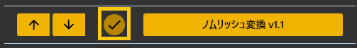
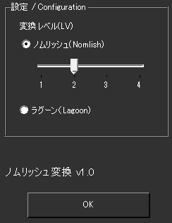

<!-- version-banner -->
!!! info ""
    ゆかコネNEO **v3.0** のドキュメントです。v2.3 をお使いの方は [v2.3 版のこのページ](../../v2.3/plugin/plugin_nomlish.md) を、違いを知りたい方は [v2.3 から v3.0 への移行](../../mig/mig_neo_v3.0.md) をご覧ください。

!!! Info "前提条件"
    * なし

## このプラグインで出来ること

* 認識後の文字を強制的にノムリッシュ置き換えることができます
* 2つの変換モード（ノムリッシュ・ラグーン）
* 4段階の変換レベル制御
* リアルタイムAPIベース変換

!!! note "この置換機能について"
    * [ノムリッシュ変換](https://racing-lagoon.info/nomu/translate.php)のAPIを用いて実現しています。

## ノムリッシュ変換プラグインができることは

* ノムリッシュ語とは、ファイナルファンタジー風の口調・用語で語られた文章のことを指します。このプラグインは、入力された文章をノムリッシュ語や、「ゲームレーシング」風のラグーン語に変換します。

##　有効化

* プラグインを使うチェックをONにしてください。

<!-- wpf-settings-note -->
!!! info "v3.0 で設定画面が新しくなりました"
    見た目がほかのプラグインと揃い、**表示言語に合わせて日本語・英語などで出る**ようになりました。
    各項目には「何を入れる欄なのか」「空のままだとどうなるのか」の説明が付いています。
    変換の種類と強さを設定します。

    設定は**下書き**として持たれます。閉じるときに「適用」「破棄」「続ける」の 3 択が出るので、
    試して気に入らなければ破棄できます。
    新しい画面が開けなかったときは、従来の画面が代わりに開きます。
    → [プラグインの有効化](enabled.md)

## 設定

|設定|意味|
|:--|:---|
|変換レベル|変換内容をきめます（1-4の段階設定）|
|変換モード|ノムリッシュ/ラグーンモードの選択|

## 詳細機能

### 変換モード

#### ノムリッシュモード（デフォルト）
* **特徴**: ファイナルファンタジー風の口調・用語変換
* **例**: 「こんにちは」→「挨拶をするのだ」
* **用途**: RPG風の演出、配信エンターテイメント

#### ラグーンモード  
* **特徴**: 「レーシングラグーン」風の口調変換
* **例**: より独特なゲーム用語への変換
* **用途**: 特殊な演出効果、個性的な表現

### 変換レベル制御

| レベル | 変換強度 | 説明 |
|:------|:---------|:-----|
| 1 | 軽微 | 基本的な語尾変換のみ |
| 2 | 標準 | バランスの取れた変換（デフォルト）|
| 3 | 強化 | 積極的な用語置換 |
| 4 | 最大 | 最も強力な変換処理 |

## 制約・仕様

* ノムリッシュ変換ＡＰＩは日本語にのみ変換されます。母国語や変換先に日本語がない場合は変換されません。
* ノムリッシュ変換ＡＰＩが混んでいて動かない場合は変換できません。
* 変換には少々待ち時間がかかることがあります。
* 他者作成のＡＰＩを使用させていただいております。予告なくサービスが終了することがあります。

## 使うとき

* 音声認識と同時に置換されます。
* わんコメと連携している場合には、わんコメ受信結果にも適用されます。読み上げプラグインもONにすることで、ノムリッシュ変換後の文章を読み上げさせることができます。