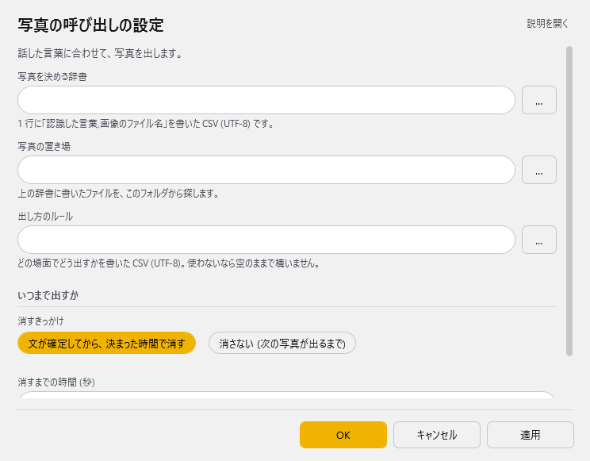

<!-- version-banner -->
!!! info ""
    ゆかコネNEO **v3.0** のドキュメントです。v2.3 をお使いの方は [v2.3 版のこのページ](../../v2.3/plugin/plugin_photopickup.md) を、違いを知りたい方は [v2.3 から v3.0 への移行](../../mig/mig_neo_v3.0.md) をご覧ください。

!!! Info "前提条件"
    * なし

## このプラグインで出来ること

* 指定した単語を含んでいたら、写真を表示します


##　有効化


* プラグインを使うチェックをONにしてください。

## 動作の仕組み

* 認識の基準は表示ルールで決めます。
* 表示ルールがなければ、ファイル名と同じ言葉を検出したら表示します

!!! Note "扱える写真の形式"
    * PNG
    * JPEG
    * BMP
    * GIF
    * そのほかにも対応しているものが若干あります

## 設定

プラグイン一覧で、このプラグインの名前の右にある **「設定」** を押すと開きます。

!!! info "閉じるときの 3 択"
    設定は**下書き**として持たれ、「OK」か「適用」を押すまで動いているプラグインには効きません。
    変更したまま閉じようとすると「変更が保存されていません」と聞かれ、**［はい］保存して閉じる／［いいえ］破棄して閉じる／［キャンセル］閉じるのをやめる** から選べます。

話した言葉に合わせて、写真を出します。



| 項目 | 説明 |
|:--|:--|
| 写真を決める辞書 | 1 行に「認識した言葉,画像のファイル名」を書いた CSV (UTF-8) です。（右の「…」で選べます） |
| 写真の置き場 | 上の辞書に書いたファイルを、このフォルダから探します。（右の「…」で選べます） |
| 出し方のルール | どの場面でどう出すかを書いた CSV (UTF-8)。使わないなら空のままで構いません。（右の「…」で選べます） |

**いつまで出すか**

| 項目 | 説明 |
|:--|:--|
| 消すきっかけ | 選択肢：文が確定してから、決まった時間で消す／消さない (次の写真が出るまで)。既定：消さない (次の写真が出るまで) |
| 消すまでの時間 (秒) | 上で「決まった時間で消す」を選んだときに使います。（既定：「2」） |

### 補足

#### ファイル特定辞書の作り方

!!! Info "編集方法"
    * Excel もしくは メモ帳で実施します。

=== "Case1:Excelの場合"

    
    1. Excelでデータを作ります。

    2. CSVファイルとして保存します。

    
=== "Case2:メモ帳の場合"

    1. 下記のようなファイルを作ります。

    ``` js
    おはよう,goodmorning.png
    ```
    2. CSV（UTF8エンコード)で保存します。

#### ルールファイルの作り方

!!! Info "編集方法"
    * Excel もしくは メモ帳で実施します。

=== "Case1:Excelの場合"


    1. Excelでデータを作ります。

    2. CSVファイルとして保存します。

    
=== "Case2:メモ帳の場合"

    1. 下記のようなファイルを作ります。

    ``` js
    goodmorning.png.[^0-9]
    ```
    2. CSV（UTF8エンコード)で保存します。

## 高度な機能

### 辞書ベース画像認識システム

#### スマートマッチング
* **順序処理**: ソートされた辞書による効率的な検索
* **部分一致**: テキスト内での柔軟な検索機能
* **最初一致**: 最初にマッチしたルールでの即座実行

#### 辞書構造
```csv
検索キーワード, 画像ファイル名
おはよう, goodmorning.png
こんにちは, hello.jpg
おやすみ, goodnight.bmp
```

### 正規表現ルールエンジン

#### 高度なパターンマッチング
* **正規表現対応**: 複雑な条件による画像選択
* **複数ルール**: 複数の正規表現ルールの組み合わせ
* **動的追加**: 実行時での新規ルール追加機能

#### ルール例
```csv
画像ファイル名, 正規表現
weather.png, (天気|気候|晴れ|雨|雪)
number.png, [0-9]+
greeting.png, (おはよう|こんにちは|こんばんは)
```

### キャッシュ管理システム

#### メモリ最適化
* **自動キャッシュ**: 頻繁に使用される画像のメモリ保持
* **タイマー制御**: 定期的なメモリ解放処理
* **効率的読み込み**: 一度読み込んだ画像の再利用

#### リソース管理
```csharp
// 自動メモリ管理
Timer AutoDispose = new Timer();
AutoDispose.Interval = 5000; // 5秒間隔
AutoDispose.Enabled = true;
```

### フォールバック検索機能

#### 多段階検索システム
1. **辞書マッチング**: 最初に辞書による検索実行
2. **ファイル名検索**: 辞書に該当なしの場合のファイル名マッチング
3. **大文字小文字無視**: 柔軟な文字列比較
4. **ディレクトリスキャン**: フォルダ内の自動画像発見

#### 検索アルゴリズム
```csharp
// 優先順位付き検索
foreach (string searchKey in SortedDic) {
    if (Text.IndexOf(searchKey) >= 0) {
        CardQuery = ReplaceDic[searchKey];
        break;
    }
}
```

### マルチフォーマット対応

#### 対応画像形式
| 形式 | 拡張子 | 特徴 |
|:-----|:-------|:-----|
| PNG | .png | 透明度対応、高品質 |
| JPEG | .jpg, .jpeg | 圧縮効率、写真向け |
| BMP | .bmp | 無圧縮、高速読み込み |
| GIF | .gif | アニメーション対応 |
| その他 | .tiff, .webp | 拡張フォーマット |

#### 形式別最適化
* **PNG**: 透明度情報の適切な処理
* **JPEG**: 圧縮品質の自動検出
* **GIF**: アニメーション再生制御
* **BMP**: 高速メモリ読み込み

### 実用例

#### イベント連動表示
```csv
キーワード, 画像
誕生日, birthday_celebration.png
記念日, anniversary.jpg
お疲れ様, thankyou.gif
```

#### 感情表現システム
```csv
正規表現, 画像
(嬉しい|楽しい|幸せ), happy_face.png
(悲しい|辛い|つらい), sad_face.png
(驚き|びっくり), surprise.jpg
```

#### 季節・天候連動
```csv
キーワード, 画像
春, sakura.png
夏, beach.jpg
秋, autumn_leaves.png
冬, snow.gif
```

### トラブルシューティング

#### 画像が表示されない
* **ファイル存在**: 指定パスでの画像ファイル確認
* **形式対応**: サポートされているフォーマットの確認
* **権限設定**: 画像ファイルのアクセス権限確認

#### マッチングが正常でない
* **辞書順序**: CSV辞書の記述順序確認
* **正規表現**: パターンの正確性確認
* **エンコード**: CSVファイルのUTF-8エンコード確認

#### メモリ使用量が多い
* **キャッシュ設定**: 自動解放間隔の調整
* **画像サイズ**: 適切な解像度での画像準備
* **フォーマット選択**: 用途に応じた最適形式の選択

## 使い方
1. 音声認識させると自動的に処理され、写真表示画面に読み込まれます。

