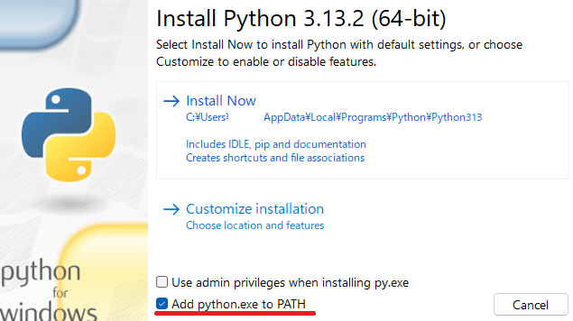
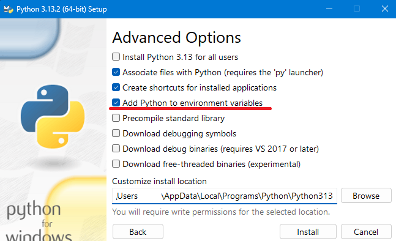

<!-- version-banner -->
!!! info ""
    ゆかコネNEO **v3.0** のドキュメントです。v2.3 をお使いの方は [v2.3 版のこのページ](../../v2.3/plugin/plugin_pythonunit.md) を、違いを知りたい方は [v2.3 から v3.0 への移行](../../mig/mig_neo_v3.0.md) をご覧ください。

!!! Info "前提条件"
    * v2.1.59～

## このプラグインで出来ること

* Pythonというプログラム言語を使って、字幕の表示内容を自由に変更できます
* 簡単なプログラムで、認識結果を好きなように加工できます

## 有効化


* プラグインを使うチェックをONにしてください。

## 設定

プラグイン一覧で、このプラグインの名前の右にある **「設定」** を押すと開きます。

!!! info "閉じるときの 3 択"
    設定は**下書き**として持たれ、「OK」か「適用」を押すまで動いているプラグインには効きません。
    変更したまま閉じようとすると「変更が保存されていません」と聞かれ、**［はい］保存して閉じる／［いいえ］破棄して閉じる／［キャンセル］閉じるのをやめる** から選べます。

置き場に入れた .py が、字幕の通り道で呼ばれます。

**置き場**

| 項目 | 説明 |
|:--|:--|
| 「フォルダを開く」ボタン | ここへ .py を置くと、次の発話から呼ばれます。 |

**読み込み直す**

| 項目 | 説明 |
|:--|:--|
| 「いま置いてある .py を読み込み直す」ボタン | 本体を立ち上げ直さずに、書き替えた .py を反映します。 |

## 初期設定

!!! Info "Pythonのインストールが必要です"
    * Python3のインストールが必要です
    * Microsoftストアではなく、[Python公式サイト](https://www.python.org/downloads/windows/)から、ダウンロードしてください。
    * 脆弱性などの関係から、古いバージョンはお勧めしません

* 注意点としては、インストール時に表示されるパスを通すチェックをONにする必要があります。



## 使うとき

1. Python をインストールしておきます。
2. 設定画面のフォルダを開き、Pythonプログラム（～.py）を入れます
3. 自動的に読み込まれ、音声認識するたびに内部で動きます。
4. ファイルを書き換えたら、ゆかコネを再起動するかモジュール再読み込みボタンをおしてください。

!!! Info "Pythonプログラムのファイルを消した時"
    * ゆかコネの再起動が必要です

!!! Info "フォルダの中の .py はすべて読み込まれます"
    * 「フォルダを開く」で開いた場所にある ``.py`` ファイルは、すべて読み込まれます。
    * 一時的に無効にしたい場合は、拡張子を変える（``.py.bak`` にするなど）か、別のフォルダへ移してください。

!!! Info "このプラグインはAPIから操作できません"
    ``/api/command`` から Python のプログラムを呼び出すことはできません。

## プログラム例（初心者向け）

!!! Info "例題"
    * 音声認識で「です」と表示されるところをすべて「にゃん」にします
    * 翻訳１の「今日」をすべて「昨日」と解釈して翻訳します
    * 翻訳１文の「weather」をすべて「❤」にします

``` Python
#=====================================================
# ゆかコネNEO Pythonプラグイン拡張 サンプル
#=====================================================
# ・Pythonでつくれるプラグインモジュールです
# ・Pythonスクリプトで動かすより、コンパイルしたほう
#   速いですが、Pythonで書くほうがおそらく簡単です
#=====================================================

#=====================================================
# 音声認識されたとき
#=====================================================
# これは、音声認識されるたびに呼び出されます。
# ここを書き換えると、母国語の表示を置換できます。
# Message["TextFixed"] が True ならば、音声認識で文が確定した状態です
# Message["isDeleted"] が True ならば、文が取り消されたことを意味します
def PostRecognition(Message):
    text = Message["Text"]
    text = text.replace('です', 'にゃん')
    return text

#=====================================================
# 翻訳を実行する前
#=====================================================
# これは、翻訳を掛ける前の状態を変更できます。
# Text1～Text4　は、それぞれ翻訳１～翻訳４に対応する母国語です。
# ここを書き換えたあとのものが翻訳されます。
# Message["Language1"] １～４が、翻訳先言語コードです
# Message["Native"] が母国語言語コードです
# Message["ID"] をみると、文章のユニークなIDが得られます
def PreTranslation(Message):
    text = Message["Text1"]
    text = text.replace('今日', '昨日')
    Message["Text1"] = text
    return Message
    
#=====================================================
# 翻訳を実行した後
#=====================================================
# これは、翻訳を掛けたあとの状態を変更できます。
# Text1～Text4　は、それぞれ翻訳１～翻訳４に対応する翻訳後文です。
# ここを書き換えたあとのものが表示されます。
def PostTranslation(Message):
    text = Message["Text1"]
    text = text.replace('weather', '❤')
    Message["Text1"] = text
    return Message
```

## プログラミングが初めての方へ

このプラグインはプログラミングの知識が必要です。上記の例を参考に、以下の部分を変更してみてください：

* `'です'` と `'にゃん'` の部分を、変更したい文字に書き換える
* `replace` は「置き換える」という意味です
* ファイルを保存したら「モジュール再読み込み」ボタンを押してください

## よくある質問

**Q: プログラムがうまく動きません**  
A: Pythonが正しくインストールされているか確認してください。インストール時に「パスを通す」チェックをONにする必要があります。

**Q: ファイルはどこに保存すればいいですか？**  
A: 「フォルダを開く」ボタンを押すと、保存する場所が開きます。そこに「.py」で終わるファイル名で保存してください。

**Q: エラーが出ます**  
A: プログラムの書き方に間違いがある可能性があります。上記の例をそのままコピーしてから、少しずつ変更してみてください。