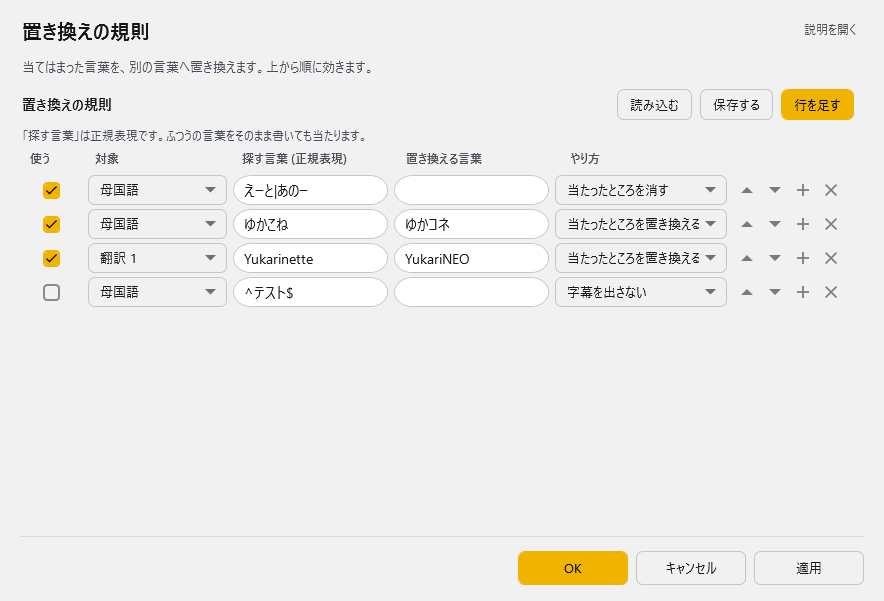

<!-- version-banner -->
!!! info ""
    ゆかコネNEO **v3.0** のドキュメントです。v2.3 をお使いの方は [v2.3 版のこのページ](../../v2.3/plugin/plugin_regexp.md) を、違いを知りたい方は [v2.3 から v3.0 への移行](../../mig/mig_neo_v3.0.md) をご覧ください。

!!! Info "前提条件"
    * なし

## このプラグインで出来ること

* 認識された文字を自動的に置き換えることができます
* 言い間違いや不適切な言葉を修正できます
* 専門用語を分かりやすい言葉に変換できます

!!! note "この置換機能について"
    * ゆかりねっととの互換があるようにつくっています

##　有効化

* プラグインを使うチェックをONにしてください。

## 設定

プラグイン一覧で、このプラグインの名前の右にある **「設定」** を押すと開きます。

!!! info "閉じるときの 3 択"
    設定は**下書き**として持たれ、「OK」か「適用」を押すまで動いているプラグインには効きません。
    変更したまま閉じようとすると「変更が保存されていません」と聞かれ、**［はい］保存して閉じる／［いいえ］破棄して閉じる／［キャンセル］閉じるのをやめる** から選べます。

当てはまった言葉を、別の言葉へ置き換えます。上から順に効きます。

**置き換えの規則**（表）

列：使う／対象／探す言葉 (正規表現)／置き換える言葉／やり方

「探す言葉」は正規表現です。ふつうの言葉をそのまま書いても当たります。

表の右上の **「行を足す」** で行を増やします。行の右端のボタンは ▲▼＝1 つ上へ／下へ、＋＝この下に足す、×＝この行を消す です。**「保存する」** はいまの中身を CSV へ書き出します（控え用）。**「読み込む」** は CSV から読み込んで、いまの中身と入れ替えます。

## オプション

* ゆかりねっとが入っている場合は、インポートボタンを押すことで自動取り込みします。

## よく使うパターン例

### 言い間違いの修正
- 「です」→「だ」（関西弁風に変更）
- 「えー」→「」（削除）
- 「あの」→「」（削除）

### 専門用語の分かりやすい言葉への変更
- 「API」→「アプリの接続機能」
- 「レスポンシブ」→「画面サイズに合わせて表示を変える」
- 「UI」→「画面デザイン」

### 不適切な言葉のフィルタ
- 特定の言葉を「****」に置き換える

## 基本的な使い方

1. 「置換前」に変更したい言葉を入力
2. 「置換後」に変更後の言葉を入力
3. 「有効」にチェックを入れる
4. 「テスト」で動作を確認

!!! tip "初心者の方へ"
    複雑な正規表現は使わずに、そのまま文字を入力するだけでも十分に機能します。例：「です」→「だ」

## よくある質問

**Q: 正規表現って何ですか？**  
A: 文字列の検索パターンを指定する書き方ですが、普通の文字をそのまま入力するだけでも使えます。

**Q: うまく置換されません**  
A: 「テスト」機能で確認してみてください。大文字・小文字や全角・半角の違いも確認してください。

**Q: 設定がたくさんあって分かりません**  
A: まずは簡単な例（「です」→「だ」など）から始めてみてください。