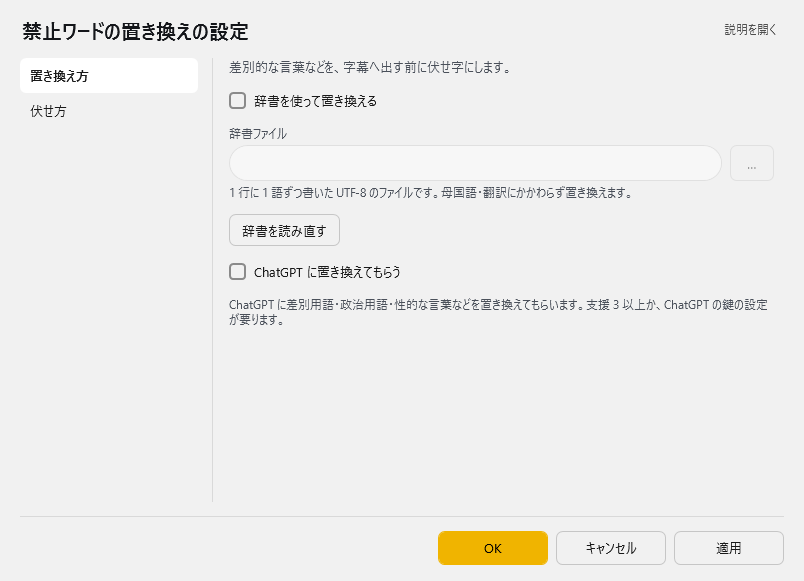
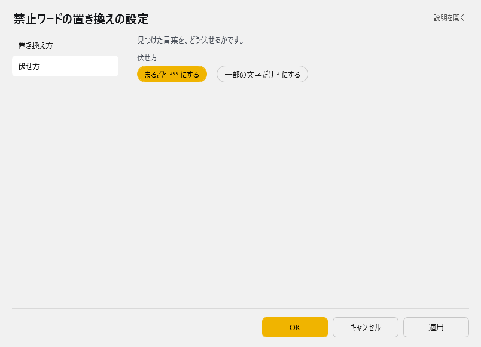

<!-- version-banner -->
!!! info ""
    ゆかコネNEO **v3.0** のドキュメントです。v2.3 をお使いの方は [v2.3 版のこのページ](../../v2.3/plugin/plugin_replacefwords.md) を、違いを知りたい方は [v2.3 から v3.0 への移行](../../mig/mig_neo_v3.0.md) をご覧ください。

!!! Info "前提条件"
    * なし
    * AIフィルタリング機能を使用する場合は、OpenAI APIキーが必要

## このプラグインで出来ること

* 不適切な言葉（F-Words）を自動的に検出して置換します
* カスタム辞書を使用して特定の単語をフィルタリングします
* AIを使用した高度なコンテンツフィルタリングが可能です

## 有効化

<!-- TODO: スクリーンショット未撮影。撮ったら images/plugin_replacefwords_p1.png として置き、次の行を有効にする -->
<!--  -->

* プラグインを使うチェックをONにしてください。

## 動作の仕組み

このプラグインは、音声認識された文字列から不適切な言葉を検出し、自動的に置換する機能を提供します。

### フィルタリング方式

1. **辞書ベースフィルタリング**
   - 事前定義された単語リストによる検出
   - カスタム辞書の追加が可能
   - 単語を「***」や指定文字に置換

2. **AIベースフィルタリング**
   - OpenAI APIを使用した文脈判断
   - より自然な置換表現の生成
   - 文章全体の意味を保ちながらフィルタリング

## 設定

プラグイン一覧で、このプラグインの名前の右にある **「設定」** を押すと開きます。
画面は **2 ページ**に分かれていて、左の一覧で切り替えます（置き換え方／伏せ方）。

!!! info "閉じるときの 3 択"
    設定は**下書き**として持たれ、「OK」か「適用」を押すまで動いているプラグインには効きません。
    変更したまま閉じようとすると「変更が保存されていません」と聞かれ、**［はい］保存して閉じる／［いいえ］破棄して閉じる／［キャンセル］閉じるのをやめる** から選べます。

### 置き換え方

差別的な言葉などを、字幕へ出す前に伏せ字にします。



| 項目 | 説明 |
|:--|:--|
| ☑ 辞書を使って置き換える | 既定：OFF |
| 辞書ファイル | 1 行に 1 語ずつ書いた UTF-8 のファイルです。母国語・翻訳にかかわらず置き換えます。（右の「…」で選べます） |
| 「辞書を読み直す」ボタン | — |
| ☑ ChatGPT に置き換えてもらう | 既定：OFF |

> ChatGPT に差別用語・政治用語・性的な言葉などを置き換えてもらいます。支援 3 以上か、ChatGPT の鍵の設定が要ります。

### 伏せ方

見つけた言葉を、どう伏せるかです。



| 項目 | 説明 |
|:--|:--|
| 伏せ方 | 選択肢：まるごと *** にする／一部の文字だけ * にする。既定：一部の文字だけ * にする |

### 補足

* **辞書を使って置き換える**：1 行に 1 語ずつ書いた UTF-8 のテキストファイルを指定します。母国語・翻訳にかかわらず置き換えます。
  ファイルを書き換えたときは **「辞書を読み直す」** を押すと、すぐ反映されます。
* **ChatGPT に置き換えてもらう**：差別用語・政治用語・性的な言葉などを ChatGPT に判断してもらいます。
  支援 3 以上か、ChatGPT の鍵の設定が要ります。応答を待つぶん、字幕が少し遅れます。
* 見つけた言葉の伏せ方は「伏せ方」ページで選びます（まるごと `***` にする／一部の文字だけ `*` にする）。

## 辞書ファイルの形式

辞書ファイルはテキストファイル（.txt）で、1行に1単語を記載します：

```
不適切な単語1
不適切な単語2
不適切な単語3
```

### カスタム置換の設定

タブ区切りで置換後の文字を指定することも可能です：

```
不適切な単語1	[削除]
不適切な単語2	○○○
不適切な単語3	***
```

## 使用例

### 配信での活用

ライブ配信で視聴者に適切なコンテンツを提供：

* 子供向け配信での自動フィルタリング
* 企業配信でのコンプライアンス対応
* 教育コンテンツでの言葉の制限

### AI フィルタリングの例

**入力**: 「この○○○な状況は本当に困る」
**出力**: 「この困難な状況は本当に困る」

AIフィルタリングは文脈を理解して、より自然な置換を行います。

## 詳細設定

### AIモデル設定

使用されるAIモデル：
* **モデル**: gpt-4.1-mini（コード内設定）
* **Temperature**: 0.5（適度な創造性）
* **Max Tokens**: 1000（応答最大長）

### 内蔵プロンプト

AIフィルタリングで使用される内蔵プロンプト：

#### システムロール
```
You are a modifier and only modified statements are permitted to be answered.
If a word contains violence, sexuality, political ideology, discrimination or a swearword, 
replace the word with '*'. Answers should be in the same language as the text and replies should be in response only.
```

#### 処理内容
* 暴力的表現、性的表現、政治的イデオロギー、差別的表現、罵倒語を「*」で置換
* 元の言語で応答
* 修正された文章のみを返答

### 処理タイミング

* **確定文章のみ**: 音声認識が確定した文章（fixedText=true）のみ処理
* **削除・クリア除外**: 削除された文章やクリアされた文章は処理しない
* **同時処理**: 辞書フィルタリングとAIフィルタリングは両方有効時に順次実行

## トラブルシューティング

!!! Warning "注意事項"
    * 過度なフィルタリングは会話の自然さを損なう可能性があります
    * AIフィルタリングは処理時間がかかる場合があります
    * 辞書ファイルは UTF-8 エンコーディングで保存してください

### フィルタリングが機能しない場合

1. 辞書ファイルのパスと形式を確認
2. プラグインが有効になっているか確認
3. 文字エンコーディングを確認（UTF-8推奨）

## 関連プラグイン

* [辞書](plugin_dictionary.md) - 一般的な単語置換
* [正規表現](plugin_regexp.md) - パターンマッチングによる置換
* [GPT3整形/AIアシスタント](plugin_GPT3.md) - AI による文章整形