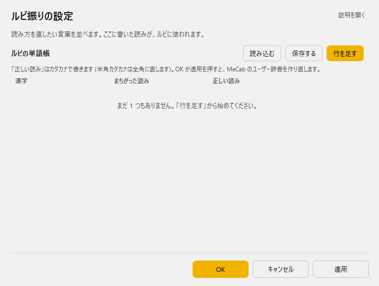

<!-- version-banner -->
!!! info ""
    ゆかコネNEO **v3.0** のドキュメントです。v2.3 をお使いの方は [v2.3 版のこのページ](../../v2.3/plugin/plugin_ruby.md) を、違いを知りたい方は [v2.3 から v3.0 への移行](../../mig/mig_neo_v3.0.md) をご覧ください。

!!! Info "前提条件"
    * 日本語もしくは中国語の場合

## このプラグインで出来ること

* 認識後の文章にルビ（かな、もしくはピンイン)を振ることができます

!!! warning "ルビはNEOの表示レイアウト内のみ有効で、OBS転送などには反映されません"

##　有効化

* プラグインを使うチェックをONにしてください。

## 設定

プラグイン一覧で、このプラグインの名前の右にある **「設定」** を押すと開きます。

!!! info "閉じるときの 3 択"
    設定は**下書き**として持たれ、「OK」か「適用」を押すまで動いているプラグインには効きません。
    変更したまま閉じようとすると「変更が保存されていません」と聞かれ、**［はい］保存して閉じる／［いいえ］破棄して閉じる／［キャンセル］閉じるのをやめる** から選べます。

読み方を直したい言葉を並べます。ここに書いた読みが、ルビに使われます。ルビを字幕に出すかどうかは、本体の「表示内容」にある「ルビの表示」で切り替えます。

**ルビの単語帳**（表）

列：漢字／まちがった読み／正しい読み

「正しい読み」はカタカナで書きます (半角カタカナは全角に直します)。OK か適用を押すと、MeCab のユーザー辞書を作り直します。

表の右上の **「行を足す」** で行を増やします。行の右端のボタンは ▲▼＝1 つ上へ／下へ、＋＝この下に足す、×＝この行を消す です。**「保存する」** はいまの中身を CSV へ書き出します（控え用）。**「読み込む」** は CSV から読み込んで、いまの中身と入れ替えます。

### 補足

!!! Info "辞書編集は必須ではありません。正しくルビが振れない場合は辞書を再構築できます"

!!! Success "編集後OKを押すと辞書の再構築が始まります。少し時間がかかります"

## 使うとき

1. 音声認識と同時にルビが付与されます。
