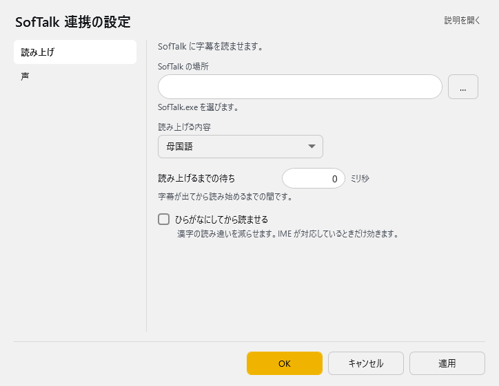
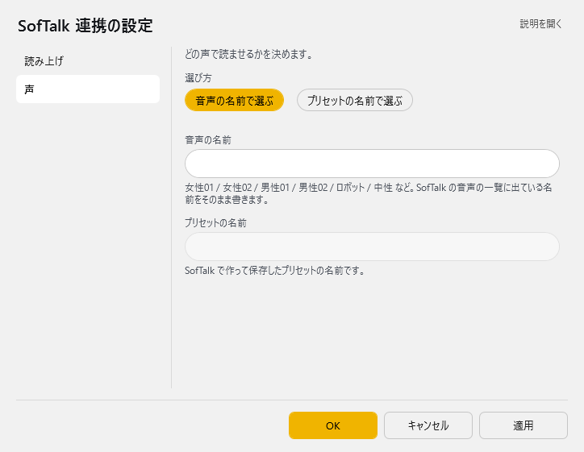

<!-- version-banner -->
!!! info ""
    ゆかコネNEO **v3.0** のドキュメントです。v2.3 をお使いの方は [v2.3 版のこのページ](../../v2.3/plugin/plugin_softalk.md) を、違いを知りたい方は [v2.3 から v3.0 への移行](../../mig/mig_neo_v3.0.md) をご覧ください。

!!! Info "前提条件"
    * Softalkが起動していること

## このプラグインで出来ること

* Softalkをつかって音声認識結果を読み上げできます。

##　有効化

* プラグインを使うチェックをONにしてください。

## 設定

プラグイン一覧で、このプラグインの名前の右にある **「設定」** を押すと開きます。
画面は **2 ページ**に分かれていて、左の一覧で切り替えます（読み上げ／声）。

!!! info "閉じるときの 3 択"
    設定は**下書き**として持たれ、「OK」か「適用」を押すまで動いているプラグインには効きません。
    変更したまま閉じようとすると「変更が保存されていません」と聞かれ、**［はい］保存して閉じる／［いいえ］破棄して閉じる／［キャンセル］閉じるのをやめる** から選べます。

### 読み上げ

SofTalk に字幕を読ませます。

| 項目 | 説明 |
|:--|:--|
| SofTalk の場所 | SofTalk.exe を選びます。（右の「…」で選べます） |
| 読み上げる内容 | 選択肢：母国語／翻訳 1／翻訳 2／翻訳 3／翻訳 4。既定：母国語 |
| 読み上げるまでの待ち | 字幕が出てから読み始めるまでの間です。（0～60000ミリ秒。既定：0） |
| ☑ ひらがなにしてから読ませる | 漢字の読み違いを減らせます。IME が対応しているときだけ効きます。（既定：OFF） |

### 声

どの声で読ませるかを決めます。

| 項目 | 説明 |
|:--|:--|
| 選び方 | 選択肢：音声の名前で選ぶ／プリセットの名前で選ぶ。既定：プリセットの名前で選ぶ |
| 音声の名前 | 女性01 / 女性02 / 男性01 / 男性02 / ロボット / 中性 など。SofTalk の音声の一覧に出ている名前をそのまま書きます。 |
| プリセットの名前 | SofTalk で作って保存したプリセットの名前です。 |

## 使うとき

1. Softalkを立ち上げます。
1. ゆかコネNEOで音声認識をしましょう。
1. 文章が確定すると同時にSoftalkで読み上げが行われます。
