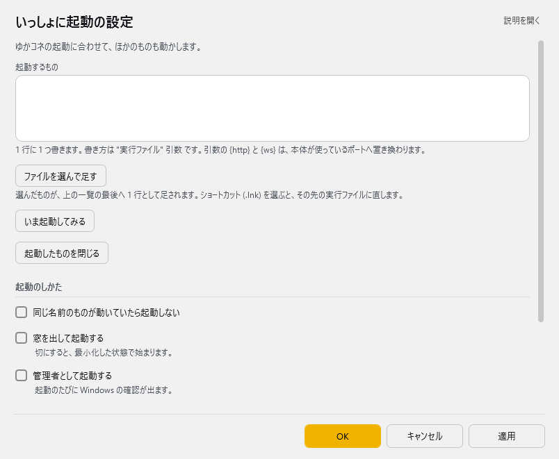

<!-- version-banner -->
!!! info ""
    ゆかコネNEO **v3.0** のドキュメントです。v2.3 をお使いの方は [v2.3 版のこのページ](../../v2.3/plugin/plugin_startup.md) を、違いを知りたい方は [v2.3 から v3.0 への移行](../../mig/mig_neo_v3.0.md) をご覧ください。

!!! Info "前提条件"
    * 特になし

## このプラグインで出来ること

* 起動時に関連するツールも起動できます

!!! Info "こういう時に使おう"
    * いくつも使うツールがある場合に活用しましょう

##　有効化

* プラグインを使うチェックをONにしてください。

## 設定

プラグイン一覧で、このプラグインの名前の右にある **「設定」** を押すと開きます。

!!! info "閉じるときの 3 択"
    設定は**下書き**として持たれ、「OK」か「適用」を押すまで動いているプラグインには効きません。
    変更したまま閉じようとすると「変更が保存されていません」と聞かれ、**［はい］保存して閉じる／［いいえ］破棄して閉じる／［キャンセル］閉じるのをやめる** から選べます。

ゆかコネの起動に合わせて、ほかのものも動かします。

| 項目 | 説明 |
|:--|:--|
| 起動するもの | 1 行に 1 つ書きます。書き方は "実行ファイル" 引数 です。引数の {http} と {ws} は、本体が使っているポートへ置き換わります。 |
| 「ファイルを選んで足す」ボタン | 選んだものが、上の一覧の最後へ 1 行として足されます。ショートカット (.lnk) を選ぶと、その先の実行ファイルに直します。 |
| 「いま起動してみる」ボタン | — |
| 「起動したものを閉じる」ボタン | — |

**起動のしかた**

| 項目 | 説明 |
|:--|:--|
| ☑ 同じ名前のものが動いていたら起動しない | 既定：OFF |
| ☑ 窓を出して起動する | 切にすると、最小化した状態で始まります。（既定：OFF） |
| ☑ 管理者として起動する | 起動のたびに Windows の確認が出ます。（既定：OFF） |
| ☑ cmd 経由で起動する | 関連づけや短縮 (.lnk など) を効かせたいときに入にします。（既定：OFF） |

**終わるとき**

| 項目 | 説明 |
|:--|:--|
| ☑ ゆかコネを閉じたら、起動したものも閉じる | いきなり終わらせず、窓を前へ出してから閉じるよう頼みます。（既定：OFF） |

