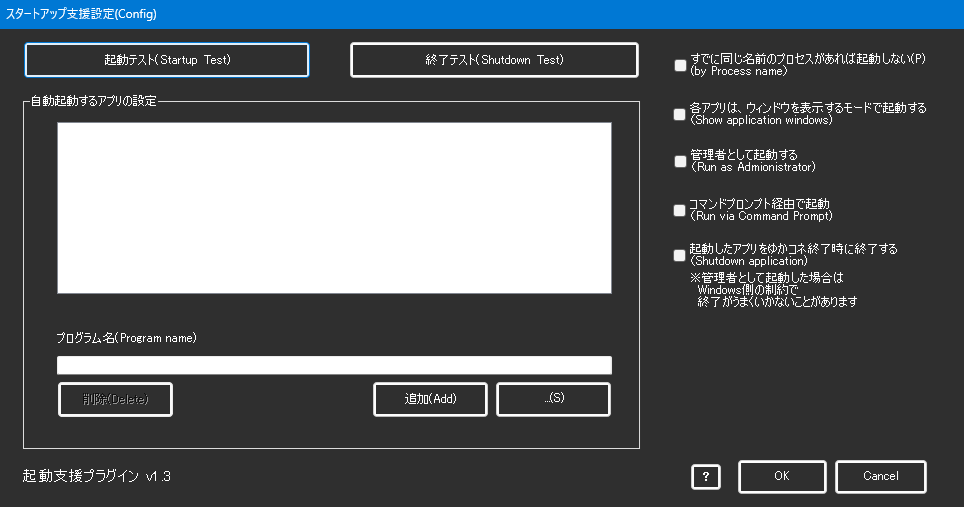

<!-- version-banner -->
!!! info ""
    ゆかコネNEO **v3.0** のドキュメントです。v2.3 をお使いの方は [v2.3 版のこのページ](../../v2.3/plugin/plugin_startup.md) を、違いを知りたい方は [v2.3 から v3.0 への移行](../../mig/mig_neo_v3.0.md) をご覧ください。

!!! Info "前提条件"
    * 特になし

## このプラグインで出来ること

* 起動時に関連するツールも起動できます

!!! Info "こういう時に使おう"
    * いくつも使うツールがある場合に活用しましょう

##　有効化

* プラグインを使うチェックをONにしてください。

## 設定

|設定|意味|
|:--|:---|
|立ち上げ時に起動|この起動設定を有効にします|
|すでに同じ名前のプロセスがあれば起動しない|すでに立ち上がっていれば多重起動しません|
|各アプリはウィンドウを表示するモードで起動|ウィンドウを隠さずに起動します|
