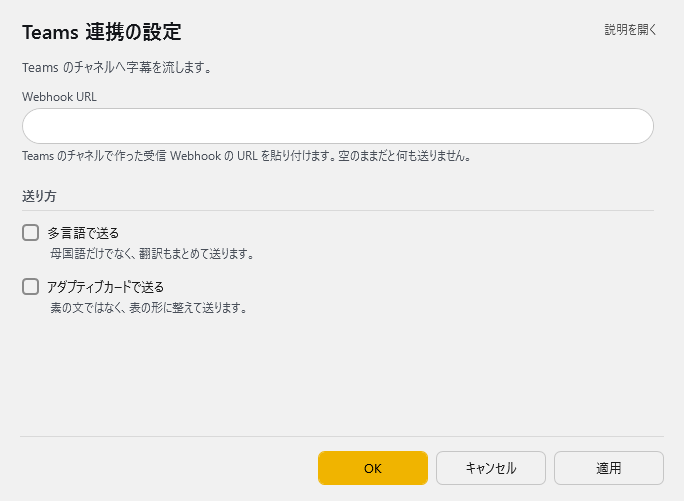
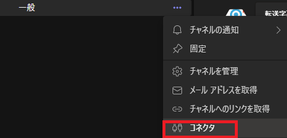
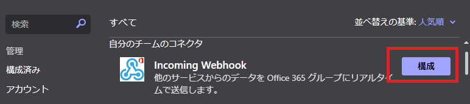
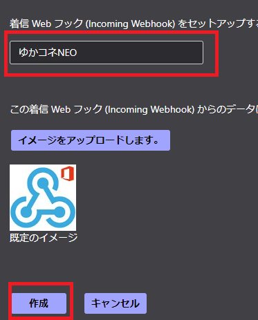
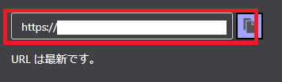
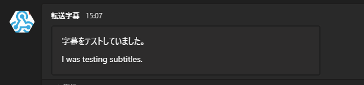

<!-- version-banner -->
!!! info ""
    ゆかコネNEO **v3.0** のドキュメントです。v2.3 をお使いの方は [v2.3 版のこのページ](../../v2.3/plugin/plugin_teamswebhook.md) を、違いを知りたい方は [v2.3 から v3.0 への移行](../../mig/mig_neo_v3.0.md) をご覧ください。

!!! Info "前提条件"
    * Webhook URL登録するためには Microsoft アカウントが必要です。
    * プラグインは v2.0.115から同梱されています

## このプラグインで出来ること

* 音声認識結果を Microsoft Teams チャットチャネル転送することができます

##　有効化

* プラグインを使うチェックをONにしてください。

## 設定

プラグイン一覧で、このプラグインの名前の右にある **「設定」** を押すと開きます。

!!! info "閉じるときの 3 択"
    設定は**下書き**として持たれ、「OK」か「適用」を押すまで動いているプラグインには効きません。
    変更したまま閉じようとすると「変更が保存されていません」と聞かれ、**［はい］保存して閉じる／［いいえ］破棄して閉じる／［キャンセル］閉じるのをやめる** から選べます。

Teams のチャネルへ字幕を流します。

| 項目 | 説明 |
|:--|:--|
| Webhook URL | Teams のチャネルで作った受信 Webhook の URL を貼り付けます。空のままだと何も送りません。 |

**送り方**

| 項目 | 説明 |
|:--|:--|
| ☑ 多言語で送る | 母国語だけでなく、翻訳もまとめて送ります。（既定：OFF） |
| ☑ アダプティブカードで送る | 素の文ではなく、表の形に整えて送ります。（既定：OFF） |

## 具体的な使い方

* まず、Teamsクライアントの書き込みたいｃｈのメニューからコネクタ画面をだします

* Incomming Webhookを探して、構成をおします

* 表示名を決めて設定します

* URLが発行されます。このアドレスをゆかコネNEOに設定します。

* 認識が終わるごとに、転送されます。

