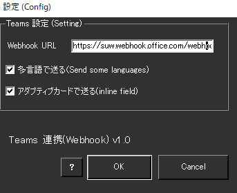

<!-- version-banner -->
!!! info ""
    ゆかコネNEO **v3.0** のドキュメントです。v2.3 をお使いの方は [v2.3 版のこのページ](../../v2.3/plugin/plugin_teamswebhook.md) を、違いを知りたい方は [v2.3 から v3.0 への移行](../../mig/mig_neo_v3.0.md) をご覧ください。

!!! Info "前提条件"
    * Webhook URL登録するためには Microsoft アカウントが必要です。
    * プラグインは v2.0.115から同梱されています

## このプラグインで出来ること

* 音声認識結果を Microsoft Teams チャットチャネル転送することができます

##　有効化

* プラグインを使うチェックをONにしてください。

<!-- wpf-settings-note -->
!!! info "v3.0 で設定画面が新しくなりました"
    見た目がほかのプラグインと揃い、**表示言語に合わせて日本語・英語などで出る**ようになりました。
    各項目には「何を入れる欄なのか」「空のままだとどうなるのか」の説明が付いています。
    Webhook URL／多言語／アダプティブカード を設定します。

    設定は**下書き**として持たれます。閉じるときに「適用」「破棄」「続ける」の 3 択が出るので、
    試して気に入らなければ破棄できます。
    新しい画面が開けなかったときは、従来の画面が代わりに開きます。
    → [プラグインの有効化](enabled.md)

## 設定

|設定|意味|
|:--|:---|
|Webhook URL|WebHookのアドレスを入れます。|
|多言語で送る|翻訳も一緒に送ります|
|アダプティブカードで送る|見やすい形に整形しておくります|

## 具体的な使い方

* まず、Teamsクライアントの書き込みたいｃｈのメニューからコネクタ画面をだします

* Incomming Webhookを探して、構成をおします

* 表示名を決めて設定します

* URLが発行されます。このアドレスをゆかコネNEOに設定します。

* 認識が終わるごとに、転送されます。

