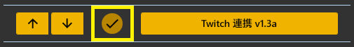
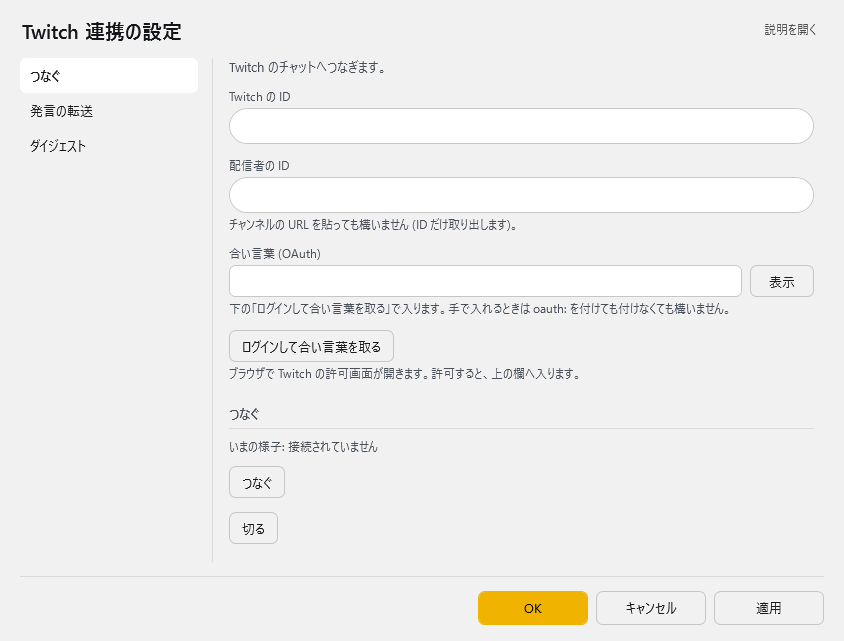
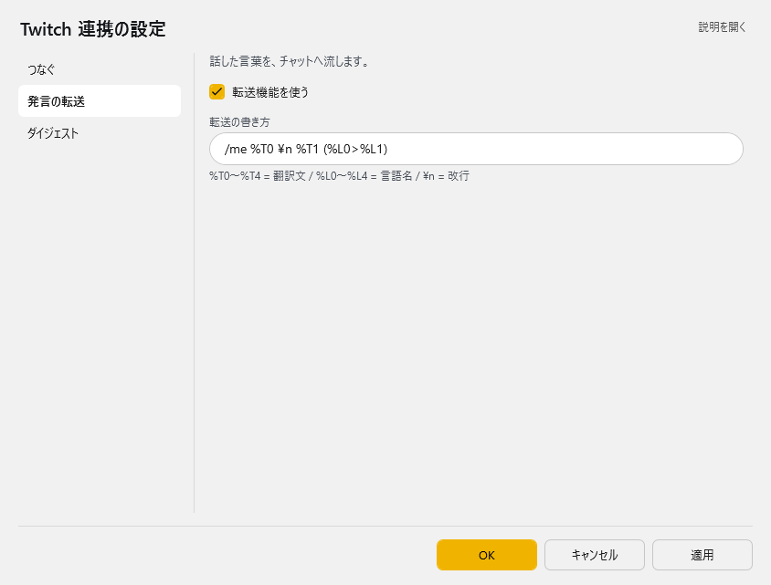
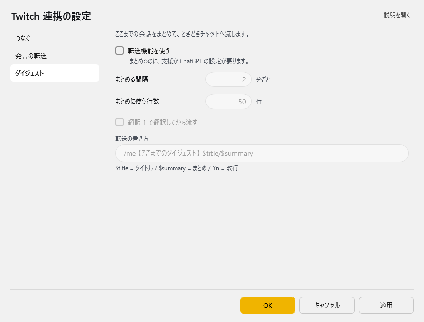

<!-- version-banner -->
!!! info ""
    ゆかコネNEO **v3.0** のドキュメントです。v2.3 をお使いの方は [v2.3 版のこのページ](../../v2.3/plugin/plugin_twitch.md) を、違いを知りたい方は [v2.3 から v3.0 への移行](../../mig/mig_neo_v3.0.md) をご覧ください。

!!! Info "前提条件"
    * Twitch アカウントが必要です。

## このプラグインで出来ること

* 音声認識結果をTwitchチャットチャネルに転送することができます

##　有効化

* プラグインを使うチェックをONにしてください。

## 設定

プラグイン一覧で、このプラグインの名前の右にある **「設定」** を押すと開きます。
画面は **3 ページ**に分かれていて、左の一覧で切り替えます（つなぐ／発言の転送／ダイジェスト）。

!!! info "閉じるときの 3 択"
    設定は**下書き**として持たれ、「OK」か「適用」を押すまで動いているプラグインには効きません。
    変更したまま閉じようとすると「変更が保存されていません」と聞かれ、**［はい］保存して閉じる／［いいえ］破棄して閉じる／［キャンセル］閉じるのをやめる** から選べます。

### つなぐ

Twitch のチャットへつなぎます。

| 項目 | 説明 |
|:--|:--|
| Twitch の ID | — |
| 配信者の ID | チャンネルの URL を貼っても構いません (ID だけ取り出します)。 |
| 合い言葉 (OAuth) | 下の「ログインして合い言葉を取る」で入ります。手で入れるときは oauth: を付けても付けなくても構いません。入力は伏せ字で表示されます。「表示」を押すと中身を確かめられます（もう一度押すと伏せます） |
| 「ログインして合い言葉を取る」ボタン | ブラウザで Twitch の許可画面が開きます。許可すると、上の欄へ入ります。 |

**つなぐ**

> いまの様子: …

| 項目 | 説明 |
|:--|:--|
| 「つなぐ」ボタン | — |
| 「切る」ボタン | — |

### 発言の転送

話した言葉を、チャットへ流します。

| 項目 | 説明 |
|:--|:--|
| ☑ 転送機能を使う | 既定：ON |
| 転送の書き方 | %T0〜%T4 = 翻訳文 / %L0〜%L4 = 言語名 / \  = 改行 |

### ダイジェスト

ここまでの会話をまとめて、ときどきチャットへ流します。

| 項目 | 説明 |
|:--|:--|
| ☑ 転送機能を使う | まとめるのに、支援か ChatGPT の設定が要ります。（既定：OFF） |
| まとめる間隔 | 1～120分ごと。既定：2 |
| まとめに使う行数 | 5～50行。既定：50 |
| ☑ 翻訳 1 で翻訳してから流す | 既定：OFF |
| 転送の書き方 | $title = タイトル / $summary = まとめ / \  = 改行（既定：「/me 【ここまでのダイジェスト】 $title/$summary」） |

### 補足

!!! Info "OAuthについて"
    * この文字列は、認証したアカウントに入るための認証済み手形みたいなものです。
    * この文字が漏洩するとアカウントの安全性が脅かされるため慎重に取扱いをしてください
    * この文字列は無効化されるまで　有効です。

## 具体的な使い方
1. IDを入れ、Twitchアカウント認証を行います
2. 認証後に得られる OAuth　Passコードを入れます
3. 接続先を決めます
4. 接続を押します

## 便利な機能

### 簡単認証
「接続認証」ボタンを押すだけで、ブラウザが開いてTwitchアカウントでログイン。認証が完了すると自動でOAuthコードが設定画面に入力されます。

### 柔軟なメッセージ形式
転送パターンで以下のような設定が可能：
- `%T0` : 音声認識した原文
- `%T1` : 翻訳1の結果
- `%L0` : 原文の言語名
- `%L1` : 翻訳1の言語名

例：`%T0 \n %T1 (%L0>%L1)` → 「こんにちは Hello (ja>en)」

### URL貼り付け対応
設定画面の配信者IDに「https://www.twitch.tv/channel_name」のようなURLを貼り付けると、自動で「channel_name」だけ抽出してくれます。

## よくある問題

### 接続できない場合
- Twitchアカウント名（配信者ID）が正しいか確認
- 「接続認証」ボタンで認証をやり直してみる
- インターネット接続を確認

### メッセージが送信されない場合
- プラグインが有効（チェックON）になっているか確認
- 転送パターンが正しく設定されているか確認
- Twitchチャンネルに正常に接続されているか確認