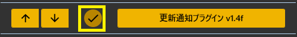

<!-- version-banner -->
!!! info ""
    ゆかコネNEO **v3.0** のドキュメントです。v2.3 をお使いの方は [v2.3 版のこのページ](../../v2.3/plugin/plugin_update.md) を、違いを知りたい方は [v2.3 から v3.0 への移行](../../mig/mig_neo_v3.0.md) をご覧ください。

!!! Info "前提条件"
    * 特になし

## このプラグインで出来ること

* ソフトウェアの更新時期をお知らせします

##　有効化

* プラグインを使うチェックをONにしてください。

## 設定

プラグイン一覧で、このプラグインの名前の右にある **「設定」** を押すと開きます。

!!! info "閉じるときの 3 択"
    設定は**下書き**として持たれ、「OK」か「適用」を押すまで動いているプラグインには効きません。
    変更したまま閉じようとすると「変更が保存されていません」と聞かれ、**［はい］保存して閉じる／［いいえ］破棄して閉じる／［キャンセル］閉じるのをやめる** から選べます。

新しい版が出ていないかを調べ、入れ替えます。

| 項目 | 説明 |
|:--|:--|
| 「調べ直す」ボタン | — |

**入れ替える**

| 項目 | 説明 |
|:--|:--|
| 「安定版を入れる…」ボタン | 落とし終わると更新プログラムが立ち上がり、本体はいったん閉じます。 |
| 「開発版を入れる…」ボタン | 開発版には、試している途中のものが入っています。 |

**自動で知らせる**

| 項目 | 説明 |
|:--|:--|
| どちらの版を知らせるか | 起動のときに調べて、新しい版があれば知らせます。（選択肢：安定版だけ／開発版も。既定：安定版だけ） |

### 補足

!!! Info "通常は安定版で問題ありません"
    * 安定版は、様子を見ながら版が上がっていきます。
    * 不都合があるときに、問題を解消するため開発版を使う手はあります。

!!! Info "開発版は更新のペースが速いです"
    * 毎日更新されることもあります。
    * 通知が多すぎると感じたら、「どちらの版を知らせるか」を **安定版だけ** にしてください。

## 更新が来た場合

* 起動時にバージョンアップするか聞かれます。
* はいを押すと、上書きアップデートを行う画面に移行します。

!!! Warning "バージョンアップは配信前を避けましょう"
    * トラブルが起きない保証はないので、リカバリーできる時間があるときに行いましょう
    * 問題が発生したときは[再インストール](../qa/reinstall.md)をお試しください
