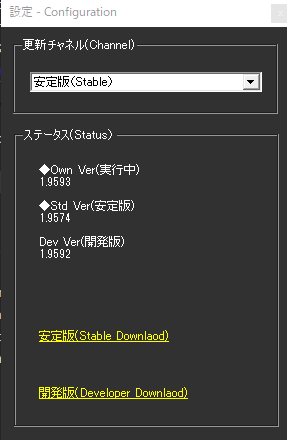

<!-- version-banner -->
!!! info ""
    ゆかコネNEO **v3.0** のドキュメントです。v2.3 をお使いの方は [v2.3 版のこのページ](../../v2.3/plugin/plugin_update.md) を、違いを知りたい方は [v2.3 から v3.0 への移行](../../mig/mig_neo_v3.0.md) をご覧ください。

!!! Info "前提条件"
    * 特になし

## このプラグインで出来ること

* ソフトウェアの更新時期をお知らせします

##　有効化

* プラグインを使うチェックをONにしてください。

## 設定

* 通知してほしいタイミングを「更新チャネル」で設定します

!!! Info "通常は安定板で問題ありません"
    * 安定版は様子を見ながらバージョンが上がっていきます。
    * 不都合があるときに、問題解消のため開発版を使う手はあります

!!! Info "とにかく開発版はペースが速いです"
    * リクエストがおおいので、毎日更新されるときもあります。
    * あまり通知が必要なければ、開発版じゃないほうがよいかもしれません
    * いち早く最新機能や、他のツールとの連携不具合にメスを入れているバージョンとなります

## 更新が来た場合

* 起動時にバージョンアップするか聞かれます。
* はいを押すと、上書きアップデートを行う画面に移行します。

!!! Warning "バージョンアップは配信前を避けましょう"
    * トラブルが起きない保証はないので、リカバリーできる時間があるときに行いましょう
    * 問題が発生したときは[再インストール](../qa/reinstall.md)をお試しください
