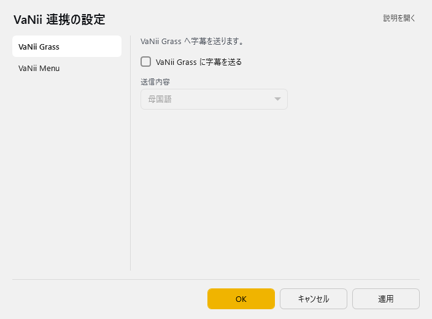
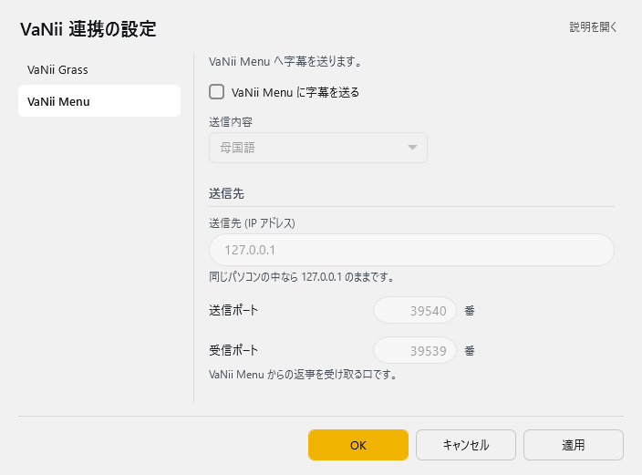

<!-- version-banner -->
!!! info ""
    ゆかコネNEO **v3.0** のドキュメントです。v2.3 をお使いの方は [v2.3 版のこのページ](../../v2.3/plugin/plugin_vanii.md) を、違いを知りたい方は [v2.3 から v3.0 への移行](../../mig/mig_neo_v3.0.md) をご覧ください。

!!! Info "前提条件"
    * [VaNiiMenu](https://sabowl.sakura.ne.jp/gpsnmeajp/unity/vaniimenu/)もしくは、 [VaNiiGrass](https://sabowl.sakura.ne.jp/gpsnmeajp/unity/vaniiglass/)が必要です

## このプラグインで出来ること

* バーチャルワールド内に字幕を出すことができます。
!!! Info "謝辞"
    * 連携先ソフトウェアの開発者は[gpsnmeajp様](https://sabowl.sakura.ne.jp/gpsnmeajp/)です。

!!! Warning "うまく動かないときのレポートについて"
    * 当方が連携機能をつかって勝手に連携しているだけです。 gpsnmeajp様に直接問い合わせをしないでください。

##　有効化

* プラグインを使うチェックをONにしてください。

## 設定

プラグイン一覧で、このプラグインの名前の右にある **「設定」** を押すと開きます。
画面は **2 ページ**に分かれていて、左の一覧で切り替えます（VaNii Grass／VaNii Menu）。

!!! info "閉じるときの 3 択"
    設定は**下書き**として持たれ、「OK」か「適用」を押すまで動いているプラグインには効きません。
    変更したまま閉じようとすると「変更が保存されていません」と聞かれ、**［はい］保存して閉じる／［いいえ］破棄して閉じる／［キャンセル］閉じるのをやめる** から選べます。

### VaNii Grass

VaNii Grass へ字幕を送ります。

| 項目 | 説明 |
|:--|:--|
| ☑ VaNii Grass に字幕を送る | 既定：OFF |
| 送信内容 | 選択肢：母国語／翻訳 1／翻訳 2／翻訳 3／翻訳 4。既定：母国語 |

### VaNii Menu

VaNii Menu へ字幕を送ります。

| 項目 | 説明 |
|:--|:--|
| ☑ VaNii Menu に字幕を送る | 既定：OFF |
| 送信内容 | 選択肢：母国語／翻訳 1／翻訳 2／翻訳 3／翻訳 4。既定：母国語 |

**送信先**

| 項目 | 説明 |
|:--|:--|
| 送信先 (IP アドレス) | 同じパソコンの中なら 127.0.0.1 のままです。（既定：「127.0.0.1」） |
| 送信ポート | 1～65535番。既定：39540 |
| 受信ポート | VaNii Menu からの返事を受け取る口です。（1～65535番。既定：39539） |

## 使い方
1. VaNiiMenuやVaNiiGrassを起動します。
2. 音声認識されると、ボードに表示されます。

