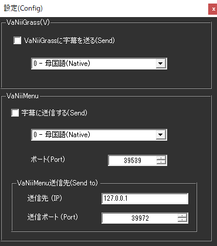

<!-- version-banner -->
!!! info ""
    ゆかコネNEO **v3.0** のドキュメントです。v2.3 をお使いの方は [v2.3 版のこのページ](../../v2.3/plugin/plugin_vanii.md) を、違いを知りたい方は [v2.3 から v3.0 への移行](../../mig/mig_neo_v3.0.md) をご覧ください。

!!! Info "前提条件"
    * [VaNiiMenu](https://sabowl.sakura.ne.jp/gpsnmeajp/unity/vaniimenu/)もしくは、 [VaNiiGrass](https://sabowl.sakura.ne.jp/gpsnmeajp/unity/vaniiglass/)が必要です

## このプラグインで出来ること

* バーチャルワールド内に字幕を出すことができます。
!!! Info "謝辞"
    * 連携先ソフトウェアの開発者は[gpsnmeajp様](https://sabowl.sakura.ne.jp/gpsnmeajp/)です。

!!! Warning "うまく動かないときのレポートについて"
    * 当方が連携機能をつかって勝手に連携しているだけです。 gpsnmeajp様に直接問い合わせをしないでください。

##　有効化

* プラグインを使うチェックをONにしてください。

<!-- wpf-settings-note -->
!!! info "v3.0 で設定画面が新しくなりました"
    見た目がほかのプラグインと揃い、**表示言語に合わせて日本語・英語などで出る**ようになりました。
    各項目には「何を入れる欄なのか」「空のままだとどうなるのか」の説明が付いています。
    VaNii Grass／VaNii Menu の 2 ページに分かれました。

    設定は**下書き**として持たれます。閉じるときに「適用」「破棄」「続ける」の 3 択が出るので、
    試して気に入らなければ破棄できます。
    新しい画面が開けなかったときは、従来の画面が代わりに開きます。
    → [プラグインの有効化](enabled.md)

## 設定

* 使う機能のチェックをONにし、言語を選んでください。

## 使い方
1. VaNiiMenuやVaNiiGrassを起動します。
2. 音声認識されると、ボードに表示されます。

