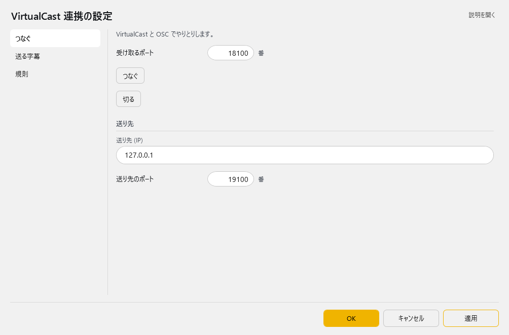
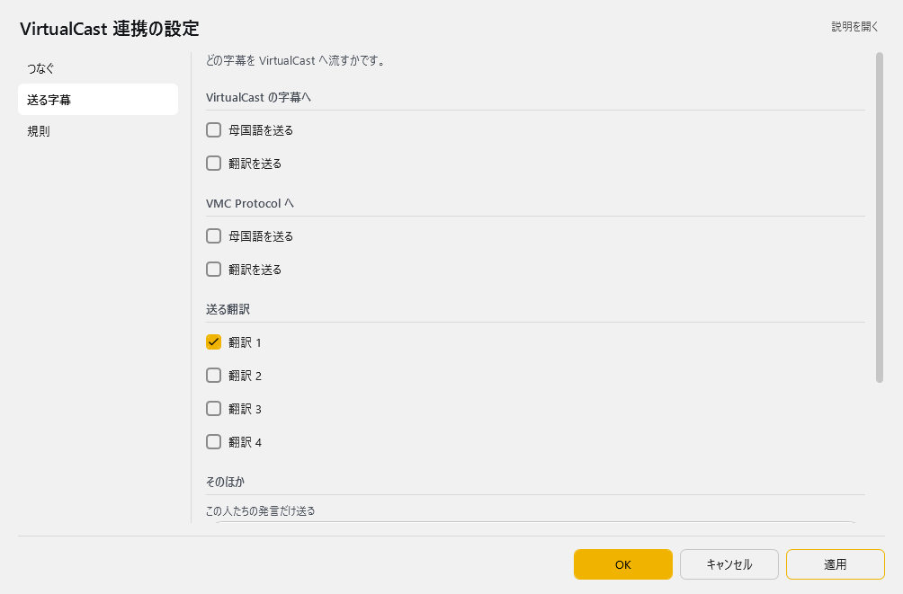
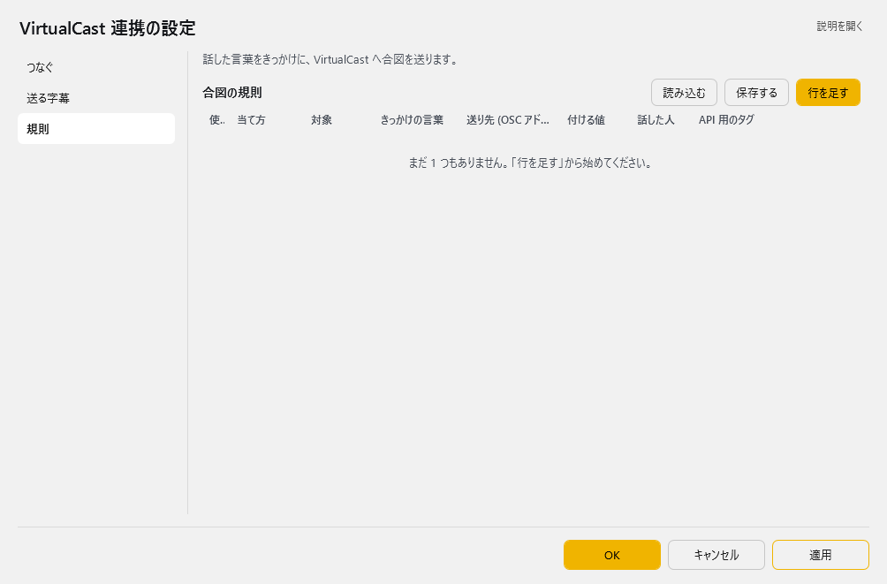

<!-- version-banner -->
!!! info ""
    ゆかコネNEO **v3.0** のドキュメントです。v2.3 をお使いの方は [v2.3 版のこのページ](../../v2.3/plugin/plugin_vcas.md) を、違いを知りたい方は [v2.3 から v3.0 への移行](../../mig/mig_neo_v3.0.md) をご覧ください。

!!! Info "前提条件"
    * バーチャルキャスとTHE SEED ONLINE を連携させることが必要です。
    * バーチャルキャストを動かすPCとゆかコネNEOを動かすPCは同一である必要があります

!!! question "バーチャルキャストについて"
    * ここで説明している使い方は株式会社バーチャルキャスト非公認のものです。
    * １ユーザが公開しているVCIの使い方となります。

## このプラグインで出来ること

* バーチャルキャストのワールド内に字幕を出すことができます。

##　有効化

* プラグインを使うチェックをONにしてください。

## 設定

プラグイン一覧で、このプラグインの名前の右にある **「設定」** を押すと開きます。
画面は **3 ページ**に分かれていて、左の一覧で切り替えます（つなぐ／送る字幕／規則）。

!!! info "閉じるときの 3 択"
    設定は**下書き**として持たれ、「OK」か「適用」を押すまで動いているプラグインには効きません。
    変更したまま閉じようとすると「変更が保存されていません」と聞かれ、**［はい］保存して閉じる／［いいえ］破棄して閉じる／［キャンセル］閉じるのをやめる** から選べます。

### つなぐ

VirtualCast と OSC でやりとりします。

| 項目 | 説明 |
|:--|:--|
| 受け取るポート | 1～65535番。既定：9001 |
| 「つなぐ」ボタン | — |
| 「切る」ボタン | — |

**送り先**

| 項目 | 説明 |
|:--|:--|
| 送り先 (IP) | 既定：「127.0.0.1」 |
| 送り先のポート | 1～65535番。既定：9000 |

### 送る字幕

どの字幕を VirtualCast へ流すかです。

**VirtualCast の字幕へ**

| 項目 | 説明 |
|:--|:--|
| ☑ 母国語を送る | 既定：OFF |
| ☑ 翻訳を送る | 既定：OFF |

**VMC Protocol へ**

| 項目 | 説明 |
|:--|:--|
| ☑ 母国語を送る | 既定：OFF |
| ☑ 翻訳を送る | 既定：OFF |

**送る翻訳**

| 項目 | 説明 |
|:--|:--|
| ☑ 翻訳 1 | 既定：OFF |
| ☑ 翻訳 2 | 既定：OFF |
| ☑ 翻訳 3 | 既定：OFF |
| ☑ 翻訳 4 | 既定：OFF |

**そのほか**

| 項目 | 説明 |
|:--|:--|
| この人たちの発言だけ送る | 名前をカンマで区切って書きます。空なら誰の発言でも送ります。 |
| ☑ 値を整数で送る | 既定：OFF |

**アバターと連動する**

| 項目 | 説明 |
|:--|:--|
| ☑ ミュートに合わせて字幕も止める | 既定：OFF |
| ☑ 手の形で読み上げの声を切り替える | 既定：OFF |

### 規則

話した言葉をきっかけに、VirtualCast へ合図を送ります。

**合図の規則**（表）

列：使う／当て方／対象／きっかけの言葉／送り先 (OSC アドレス)／付ける値／話した人／API 用のタグ

表の右上の **「行を足す」** で行を増やします。行の右端のボタンは ▲▼＝1 つ上へ／下へ、＋＝この下に足す、×＝この行を消す です。**「保存する」** はいまの中身を CSV へ書き出します（控え用）。**「読み込む」** は CSV から読み込んで、いまの中身と入れ替えます。

### 補足

1. [THE SEED ONLINE](https://seed.online/products/66338c22802dab2dc2960fcfef0da39b7c916fcd9c7bdd24d5afd4e1d6fa7dde) でゆかコネNEO字幕VCIを手に入れます。
2. 一度バーチャルキャストの中で VCI を開いてください。
3. 「つなぐ」ページで **つなぐ** を押します。受け取るポート・送り先のポートは、VirtualCast 側の OSC の設定と合わせてください。

## 使い方
1. バーチャルキャスト内でVCIを表示します
2. 音声認識されると、ボードに表示されます。

!!! info "バーチャルキャスト内での操作について"
    * ボード自体は伸縮可能です。
    * パーツをUseすると背景色が変わります。

