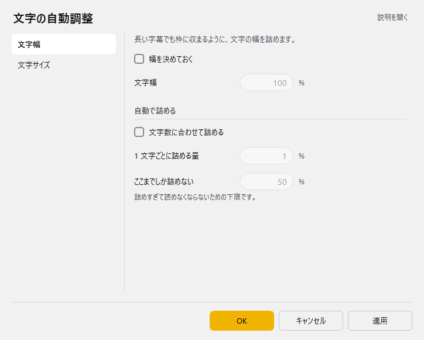
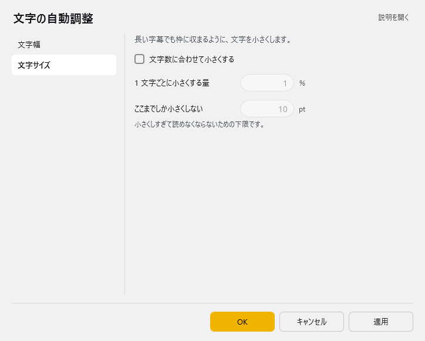

<!-- version-banner -->
!!! info ""
    ゆかコネNEO **v3.0** のドキュメントです。v2.3 をお使いの方は [v2.3 版のこのページ](../../v2.3/plugin/plugin_viewcompat.md) を、違いを知りたい方は [v2.3 から v3.0 への移行](../../mig/mig_neo_v3.0.md) をご覧ください。

## このプラグインで出来ること

* 旧来のゆかコネにある機能を移植しています。

## 有効化

* プラグインを使うチェックをONにしてください。

## 設定

プラグイン一覧で、このプラグインの名前の右にある **「設定」** を押すと開きます。
画面は **2 ページ**に分かれていて、左の一覧で切り替えます（文字幅／文字サイズ）。

!!! info "閉じるときの 3 択"
    設定は**下書き**として持たれ、「OK」か「適用」を押すまで動いているプラグインには効きません。
    変更したまま閉じようとすると「変更が保存されていません」と聞かれ、**［はい］保存して閉じる／［いいえ］破棄して閉じる／［キャンセル］閉じるのをやめる** から選べます。

### 文字幅

長い字幕でも枠に収まるように、文字の幅を詰めます。

| 項目 | 説明 |
|:--|:--|
| ☑ 幅を決めておく | 既定：OFF |
| 文字幅 | 1～400％。既定：100 |

**自動で詰める**

| 項目 | 説明 |
|:--|:--|
| ☑ 文字数に合わせて詰める | 既定：OFF |
| 1 文字ごとに詰める量 | 0～100％。既定：1 |
| ここまでしか詰めない | 詰めすぎて読めなくならないための下限です。（1～100％。既定：50） |

### 文字サイズ

長い字幕でも枠に収まるように、文字を小さくします。

| 項目 | 説明 |
|:--|:--|
| ☑ 文字数に合わせて小さくする | 既定：OFF |
| 1 文字ごとに小さくする量 | 0～100％。既定：1 |
| ここまでしか小さくしない | 小さくしすぎて読めなくならないための下限です。（1～400pt。既定：10） |

## 使い方

1. 執筆中です
