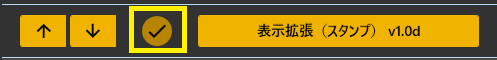
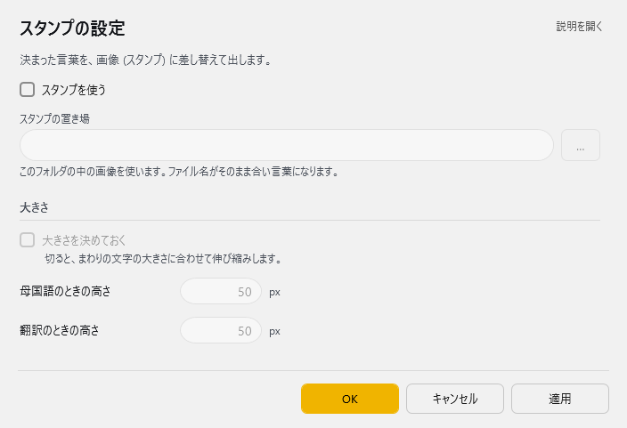

<!-- version-banner -->
!!! info ""
    ゆかコネNEO **v3.0** のドキュメントです。v2.3 をお使いの方は [v2.3 版のこのページ](../../v2.3/plugin/plugin_viewextend.md) を、違いを知りたい方は [v2.3 から v3.0 への移行](../../mig/mig_neo_v3.0.md) をご覧ください。

!!! Info "前提条件"
    * レイアウト表示のみに適用されます

## このプラグインで出来ること

* 指定した単語を含んでいたら、指定した写真に差し替え表示します

##　有効化

* プラグインを使うチェックをONにしてください。

## 動作の仕組み

* ファイル名と同じ言葉を検出したら写真と差し替えて表示します

!!! Note "扱える写真の形式"
    * PNG
    * JPEG
    * BMP
    * GIF
    * そのほかにもブラウザが対応しているもの

## 設定

プラグイン一覧で、このプラグインの名前の右にある **「設定」** を押すと開きます。

!!! info "閉じるときの 3 択"
    設定は**下書き**として持たれ、「OK」か「適用」を押すまで動いているプラグインには効きません。
    変更したまま閉じようとすると「変更が保存されていません」と聞かれ、**［はい］保存して閉じる／［いいえ］破棄して閉じる／［キャンセル］閉じるのをやめる** から選べます。

決まった言葉を、画像 (スタンプ) に差し替えて出します。

| 項目 | 説明 |
|:--|:--|
| ☑ スタンプを使う | 既定：OFF |
| スタンプの置き場 | このフォルダの中の画像を使います。ファイル名がそのまま合い言葉になります。（右の「…」で選べます） |

**大きさ**

| 項目 | 説明 |
|:--|:--|
| ☑ 大きさを決めておく | 切ると、まわりの文字の大きさに合わせて伸び縮みします。（既定：OFF） |
| 母国語のときの高さ | 1～2000px。既定：50 |
| 翻訳のときの高さ | 1～2000px。既定：50 |

## 使い方
1. 字幕を表示します
2. 音声認識させると自動的に処理され、写真表示画面に読み込まれます。

