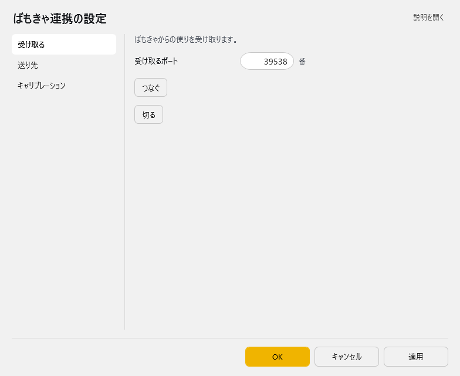
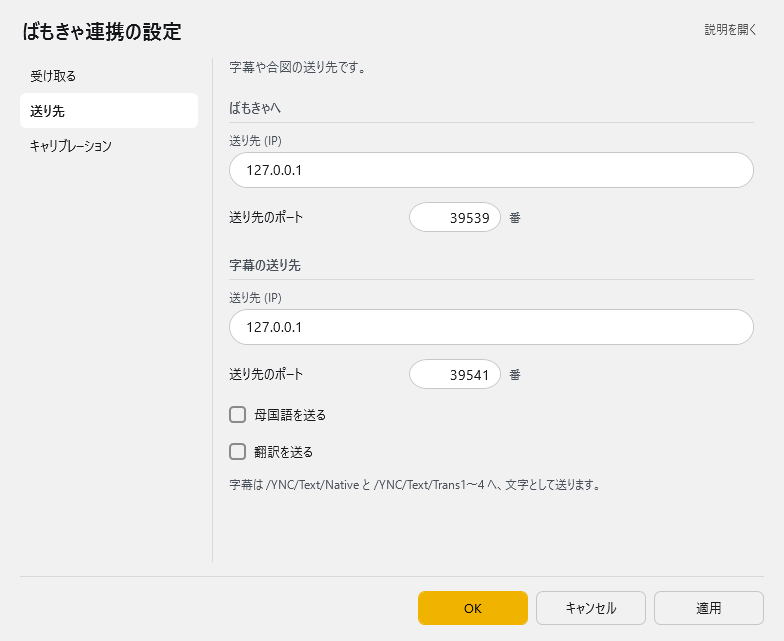
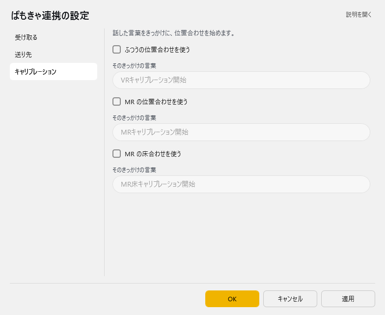

<!-- version-banner -->
!!! info ""
    ゆかコネNEO **v3.0** のドキュメントです。v2.3 をお使いの方は [v2.3 版のこのページ](../../v2.3/plugin/plugin_vmc.md) を、違いを知りたい方は [v2.3 から v3.0 への移行](../../mig/mig_neo_v3.0.md) をご覧ください。

!!! Info "前提条件"
    * [ばもきゃ](https://vmc.info/)に対応した仕組みと併用することが必要です

## このプラグインで出来ること

* ばもきゃに対応した信号を出すことができます。

!!! Info "謝辞"
    * 連携先ソフトウェアの開発者は[あきら様](https://twitter.com/sh_akira)です。

!!! Warning "うまく動かないときのレポートについて"
    * 当方が連携機能をつかって勝手に連携しているだけです。 あきら様に直接問い合わせをしないでください。

##　有効化

* プラグインを使うチェックをONにしてください。

## 設定

プラグイン一覧で、このプラグインの名前の右にある **「設定」** を押すと開きます。
画面は **3 ページ**に分かれていて、左の一覧で切り替えます（受け取る／送り先／キャリブレーション）。

!!! info "閉じるときの 3 択"
    設定は**下書き**として持たれ、「OK」か「適用」を押すまで動いているプラグインには効きません。
    変更したまま閉じようとすると「変更が保存されていません」と聞かれ、**［はい］保存して閉じる／［いいえ］破棄して閉じる／［キャンセル］閉じるのをやめる** から選べます。

### 受け取る

ばもきゃからの便りを受け取ります。

| 項目 | 説明 |
|:--|:--|
| 受け取るポート | 1～65535番。既定：39538 |
| 「つなぐ」ボタン | — |
| 「切る」ボタン | — |

### 送り先

字幕や合図の送り先です。

**ばもきゃへ**

| 項目 | 説明 |
|:--|:--|
| 送り先 (IP) | 既定：「127.0.0.1」 |
| 送り先のポート | 1～65535番。既定：39539 |

**字幕の送り先**

| 項目 | 説明 |
|:--|:--|
| 送り先 (IP) | 既定：「127.0.0.1」 |
| 送り先のポート | 1～65535番。既定：39541 |
| ☑ 母国語を送る | 既定：OFF |
| ☑ 翻訳を送る | 既定：OFF |

> 字幕は /YNC/Text/Native と /YNC/Text/Trans1〜4 へ、文字として送ります。

### キャリブレーション

話した言葉をきっかけに、位置合わせを始めます。

| 項目 | 説明 |
|:--|:--|
| ☑ ふつうの位置合わせを使う | 既定：OFF |
| そのきっかけの言葉 | 既定：「VRキャリブレーション開始」 |
| ☑ MR の位置合わせを使う | 既定：OFF |
| そのきっかけの言葉 | 既定：「MRキャリブレーション開始」 |
| ☑ MR の床合わせを使う | 既定：OFF |
| そのきっかけの言葉 | 既定：「MR床キャリブレーション開始」 |

## 使い方
1. ばもきゃ通信をするツールを起動します
2. OpenをおしてVMC参加をおします。
3. 条件がそろえば、随時通信を送ります。

