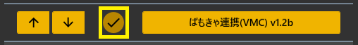
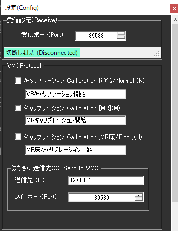
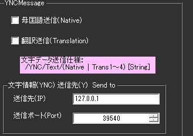

<!-- version-banner -->
!!! info ""
    ゆかコネNEO **v3.0** のドキュメントです。v2.3 をお使いの方は [v2.3 版のこのページ](../../v2.3/plugin/plugin_vmc.md) を、違いを知りたい方は [v2.3 から v3.0 への移行](../../mig/mig_neo_v3.0.md) をご覧ください。

!!! Info "前提条件"
    * [ばもきゃ](https://vmc.info/)に対応した仕組みと併用することが必要です

## このプラグインで出来ること

* ばもきゃに対応した信号を出すことができます。

!!! Info "謝辞"
    * 連携先ソフトウェアの開発者は[あきら様](https://twitter.com/sh_akira)です。

!!! Warning "うまく動かないときのレポートについて"
    * 当方が連携機能をつかって勝手に連携しているだけです。 あきら様に直接問い合わせをしないでください。

##　有効化

* プラグインを使うチェックをONにしてください。

<!-- wpf-settings-note -->
!!! info "v3.0 で設定画面が新しくなりました"
    見た目がほかのプラグインと揃い、**表示言語に合わせて日本語・英語などで出る**ようになりました。
    各項目には「何を入れる欄なのか」「空のままだとどうなるのか」の説明が付いています。

    設定は**下書き**として持たれます。閉じるときに「適用」「破棄」「続ける」の 3 択が出るので、
    試して気に入らなければ破棄できます。
    新しい画面が開けなかったときは、従来の画面が代わりに開きます。
    → [プラグインの有効化](enabled.md)

## 設定

|設定|意味|
|:--|:---|
|受信ポート|ばもきゃデータの受信ポートを指定します。デフォルトは　``39538`` です。|
|キャリブレーション開始|音声認識文に特定の文字列を含む場合は、キャリブレーション信号を送ります|
|送信先IP/ポート|ばもきゃデータの送信先を指定します。デフォルトは　``127.0.0.1:39539`` です。|

|設定|意味|
|:--|:---|
|Native Language|母国語を送ります|
|Translation Language|翻訳文を送ります|
|送信先IP/ポート|ばもきゃデータの送信先を指定します。デフォルトは　``127.0.0.1:39540`` です。|

## 使い方
1. ばもきゃ通信をするツールを起動します
2. OpenをおしてVMC参加をおします。
3. 条件がそろえば、随時通信を送ります。

