# VRChat向けOSCプラグイン

<!-- version-banner -->
!!! info ""
    ゆかコネNEO **v3.0** のドキュメントです。v2.3 をお使いの方は [v2.3 版のこのページ](../../v2.3/plugin/plugin_vrchat_osc.md) を、違いを知りたい方は [v2.3 から v3.0 への移行](../../mig/mig_neo_v3.0.md) をご覧ください。


!!! Info "前提条件"
    * [VRChat](https://vrchat.com/home/)が動作することが必要です
    * VRChatのリングメニューでOSCを``Enable``にする必要があります
    * アバターのパラメータを動かす場合は、ワールドかアバターにギミックが必要です（字幕表示や音声コマンドはギミック不要です）

## このプラグインで出来ること

* 音声認識した字幕を、VRChatのチャットボックスに表示できます
* 特定の言葉を話したときに、アバターやワールドのギミックへOSC信号を送れます（**ルール**）
* **話した言葉でVRChatそのものを操作できます**（写真を撮る・カメラを動かす・身長を変える・アバターを変える・歩く など／**音声コマンド**）
* **あらかじめ書いた台本を、キーひとつで順番に送り出せます**（字幕・チャット・カメラ操作をまとめて／**シナリオロール**）

## 有効化

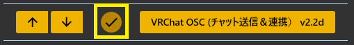

* プラグインを使うチェックをONにしてください。

!!! Info "起動順序について"
    * ツールとしての順序は特にないものの、ユーザレポートによると、ゆかコネを先に立ち上げておいたほうがトラブルが少ないようです。

## 設定

プラグイン一覧で、このプラグインの名前の右にある **「設定」** を押すと開きます。
画面は **8 ページ**に分かれていて、左の一覧で切り替えます（つなぐ／送るもの／VRChat に合わせる／音声コマンド／原点／言い換え／シナリオロール／YNC Msg）。

!!! info "閉じるときの 3 択"
    設定は**下書き**として持たれ、「OK」か「適用」を押すまで動いているプラグインには効きません。
    変更したまま閉じようとすると「変更が保存されていません」と聞かれ、**［はい］保存して閉じる／［いいえ］破棄して閉じる／［キャンセル］閉じるのをやめる** から選べます。

### つなぐ

VRChat と本体のあいだで、OSC のやりとりをする口を決めます。

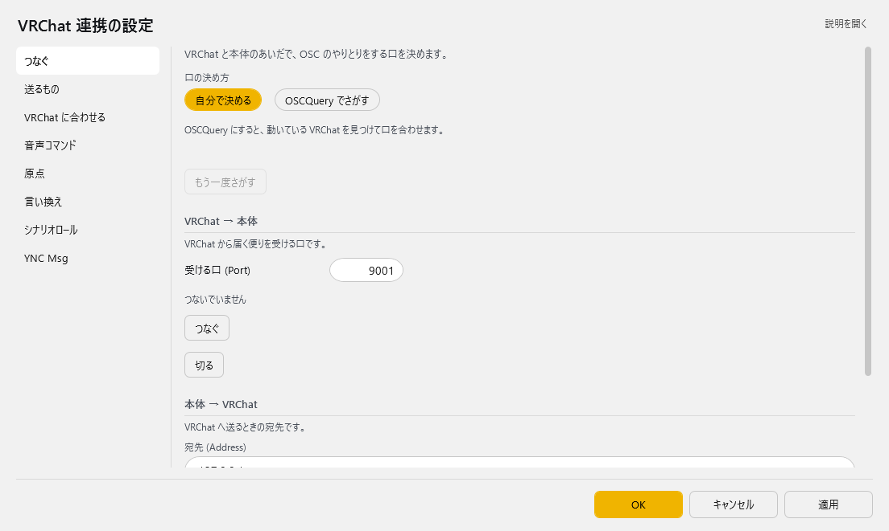

| 項目 | 説明 |
|:--|:--|
| 口の決め方 | OSCQuery にすると、動いている VRChat を見つけて口を合わせます。（選択肢：自分で決める／OSCQuery でさがす。既定：自分で決める） |
| 「もう一度さがす」ボタン | — |

**VRChat → 本体**　VRChat から届く便りを受ける口です。

| 項目 | 説明 |
|:--|:--|
| 受ける口 (Port) | 1～65535。既定：9001 |
| 「つなぐ」ボタン | — |
| 「切る」ボタン | — |

**本体 → VRChat**　VRChat へ送るときの宛先です。

| 項目 | 説明 |
|:--|:--|
| 宛先 (Address) | 既定：「127.0.0.1」 |
| 宛先の口 (Port) | 1～65535。既定：9000 |
| 「ためしに送る」ボタン | VRChat のチャット欄へ「テスト送付 (trial)」と出ます。 |

!!! Info "どちらを選べばよいか"
    * まずは 「自分で決める」 のままで構いません。
    * ポートが他のOSCツールと競合してVRChatが別ポートで待ち受けている場合に 「OSCQuery でさがす」 が役に立ちます。
    * **カメラ位置や身長を「原点」ページで取り込みたいときは 「OSCQuery でさがす」 を選んでください。** VRChatは、受け取り口を登録したツールにしかこれらの情報を送りません（登録はプラグインが自動で行います）。

### 送るもの

VRChat のチャット欄へ、どの字幕を出すかを決めます。

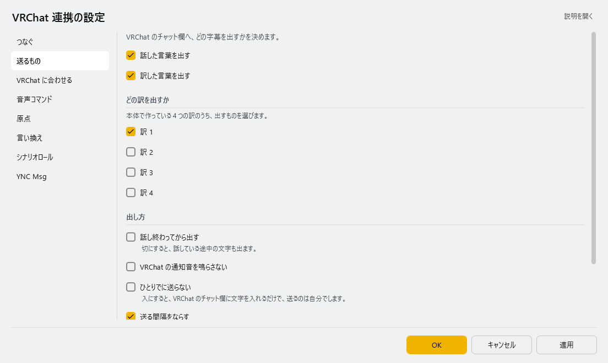

| 項目 | 説明 |
|:--|:--|
| ☑ 話した言葉を出す | 既定：ON |
| ☑ 訳した言葉を出す | 既定：ON |

**どの訳を出すか**　本体で作っている 4 つの訳のうち、出すものを選びます。

| 項目 | 説明 |
|:--|:--|
| ☑ 訳 1 | 既定：ON |
| ☑ 訳 2 | 既定：OFF |
| ☑ 訳 3 | 既定：OFF |
| ☑ 訳 4 | 既定：OFF |

**出し方**

| 項目 | 説明 |
|:--|:--|
| ☑ 話し終わってから出す | 切にすると、話している途中の文字も出ます。（既定：OFF） |
| ☑ VRChat の通知音を鳴らさない | 既定：OFF |
| ☑ ひとりでに送らない | 入にすると、VRChat のチャット欄に文字を入れるだけで、送るのは自分でします。（既定：OFF） |
| ☑ 送る間隔をならす | 切にすると、たまったぶんをそのまま送ります (VRChat に弾かれることがあります)。（既定：ON） |
| この人たちの字幕だけ出す | 読点で区切って並べます。空なら、みんなの字幕を出します。 |

!!! Info "チャットボックスの表示間隔について"
    * VRChatのチャットボックスは **5秒間に5メッセージまで** という制限があります。
    * プラグインは送信を自動で調整するので、長い文章を話しても取りこぼしません。
    * 1メッセージは**144文字**までです。超える分は自動で分割して順番に表示します。
    * 認識途中の文字は「最新の1件」だけを送るので、確定文が制限で埋まることはありません。

### VRChat に合わせる

VRChat の様子に合わせて、本体のふるまいを変えます。

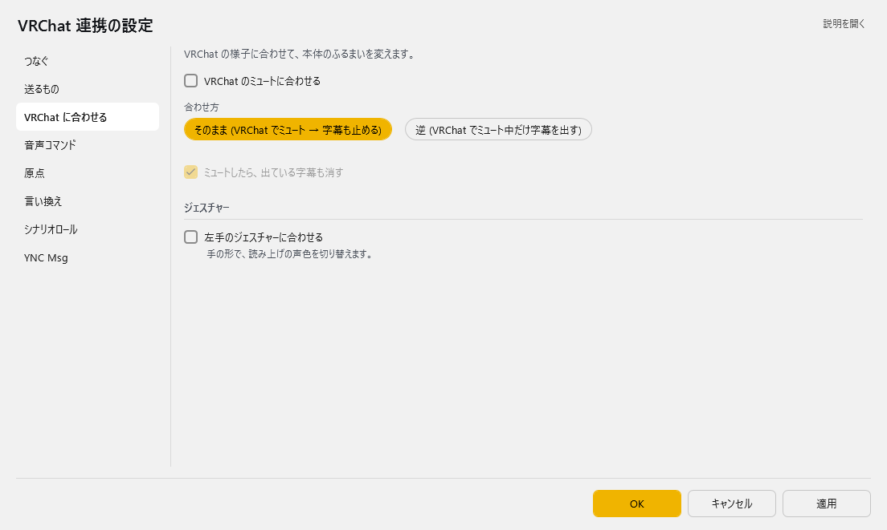

| 項目 | 説明 |
|:--|:--|
| ☑ VRChat のミュートに合わせる | 既定：OFF |
| 合わせ方 | 選択肢：そのまま (VRChat でミュート → 字幕も止める)／逆 (VRChat でミュート中だけ字幕を出す)。既定：そのまま (VRChat でミュート → 字幕も止める) |
| ☑ ミュートしたら、出ている字幕も消す | 既定：ON |

**ジェスチャー**

| 項目 | 説明 |
|:--|:--|
| ☑ 左手のジェスチャーに合わせる | 手の形で、読み上げの声色を切り替えます。（既定：OFF） |

!!! Info "連動のしかた"
    * 「VRChat のミュートに合わせる」 がONのときだけ選べます。
    * 「逆」 は、VRChatではしゃべらずに字幕だけで会話したいときに使います。

!!! Info "ミュートしたら、出ている字幕も消す"
    * VRChatのミュートだけでなく、YNC_Neo本体でミュートしたときにも消えます。
    * 送信待ちの字幕が残っていた場合も、まとめて取り消します。

!!! Info "左手のジェスチャーに合わせる"
    * 読み上げ連携プラグインがONになっていないと機能しません。

### 音声コマンド

決めた言葉を話すと、VRChat のカメラや身長を動かします。

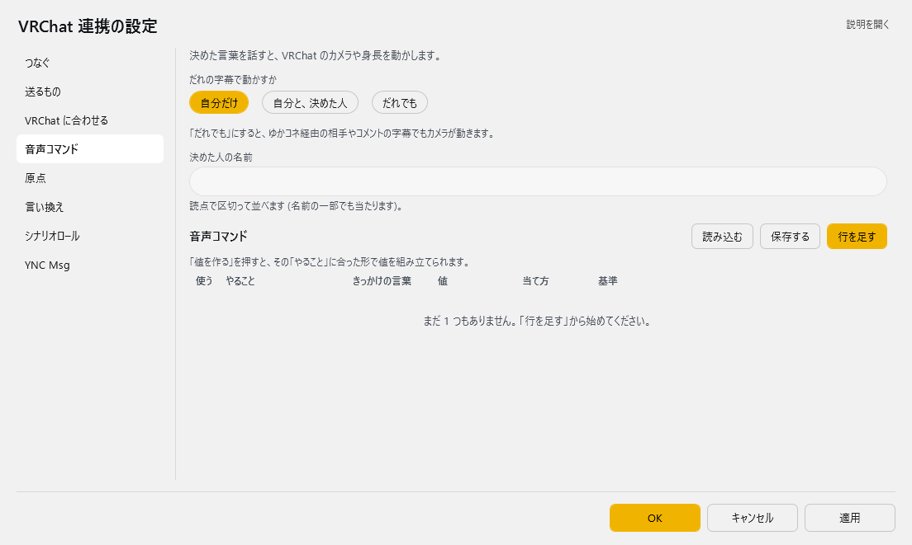

| 項目 | 説明 |
|:--|:--|
| だれの字幕で動かすか | 「だれでも」にすると、ゆかコネ経由の相手やコメントの字幕でもカメラが動きます。（選択肢：自分だけ／自分と、決めた人／だれでも。既定：自分だけ） |
| 決めた人の名前 | 読点で区切って並べます (名前の一部でも当たります)。 |

**音声コマンド**（表）

列：使う／やること／きっかけの言葉／値／当て方（含まれる／そっくり同じ）／基準（そのままの値／原点からの差）

行の右には **「値を作る」**（値を組み立てる画面を開く）と **「ためす」**（その行を VRChat へ送ってみる）のボタンがあります。

「値を作る」を押すと、その「やること」に合った形で値を組み立てられます。

表の右上の **「行を足す」** で行を増やします。行の右端のボタンは ▲▼＝1 つ上へ／下へ、＋＝この下に足す、×＝この行を消す です。**「保存する」** はいまの中身を CSV へ書き出します（控え用）。**「読み込む」** は CSV から読み込んで、いまの中身と入れ替えます。

!!! Info "音声コマンドが発動する条件"
    * **母国語の、確定した認識結果**だけが判定に使われます（翻訳文では発動しません）。
    * 「そっくり同じ」 は、末尾の「。」「？」などの句読点を無視して比較します。「天気」と登録すれば「天気。」でも発動します。
    * 迷ったら 「含まれる」 のままで構いません。ただし、ふだんの会話に出てくる短い言葉をトリガーにすると誤爆します。``カメラ写真`` のような、言わない組み合わせにするのがコツです。

#### やることの一覧

|分類|やること|値|
|:--|:---|:---|
|カメラ操作|写真を撮る／タイマー撮影／カメラを閉じる|不要|
|カメラ操作|カメラ:写真モード／配信モード／ドローン|不要|
|カメラ操作|グリーンスクリーンON・OFF／カメラが自分を見るON・OFF|不要|
|カメラ操作|カメラドリー再生・停止|不要（VRChat Plus / VRC+ の機能です）|
|カメラ移動|カメラを前／後ろ／左／右／上／下へ移動|移動量[m]（空欄なら0.5）|
|カメラ移動|カメラを左／右へ旋回|角度[°]（空欄なら15）|
|カメラ移動|カメラを相対移動|``dx dy dz``（例：``0 1 0`` で1m上へ）|
|カメラ移動|カメラを指定座標へ移動|``x y z`` または ``x y z rx ry rz``|
|カメラ移動|カメラ位置を呼び出す|``x y z rx ry rz``|
|アバター|アバター変身|``avtr_`` で始まるアバターID|
|アバター|身長を変更|身長[m]（例：``1.6``）|
|アバター|身長を2割アップ／ダウン|不要|
|原点|今のカメラ位置／身長／アバターを原点に記録|不要|
|原点|原点カメラ／身長／アバターへ戻る|不要|
|操作|前／後ろ／左／右へ歩く、前へ走る|歩く秒数（空欄なら1）|
|操作|左／右を向く|旋回秒数（空欄なら0.5）|
|操作|ジャンプ／座る・立つ／AFK／マイクミュート／クイックメニュー／セーフモード|不要|
|操作|右手・左手で 使う／掴む／離す|不要|

!!! Warning "アバター変身について"
    * VRChatの仕様上、**お気に入り・最近使った・自分がアップロードしたアバター**にしか変身できません。
    * アバターIDは、VRChat側でそのアバターに着替えてから 行の **「値を作る」** で開く画面の ``現在値を取込`` で取り込むのが確実です。

!!! Info "新しい機能を使うにはVRChatの更新が必要です"
    |やること|必要なVRChatのバージョン|
    |:--|:---|
    |アバター変身、カメラドリー、原点アバターへ戻る|2025.1.2 以降|
    |カメラ操作・カメラ移動すべて（原点カメラへ戻る を含む）|2025.3.3 以降|
    |身長の操作すべて（変更／2割アップ・ダウン／原点身長へ戻る）|2026.2.1 以降|

#### 値を組み立てる（「値を作る」）

値の欄には直接入力や貼り付けができますが、行の **「値を作る」** を押すと入力を助ける画面が開きます。

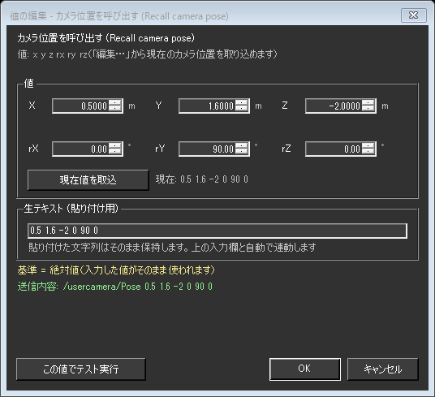

|項目|意味|
|:--|:---|
|X／Y／Z、rX／rY／rZ|位置と向きを1つずつ入力します。矢印で少しずつ動かせます|
|向き (rx ry rz) も指定する|外すと、位置だけを変えて今の向きをそのまま保ちます|
|現在値を取込|VRChatから受け取っている今の値を入れます。右に「現在: 」として常に表示されています（「基準」が **原点からの差** の行では ``現在値との差を取込`` に変わります。下記参照）|
|生テキスト (貼り付け用)|実際に保存される文字列です。**ここに貼り付けてもかまいません**|
|送信内容|この値で実際にVRChatへ送られる内容です。入力に合わせてその場で変わります|
|この値でテスト実行|OKで確定する前に、VRChatで動きを確かめられます|

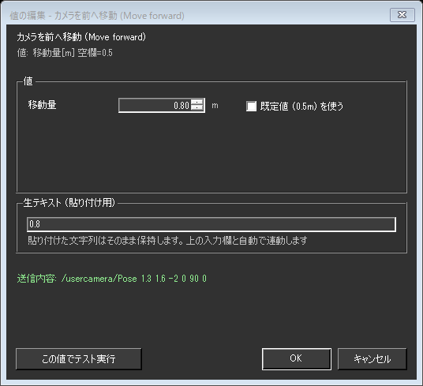

* 移動量や秒数のように数値ひとつを入れるやることでは、入力欄と単位、``既定値を使う`` のチェックが出ます。
* ``既定値を使う`` にすると値は空欄で保存され、実行時に既定値（上の一覧の「空欄なら〜」）が使われます。

!!! Info "貼り付けた文字は書き換わりません"
    * ``0.5,1.6,-2`` のようにカンマ区切りで貼り付けても正しく読み取ります。
    * 読み取れなかった文字列は**消さずにそのまま残します**（欄が赤くなり、理由が下に表示されます）。直すか空にして**別の場所をクリックすると**、上の入力欄がまた使えるようになります。
    * ``キャンセル`` を押した場合は、表の値は一切変わりません。

##### 基準が「原点からの差」のとき

「基準」を **原点からの差** にすると、値の意味が「座標そのもの」から「**原点からの差**」に変わります。
それに合わせて、この画面も次のように切り替わります。

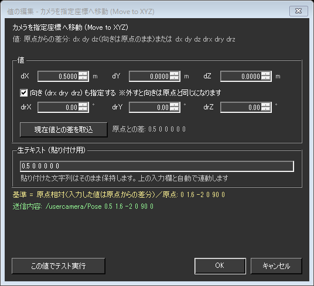

|そのままの値のとき|原点からの差のとき|
|:--|:---|
|``X`` ``Y`` ``Z`` ``rX`` ``rY`` ``rZ``|``dX`` ``dY`` ``dZ`` ``drX`` ``drY`` ``drZ``（d＝差）|
|``現在値を取込``（今の座標をそのまま入れる）|``現在値との差を取込``（**今いる場所と原点の差**を入れる）|
|``現在: 0.5 1.6 -2 0 90 0``|``原点との差: 0.5 0 0 0 0 0``|
|「向きも指定する」を外すと**今の向きを保つ**|「向きも指定する」を外すと**向きは原点と同じ**になる|

!!! Warning "「向きも指定する」の意味は基準によって違います"
    * **そのままの値** … 外すと、そのときカメラが向いている方向をそのまま保ちます。
    * **原点からの差** … 外すと「向きの差がゼロ」という意味になるので、**原点を記録したときの向き**になります。今の向きは保たれません。
    * 今の向きを保ったまま原点からの差で動かしたいときは、``現在値との差を取込`` を押してください（向きの差も含めた6つの値が入ります）。

!!! Info "「現在値との差を取込」の使いどころ"
    ワールドごとに座標が違っても、**同じ構図を撮り直せる**ようになります。
    1. VRChatで基準にしたい場所にカメラを置き、「原点」ページの **「いまの値を入れる」** を押します
    2. 撮りたい構図までカメラを動かします
    3. 行の「基準」を **原点からの差** にして **「値を作る」** を開き、``現在値との差を取込`` を押します
    4. 以後は「原点をその都度決め直す」だけで、同じ位置関係を再現できます

    原点が未設定のままこのボタンを押すと、先に原点を決めるよう画面下に表示されます。

### 原点

「原点からの差」で動かすときの、もとになる場所です。

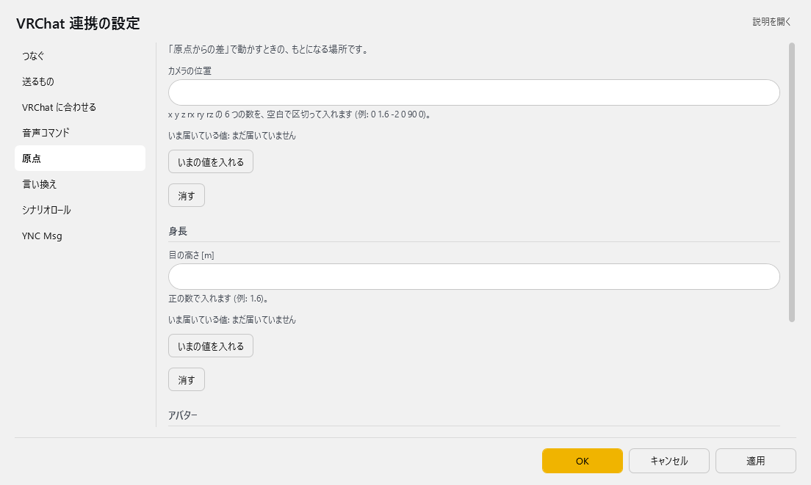

| 項目 | 説明 |
|:--|:--|
| カメラの位置 | x y z rx ry rz の 6 つの数を、空白で区切って入れます (例: 0 1.6 -2 0 90 0)。 |
| 「いまの値を入れる」ボタン | — |
| 「消す」ボタン | — |

**身長**

| 項目 | 説明 |
|:--|:--|
| 目の高さ [m] | 正の数で入れます (例: 1.6)。 |
| 「いまの値を入れる」ボタン | — |
| 「消す」ボタン | — |

**アバター**

| 項目 | 説明 |
|:--|:--|
| アバターの符丁 | — |
| 「いまの値を入れる」ボタン | — |
| 「消す」ボタン | — |

#### 原点の考え方

**原点とは、「基準」を「原点からの差」にした行が“基準”として使う値です。**
ここで決めた場所・身長からの**差分**でコマンドの値を書けるようになります。
たとえば原点カメラを決めておけば、「カメラを指定座標へ移動」の値を「原点から右に 1m」のように書けます。

* **「いまの値を入れる」** で、VRChat から受け取っている今の値を原点にします。**「消す」** で未設定に戻します（OK を押すと残ります）。
* 原点は、VRChat 内から声でも記録できます（やること：「今のカメラ位置を原点に記録」など）。記録すると設定ファイルにもすぐ書かれます。
* 記録した原点へは「原点カメラへ戻る」などで戻れます。

!!! Info "「基準」が使えるやること"
    * 「カメラ位置を呼び出す」「カメラを指定座標へ移動」「身長を変更」の 3 つだけです。
    * それ以外の行では「基準」を選んでも効きません。

!!! Warning "原点が未設定のまま「原点からの差」にすると実行されません"
    * 差分だけを絶対値として実行すると、身長 ``+0.1`` が身長 10cm になるなど危険なため、あえてエラーにしています。
    * 行の **「ためす」** を押すと、理由が表示されます。

### 言い換え

VRChat へ出す前に、字幕の文字を置き換えます。

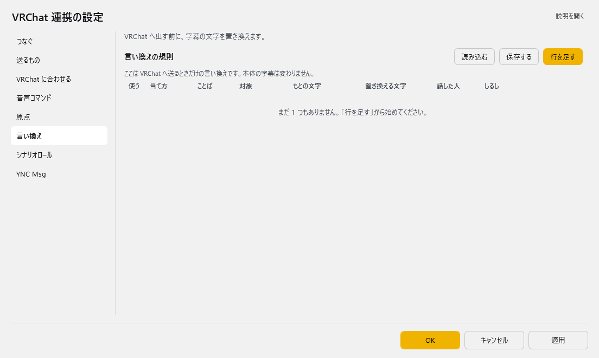

**言い換えの規則**（表）

列：使う／当て方／ことば／対象／もとの文字／置き換える文字／話した人／しるし

ここは VRChat へ送るときだけの言い換えです。本体の字幕は変わりません。

表の右上の **「行を足す」** で行を増やします。行の右端のボタンは ▲▼＝1 つ上へ／下へ、＋＝この下に足す、×＝この行を消す です。**「保存する」** はいまの中身を CSV へ書き出します（控え用）。**「読み込む」** は CSV から読み込んで、いまの中身と入れ替えます。

<!-- TODO(author): 「言い換え」ページは画面上は文字の置き換えの表だが、プラグインの読み込み処理
(PluginFunction.LoadMemory) は同じ Plugin_VRChat_OSC_rule.config を旧来の「OSC アドレスへ値を送る規則」
(使う/当て方=完全・一部/対象=1:母国語…/起動フレーズ/OSC Address/Param/対象者/タグ) として読んでいる。
画面の選択肢 (正規/原文/訳文) を読む処理が無い。アプリ側の動作が確定したら、ここに使い方を書く。 -->

### シナリオロール

書いておいた台本を、F1 で 1 行ずつ送り出します。

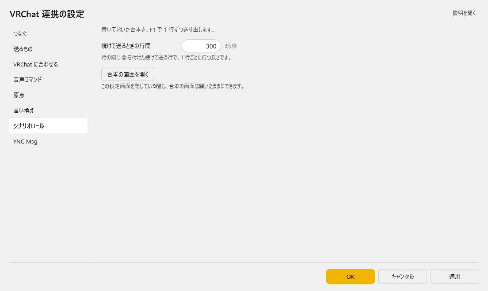

| 項目 | 説明 |
|:--|:--|
| 続けて送るときの行間 | 0～10000。既定：300 |
| 「台本の画面を開く」ボタン | この設定画面を閉じている間も、台本の画面は開いたままにできます。 |

### YNC Msg

本体の字幕を、VRChat 以外の OSC の受け手へも流します。

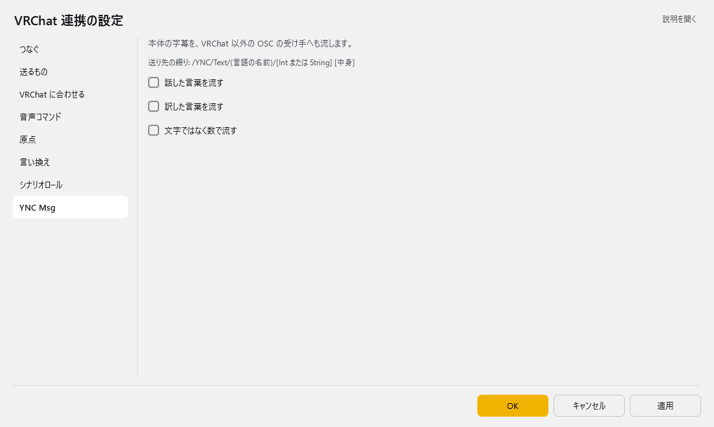

> 送り先の綴り: /YNC/Text/(言語の名前)/[Int または String] [中身]

| 項目 | 説明 |
|:--|:--|
| ☑ 話した言葉を流す | 既定：OFF |
| ☑ 訳した言葉を流す | 既定：OFF |
| ☑ 文字ではなく数で流す | 既定：OFF |

## シナリオロール（台本を順番に送る）

**あらかじめ書いておいた台本を、``F1`` キーで1行ずつ送り出す機能です。**
演劇・朗読・決まった段取りのある配信で、字幕・チャット・カメラ操作を**手元のタイミングで**進められます。

設定画面の「シナリオロール」ページの **「台本の画面を開く」** を押すと、専用のエディタが別ウィンドウで開きます。

!!! Info "ウィンドウは開いたままにしておけます"
    * 設定画面とは別のウィンドウなので、VRChatを操作しながら出しっぱなしにできます。
    * 閉じたときの**位置・大きさ・本文・カーソル行を覚えています**。次に開くと続きから使えます。
    * **開いたままゆかコネを終了すると、次回起動時に自動で開きます。** 自分で閉じてから終了すれば、次回は開きません。
    * このプラグインの**設定画面を開いている間は、ロール画面は一時的に隠れます**（設定画面を閉じると戻ります）。

### 1行の書き方

台本は **1行＝1つの動作**です。行の先頭に何を書くかで、送り先が決まります。

|行の書き方|何が起きるか|
|:--|:---|
|``<- メモ``|**コメント**です。何も送りません。段取りのメモに使います|
|``おはようございます``|コマンドを書かない素の行は、**字幕**として送ります。ゆかコネの字幕・翻訳・読み上げに流れます|
|``TEXT こんばんは``|``/YNC/Text/Native/String`` へ文字列として送ります|
|``CHAT こんばんは``|**VRChatのチャットボックス**に出します|
|``CMD camera_close``|**音声コマンドと同じ操作**を実行します（カメラ・身長・アバター・移動）|
|``OSC @/avatar/parameters/Wave true``|**好きなOSCアドレス**へ送ります。ギミック向けです|

!!! danger "v2.3 で書いた台本をお持ちの方へ"
    **v3.0 beta 7 で、``TEXT`` 行と素の行の送り先が入れ替わりました。**

    | | v2.3 | v3.0 |
    |:--|:--|:--|
    | ``TEXT 本文`` | ゆかコネの字幕 | ``/YNC/Text/Native/String`` |
    | 素の行（コマンドなし） | ``/YNC/Text/Native/String`` | ゆかコネの字幕 |

    v2.3 で書いた台本をそのまま読ませると、**エラーも出ずに送り先だけが逆になります。**

    「設定保存・復元」→「v2.3設定を移行」を実行すると、
    「原稿を v3.0 の書式へ書き直しますか？」と聞かれます。**はい**を選んでください。
    書き直しはプラグインが次に読み込まれたときに行われます（再起動すると確実です）。

    * 元の原稿は ``Plugin_VRChat_OSC.scenario-v23-backup.txt`` に控えられます
    * **書き直しは 1 回だけ**です。2 回通すと元に戻ります。v3.0 で一度でも編集した原稿は対象になりません
    * **意味を保ったまま書き換えられない行**は、そのまま残して行番号をログに出します。手で直してください
    * **外部ファイルにした台本（「台本の保存と読み込み」で開いているもの）は書き換えません。**
      手で直すか、いったんこの画面に読み込んでから移行してください

* ``TEXT`` ``CHAT`` ``OSC`` ``CMD`` は**大文字小文字どちらでも**かまいません。
* 行の先頭に空白があってもかまいません。読みやすいように字下げできます。

!!! Info "空行とコメントの使いどころ"
    * 空行はいくつ入れてもかまいません。幕やシーンの区切りに使ってください。
    * ``<-`` のコメント行は送信されないので、「ここで客席を見る」のようなト書きを書いておけます。

### 送り方（キー操作）

|キー|動作|
|:--|:---|
|``F1``|**カーソル行を送って、次の行へ進みます**。押し続けるだけで台本が進みます|
|``Esc`` または ``Shift+F1``|連続送信を**中止**します|
|``Ctrl+↓`` / ``Ctrl+↑``|送らずに次の行／前の行へ移動します|
|``F2``|いまのカメラ位置を行として挿入します|
|``F3``|アバター・カメラ操作のコマンドを選んで挿入します|

* 画面下のステータスバーに、**いま何を送ったか**が表示されます。うまくいかないときは赤い文字で理由が出ます。
* ``送信`` メニューの ``改行で送信`` をONにすると、``Enter`` でも送れます（既定はOFF）。編集中に誤送信しやすいので、慣れてから使ってください。

### まとめて送る（``@`` 連続送信）

**行の先頭に ``@`` を付けると、``@`` が付いた行が続くかぎり、まとめて送ります。**
「暗転して、カメラを動かして、セリフを出す」のような一連の動きを、``F1`` 一回で流せます。

```text
<- 第2幕 はじまり
@CMD camera_close
@OSC @/usercamera/Pose f:0.5 f:1.6 f:-2 f:0 f:90 f:0
@TEXT 幕が上がります
TEXT ここからは1行ずつ進めます
```

* 上の例では ``@`` の付いた3行が続けて送られ、``@`` の無い最後の行で止まります。
  最後の行は、次に ``F1`` を押したときに送られます。

|規則|内容|
|:--|:---|
|止まる条件|``@`` が付いていない行に来たら止まります。**空行でも止まります**|
|コメントの扱い|``<-`` のコメント行は**飛ばして先へ進みます**（区切りにはなりません）。途中にメモを書けます|
|行の間隔|「シナリオロール」ページの **続けて送るときの行間**（ミリ秒）を使います（既定 300＝0.3秒）|
|カーソル|送りながら1行ずつ動き、最後は止まった行に着きます|
|中止|走っている間に ``F1`` か ``Esc`` を押すと止まります。カーソルは止めた行に残るので、もう一度 ``F1`` を押すとその行から流し直せます|

!!! Info "先頭に「@」の文字そのものを書きたいとき"
    * ``@@`` と2つ重ねてください。``@@ました`` は ``@ました`` という文字列として送られ、連続送信にはなりません。

### OSC行の値の書き方

``OSC`` 行は、``@`` に続けてアドレス、そのあとに値を空白区切りで並べます（アドレスの ``@`` は省略できます）。
値の**型は書き方から自動で判断**します。

|書き方|送られる型|
|:--|:---|
|``1``|整数|
|``1.0``|小数|
|``true`` ``false``|真偽値|
|``"空白を含む 文字列"``|文字列（引用符で囲みます）|
|それ以外|文字列|

型を**はっきり指定したいとき**は、値の前に印を付けます。

|印|意味|例|
|:--|:---|:--|
|``i:``|整数|``i:1``|
|``f:``|小数|``f:1.5``|
|``b:``|真偽値|``b:true``|
|``s:``|文字列|``s:あいさつ``|

* 全角で ``１．６`` と打っても小数として読み取ります。日本語入力のままでも大丈夫です。
* ``TEXT`` ``CHAT`` の本文は**そのまま**送られます。引用符や記号を書いてもそのまま出ます。

!!! Warning "「1」と「1.0」は別物です"
    * ``1`` は**整数**、``1.0`` は**小数**として送られます。
    * VRChatのカメラ位置（``/usercamera/Pose``）は**小数を6つ**必要とするため、
      ``OSC @/usercamera/Pose 0 1 0 0 90 0`` と書くと整数になり、**何も起きません**。
    * ``f:0 f:1 …`` と書くか、``0.0 1.0 …`` と小数で書いてください。
    * ``F2`` の「カメラ位置を挿入」は、はじめから ``f:`` を付けた形で入ります。迷ったらこちらを使ってください。

### 台本づくりを助ける機能

#### カメラ位置を挿入（``F2``）

VRChatから受け取っている**いまのカメラ位置**を、そのまま送れる行として差し込みます。

```text
<- カメラ位置 2026-07-28 12:34:56
OSC @/usercamera/Pose f:0.5 f:1.6 f:-2 f:0 f:90 f:0
```

* VRChatで構図を決める → ``F2`` を押す、を繰り返すだけでカット割りが作れます。
* カメラ位置をまだ受け取っていないときは、画面下に赤い文字で理由が出て**何も挿入されません**。
  「つなぐ」ページの口の決め方を **OSCQuery でさがす** にし、VRChat側でカメラを出して一度動かしてください（「原点」ページの「いま届いている値」と同じ仕組みです）。

#### アバター指示コマンドを挿入（``F3``）

音声コマンドと**同じ操作の一覧**から選んで、``CMD`` 行として差し込みます。
値が必要なものは、音声コマンドと同じ入力支援の画面が開きます（``現在値を取込`` や送信内容のプレビューもそのまま使えます）。

```text
<- カメラを閉じる/オフ (Close camera)
CMD camera_close
```

!!! Info "「CMD」で書く理由"
    * 「カメラを閉じる」「前へ歩く」などは、**内部で複数の信号を決まった間隔で送る**動作です。
    * ``CMD`` で書いておけば、その**本来の間隔がそのまま守られます**。
      OSC行にばらして書くと「続けて送るときの行間」に置き換わってしまい、「1秒前進」が別物になります。
    * ``挿入`` メニューの ``挿入時に説明のコメントを付ける`` をONにしておくと、
      何のコマンドか分かるコメント行が一緒に入ります（既定ON）。

!!! Warning "原点の記録はシナリオからは実行できません"
    * ``今のカメラ位置を原点に記録`` などは一覧で灰色になり、選べません。
    * 原点の記録は設定画面の「原点」ページか、声で行ってください。``原点カメラへ戻る`` などの呼び出し側は使えます。

### 台本の保存と読み込み

|操作|キー|内容|
|:--|:---|:--|
|新規作成|``Ctrl+Shift+N``|本文を空にします|
|読み込み|``Ctrl+Shift+O``|テキストファイル(``.txt``)を開きます|
|上書き保存|``Ctrl+S``|いま開いているファイルに保存します|
|名前を付けて保存|``Ctrl+Shift+S``|ファイル名を決めて保存します|

* 本文は**保存しなくても自動で覚えています**。次にゆかコネを起動したときに、そのまま続きから使えます。
* 演目ごとにファイルを分けたいときは、``名前を付けて保存`` を使ってください。
* 古い台本が文字化けする場合でも、UTF-8 と Shift-JIS を自動で判別して読み込みます。

!!! Info "とても長い台本のとき"
    * 本文が非常に大きい（おおよそ50万文字を超える）場合、自動保存は行われません。画面下にその旨が表示されます。
    * このときは ``Ctrl+S`` でファイルに保存してください。**次回起動時はそのファイルから読み直します。**

### 書式を忘れたら

``ヘルプ`` メニューの ``書式のヘルプ...`` に、上の内容の要点がまとまっています。

!!! Info "キー割り当てやAPIから操作する"
    * このプラグインへ ``scenario`` コマンドを送ると、ロール画面を外部から操作できます。
    * ``action`` に ``open`` ``close`` ``send`` ``sendnext`` ``next`` ``prev`` ``stop`` を指定します。
    * ``action`` を ``run`` にして ``text`` に1行渡すと、**ウィンドウを開かずにその1行だけ**を実行できます。
    * 足元のキーボードやStreamDeckから ``sendnext`` を叩けば、画面を見ずに台本を進められます。

---

## 使い方

1. VRChatを起動します
2. VRChatのリングメニューでOSCを ``Enable`` にします
3. ゆかコネ側で、このプラグインの設定画面の「つなぐ」ページにある **「つなぐ」** を押して通信を開始します
4. VRChat 側で、ChatBoxの表示設定をします
5. VRChat のリングメニューでChatBoxをONにします
6. 音声認識すると字幕が表示されます

### 音声コマンドを使うとき

1. 上の手順で接続まで終わらせます
2. 「つなぐ」ページの口の決め方を **OSCQuery でさがす** にし、動いている VRChat が見つかることを確認します（見つからないときは **「もう一度さがす」**。カメラ位置などの取り込みに必要です）
3. VRChat側で一度カメラを出して動かします。「原点」ページの「いま届いている値」にカメラ位置が表示されれば準備完了です
4. 「音声コマンド」ページで行を作り、行の **「ためす」** で動作を確認してから ``OK`` で保存します
5. 実際に声に出して発動するか確かめます

### シナリオロールを使うとき

1. 上の手順で接続まで終わらせます
2. カメラ位置を台本に取り込みたい場合は、口の決め方を **OSCQuery でさがす** にしておきます
3. 「シナリオロール」ページの **「台本の画面を開く」** を押します
4. 台本を書きます。``F2``（カメラ位置）や ``F3``（アバター指示）を使うと手早く作れます
5. ``Ctrl+S`` でファイルに保存しておきます
6. 本番では、カーソルを最初の行に置いて ``F1`` を押していきます

!!! Info "本番前の下読みをおすすめします"
    * 一度 ``F1`` で最後まで通してみて、思ったとおりの順番・間隔で進むか確かめてください。
    * ``@`` でまとめた行は、間隔が短すぎると慌ただしく見えます。「続けて送るときの行間」で調整できます。
    * ``CHAT`` を続けて使う場合は、VRChat側の制限（5秒に5メッセージ）で表示が遅れて追いつくことがあります。
      画面下に送信待ちの件数が出るので、台本が先へ行き過ぎていないか確認できます。

!!! Info "うまくいかないとき"
    * 通信ポートがすでに使われている場合があります。競合ソフトを終了してください
    * 通信ポートの競合が改善できない場合は、[VRChat側の通信ポートを変更する方法](https://docs.vrchat.com/docs/osc-overview)もあります
    * 通信先が ``localhost`` と指定されている場合に通信失敗することがあります。その場合は``127.0.0.1``に変更します。

!!! Info "音声コマンドがうまくいかないとき"
    * **反応しない**：``有効`` のチェック、``実行を許可する話者``（既定は自分だけ）、トリガーワードが認識結果に含まれているかを確認してください。ゆかコネの認識結果ウィンドウで、実際に何と認識されたかを見るのが近道です。
    * **「現在: 未受信」から変わらない**：まず口の決め方が **OSCQuery でさがす** になっているかを確認してください。そのうえで、VRChatから値が届くのはそれを動かしたときだけです。カメラ位置＝カメラを出して動かす／身長＝アバターを読み込み直すか身長を変える／アバターID＝着替える、で届きます。
    * **テスト実行で赤い文字が出る**：その文がそのまま原因です。値が足りない／原点が未設定、のどちらかであることがほとんどです。
    * **意図しないときに発動する**：``一致方式`` を ``完全一致`` にするか、トリガーワードを長くしてください。

!!! Info "シナリオロールがうまくいかないとき"
    * **``F1`` を押しても何も起きない**：その行がコメント（``<-``）か空行になっていないか確認してください。画面下に「コメント行」と出ます。
    * **``OSC`` 行でカメラが動かない**：値が整数になっている可能性があります。``0 1 0 0 90 0`` ではなく ``f:0 f:1 …`` と書くか、``F2`` で挿入し直してください。
    * **赤い文字が出る**：その文がそのまま原因です。``アドレスは / で始めてください`` ``引用符 " が閉じていません`` など、書式の間違いを指しています。
    * **``@`` の連続送信が途中で止まる**：止まった行に ``@`` が付いているか確認してください。空行でも止まります（コメント行では止まりません）。
    * **``CMD`` の行で「知らないコマンドです」と出る**：``F3`` の一覧から選び直すのが確実です。コマンド名は一覧にあるものだけが使えます。
    * **ロール画面が操作できない**：このプラグインの設定画面を開いていませんか。設定画面を開いている間、ロール画面は隠れます。設定画面を閉じてください。
