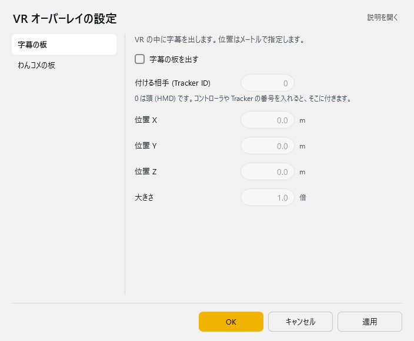
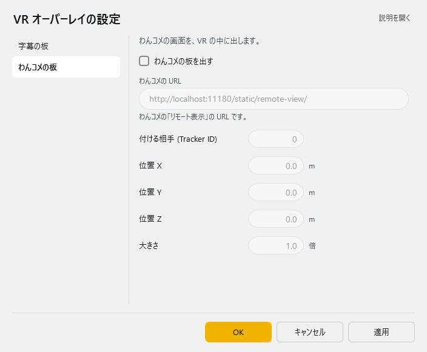

<!-- version-banner -->
!!! info ""
    ゆかコネNEO **v3.0** のドキュメントです。v2.3 をお使いの方は [v2.3 版のこのページ](../../v2.3/plugin/plugin_vroverlay.md) を、違いを知りたい方は [v2.3 から v3.0 への移行](../../mig/mig_neo_v3.0.md) をご覧ください。

!!! Info "前提条件"
    * OSC通信を使うアプリケーションと併用していること

## このプラグインで出来ること

* VRゲーム内で字幕とコメントをみることができます。
!!! Warning "オーバーレイについて"
    * リアルタイム合成するため、多少VRに負荷がかかります（FPSが低下します）。
    * 環境などによっては、オーバーレイが表示できないことがあります。(OpenVRを使っていない場合など)

##　有効化

* プラグインを使うチェックをONにしてください。

## 設定

プラグイン一覧で、このプラグインの名前の右にある **「設定」** を押すと開きます。
画面は **2 ページ**に分かれていて、左の一覧で切り替えます（字幕の板／わんコメの板）。

!!! info "閉じるときの 3 択"
    設定は**下書き**として持たれ、「OK」か「適用」を押すまで動いているプラグインには効きません。
    変更したまま閉じようとすると「変更が保存されていません」と聞かれ、**［はい］保存して閉じる／［いいえ］破棄して閉じる／［キャンセル］閉じるのをやめる** から選べます。

### 字幕の板

VR の中に字幕を出します。位置はメートルで指定します。

| 項目 | 説明 |
|:--|:--|
| ☑ 字幕の板を出す | 既定：OFF |
| 付ける相手 (Tracker ID) | 0 は頭 (HMD) です。コントローラや Tracker の番号を入れると、そこに付きます。（0～64。既定：0） |
| 位置 X | -100～100m。既定：0.0 |
| 位置 Y | -100～100m。既定：0.0 |
| 位置 Z | -100～100m。既定：0.0 |
| 大きさ | 0～100倍。既定：1.0 |

### わんコメの板

わんコメの画面を、VR の中に出します。

| 項目 | 説明 |
|:--|:--|
| ☑ わんコメの板を出す | 既定：OFF |
| わんコメの URL | わんコメの「リモート表示」の URL です。 |
| 付ける相手 (Tracker ID) | 0～64。既定：0 |
| 位置 X | -100～100m。既定：0.0 |
| 位置 Y | -100～100m。既定：0.0 |
| 位置 Z | -100～100m。既定：0.0 |
| 大きさ | 0～100倍。既定：1.0 |

### 補足

!!! Info "URLについて"
    * わんコメテンプレートからのドラッグ＆ドロップを受け付けます。
    * わんコメ以外でもURLアクセスできるものであれば表示できます

## 使い方
1. VRゲームを起動します
2. プラグインのLaunchボタンを押します
3. 黒いウィンドウが表示され、字幕が投影されます

!!! Info "黒いウィンドウについて"
    * StreamVRにオーバーレイデータを生成・送付しているプログラムです
    * 使用中は起動しておいてください（最小化で構いません）

