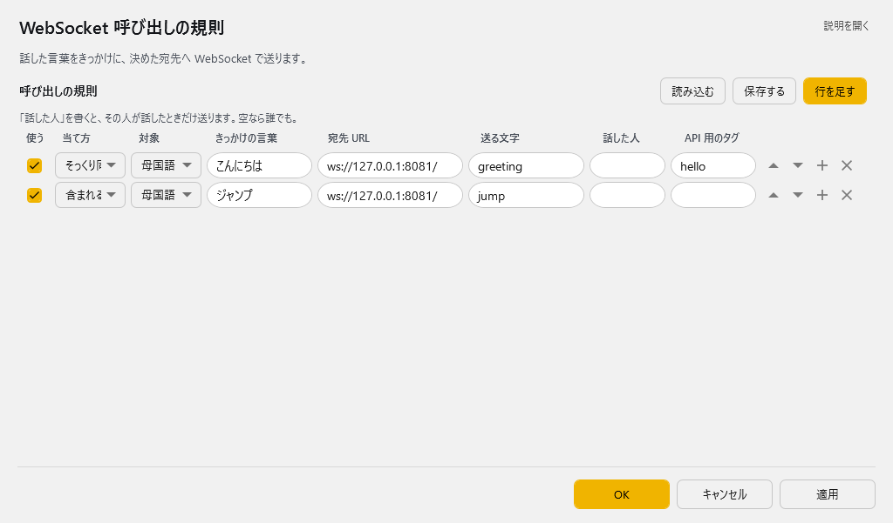

<!-- version-banner -->
!!! info ""
    ゆかコネNEO **v3.0** のドキュメントです。v2.3 をお使いの方は [v2.3 版のこのページ](../../v2.3/plugin/plugin_wscall.md) を、違いを知りたい方は [v2.3 から v3.0 への移行](../../mig/mig_neo_v3.0.md) をご覧ください。

!!! Info "前提条件"
    * WebSocketで呼び出されてつかえる機能（相手）が必要です

## このプラグインで出来ること

* 特定の条件でHTTPの通信を呼び出すことができます。

## 有効化


* プラグインを使うチェックをONにしてください。

## 設定

プラグイン一覧で、このプラグインの名前の右にある **「設定」** を押すと開きます。

!!! info "閉じるときの 3 択"
    設定は**下書き**として持たれ、「OK」か「適用」を押すまで動いているプラグインには効きません。
    変更したまま閉じようとすると「変更が保存されていません」と聞かれ、**［はい］保存して閉じる／［いいえ］破棄して閉じる／［キャンセル］閉じるのをやめる** から選べます。

話した言葉をきっかけに、決めた宛先へ WebSocket で送ります。



**呼び出しの規則**（表）

列：使う／当て方／対象／きっかけの言葉／宛先 URL／送る文字／話した人／API 用のタグ

「話した人」を書くと、その人が話したときだけ送ります。空なら誰でも。

表の右上の **「行を足す」** で行を増やします。行の右端のボタンは ▲▼＝1 つ上へ／下へ、＋＝この下に足す、×＝この行を消す です。**「保存する」** はいまの中身を CSV へ書き出します（控え用）。**「読み込む」** は CSV から読み込んで、いまの中身と入れ替えます。

## ルール

* ルールは、条件に一致したときにそのデータを送付することができる「仕掛け」です

|設定|意味|
|:--|:---|
|有効(Enabled)|この条件を有効化します|
|モード(Mode)|条件の判断モードを指定します|
|対象|対象にする言語を決めます（母国語、翻訳１～４）|
|起動フレーズ|判断に使う起動キーワードです。一致すると起動します|
|コールURL|WebSocketコールするときの送付先です (ws://で始まるアドレスになります) |
|送信文字|接続後に送信する文字列です。（送信後、通信を終了します）|
|対象者|話者名に指定文字が含まれているときに反応します。空欄の場合は全員が対象です|
|APIタグ|APIから呼び出すときにつかうタグ名です|

!!! Info "パラメータの記述"
    * 発話がきっかけで呼び出される場合は、**コールURL と 送信文字の両方**の中に下記パラメータが使えます

    |パラメータ|意味|
    |:--------|:---|
    |{text0}|母国語（文）|
    |{text1}|翻訳１（文）|
    |{text2}|翻訳２（文）|
    |{text3}|翻訳３（文）|
    |{text4}|翻訳４（文）|
    |{lang0}|母国語（言語名）|
    |{lang1}|翻訳１（言語名）|
    |{lang2}|翻訳２（言語名）|
    |{lang3}|翻訳３（言語名）|
    |{lang4}|翻訳４（言語名）|
    |{talker}|発話者名|

!!! Warning "パラメータは自動でURLエンコードされます"
    * 差し込まれる値は URLエンコード（パーセントエンコード）されます。日本語は ``%E3%81%82`` のような形になります。
    * 受け取る側でデコードが必要です。
    * **送信文字の中でもエンコードされます**。そのまま日本語を送りたい場合はご注意ください。

!!! Tech "APIタグから発火できます"
    * ``/api/command?target=Plugin_WSCall&command=exec&tag=（APIタグ）`` で、外部から呼び出せます。
    * ゆかコネNEO v2.3.128～。それ以前のバージョンでは正しく送信されません。
    * 詳しくは [プラグイン系API](../tech/tech_api_plugin.md) をご覧ください。

!!! Warning "APIタグで呼び出した場合、置換パラメータは空になります"
    * APIタグ経由（``/api/command``）で発火したときは、発話にひもづいていないため**すべてのパラメータが空文字**になります。
    * パラメータを使いたい場合は、起動フレーズによって発火するルールとして設定してください。

!!! Tips "コールURLの設定例"
    * VNyanでつかうには、コールURLに下記の用に設定します
    ```ws://127.0.0.1:8000/vnyan```


