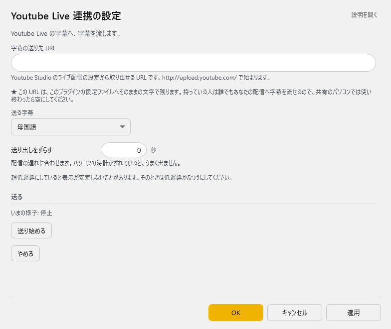

<!-- version-banner -->
!!! info ""
    ゆかコネNEO **v3.0** のドキュメントです。v2.3 をお使いの方は [v2.3 版のこのページ](../../v2.3/plugin/plugin_youtube.md) を、違いを知りたい方は [v2.3 から v3.0 への移行](../../mig/mig_neo_v3.0.md) をご覧ください。

!!! Info "前提条件"
    * Google アカウントが必要です。

## このプラグインで出来ること

* YouTube Live配信に字幕を送付できます

!!! Warning "字幕送付について"
    * 超低遅延設定の配信に字幕をつけている場合にうまく表示されないことがあります
    * PCの時刻が 50秒ずれていると送付できないことがあります
    * 別の手段として [OBS連携](plugin_OBS5.md)にある 608/607送信を使うてもあります

## 有効化

* プラグインを使うチェックをONにしてください。

## 設定

プラグイン一覧で、このプラグインの名前の右にある **「設定」** を押すと開きます。

!!! info "閉じるときの 3 択"
    設定は**下書き**として持たれ、「OK」か「適用」を押すまで動いているプラグインには効きません。
    変更したまま閉じようとすると「変更が保存されていません」と聞かれ、**［はい］保存して閉じる／［いいえ］破棄して閉じる／［キャンセル］閉じるのをやめる** から選べます。

Youtube Live の字幕へ、字幕を流します。

| 項目 | 説明 |
|:--|:--|
| 字幕の送り先 URL | Youtube Studio のライブ配信の設定から取り出せる URL です。… で始まります。 |

> ★ この URL は、このプラグインの設定ファイルへそのままの文字で残ります。持っている人は誰でもあなたの配信へ字幕を流せるので、共有のパソコンでは使い終わったら空にしてください。

| 項目 | 説明 |
|:--|:--|
| 送る字幕 | 選択肢：母国語／翻訳 1／翻訳 2／翻訳 3／翻訳 4。既定：母国語 |
| 送り出しをずらす | 配信の遅れに合わせます。パソコンの時計がずれていると、うまく出ません。（-60～60秒。既定：0） |

> 超低遅延にしていると表示が安定しないことがあります。そのときは低遅延かふつうにしてください。

**送る**

> いまの様子: …

| 項目 | 説明 |
|:--|:--|
| 「送り始める」ボタン | — |
| 「やめる」ボタン | — |

### 補足

!!! Info "送信時間の調整"
    * 現在時刻と送付字幕の時刻差が大きい場合、YouTube側が字幕を受諾しません。
    * そういう場合は字幕の時間を調整し、受諾する範囲を探してください。

!!! Info "YouTubeでのURL取得"
    * ライブ配信設定画面の字幕設定を調整することで得られます
    * YouTubeの字幕配信URLは配信毎に変わります。そのため設定は保存されません。

