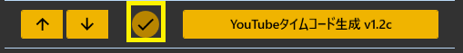
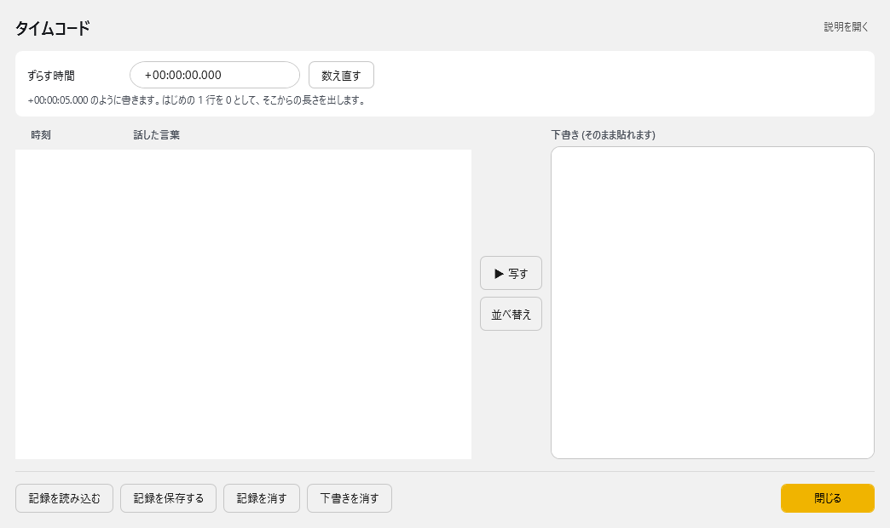

<!-- version-banner -->
!!! info ""
    ゆかコネNEO **v3.0** のドキュメントです。v2.3 をお使いの方は [v2.3 版のこのページ](../../v2.3/plugin/plugin_youtubetimecode.md) を、違いを知りたい方は [v2.3 から v3.0 への移行](../../mig/mig_neo_v3.0.md) をご覧ください。

!!! Info "前提条件"
    * 特になし

## このプラグインで出来ること

* YouTube Liveの目次につけるデータを作成できます

##　有効化

* プラグインを使うチェックをONにしてください。

## 使い方
1. プラグインを有効にします
2. 音声認識をします
3. すべて終わったら編集をします

## 編集画面

プラグイン一覧で「設定」を押すと、タイムコードの画面が開きます。

| 場所 | 中身 |
|:--|:--|
| ずらす時間 | 目次に出す時刻のずれを調整します。`+00:00:05.000` のように書き、**「数え直す」** を押します。はじめの 1 行を 0 として、そこからの長さを出します |
| 左：時刻と話した言葉 | 記録している時刻と発話の一覧です |
| **「▶ 写す」** | 左で選んだ行の時刻と言葉を、右の下書きへ写します |
| **「並べ替え」** | 下書きを時刻の順に並べ直します |
| 右：下書き | 目次の下書きです。そのまま YouTube の概要欄に貼れます |
| 記録を読み込む／記録を保存する | 記録をファイルから読み込む／ファイルに保存します |
| 記録を消す | 中で記憶している時刻と発話のデータを消します |
| 下書きを消す | 右の下書きを消します |

!!! Info "ずらす時間"
    * 配信の頭出しに合わせるのに使います
    * 時間を変えたら **「数え直す」** を押してください
    * 桁が足りないと正しくずれません（`+時:分:秒.ミリ秒` の形で書いてください）

## 編集手順
1. 「ずらす時間」を入れて **「数え直す」** を押します
2. 時刻が合うまで手順 1 を繰り返します
3. 発話をみながら、目次にしたい行を探します
4. **「▶ 写す」** を押して、下書きへ写します
5. 時刻の後ろに 目次にしたい内容を書きます
6. 手順３～５を繰り返します
7. 最後に、作った目次をYouTubeに貼ります。
