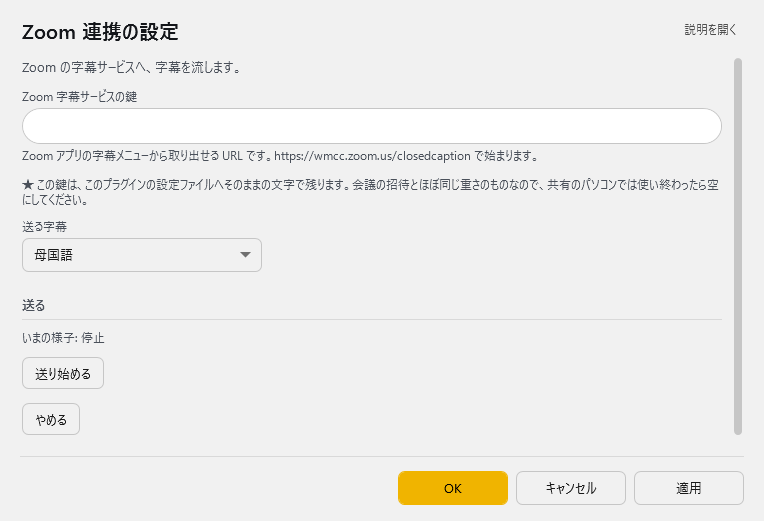

<!-- version-banner -->
!!! info ""
    ゆかコネNEO **v3.0** のドキュメントです。v2.3 をお使いの方は [v2.3 版のこのページ](../../v2.3/plugin/plugin_zoom.md) を、違いを知りたい方は [v2.3 から v3.0 への移行](../../mig/mig_neo_v3.0.md) をご覧ください。

!!! Info "前提条件"
    * ZOOM アカウントが必要です。
    * 字幕を送付するには、主催者からURLを受け取る必要があります

## このプラグインで出来ること

* ZOOM配信に字幕を送付できます

!!! Warning "字幕送付について"
    * ZOOMの仕様により、文の訂正ができないため、UDトークなどで編集した結果は反映されません。

##　有効化

* プラグインを使うチェックをONにしてください。

## 設定

プラグイン一覧で、このプラグインの名前の右にある **「設定」** を押すと開きます。

!!! info "閉じるときの 3 択"
    設定は**下書き**として持たれ、「OK」か「適用」を押すまで動いているプラグインには効きません。
    変更したまま閉じようとすると「変更が保存されていません」と聞かれ、**［はい］保存して閉じる／［いいえ］破棄して閉じる／［キャンセル］閉じるのをやめる** から選べます。

Zoom の字幕サービスへ、字幕を流します。

| 項目 | 説明 |
|:--|:--|
| Zoom 字幕サービスの鍵 | Zoom アプリの字幕メニューから取り出せる URL です。… で始まります。 |

> ★ この鍵は、このプラグインの設定ファイルへそのままの文字で残ります。会議の招待とほぼ同じ重さのものなので、共有のパソコンでは使い終わったら空にしてください。

| 項目 | 説明 |
|:--|:--|
| 送る字幕 | 選択肢：母国語／翻訳 1／翻訳 2／翻訳 3／翻訳 4。既定：母国語 |

**送る**

> いまの様子: …

| 項目 | 説明 |
|:--|:--|
| 「送り始める」ボタン | — |
| 「やめる」ボタン | — |

### 補足

!!! Info "送信者について"
    * 字幕の送信は１会議につき１名（１クライアント）にしてください。

