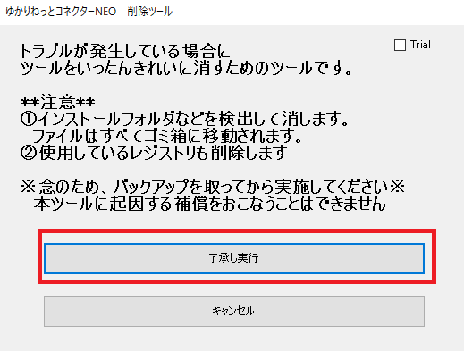
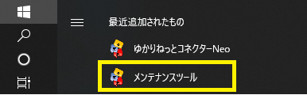
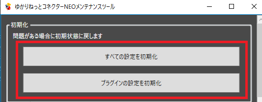
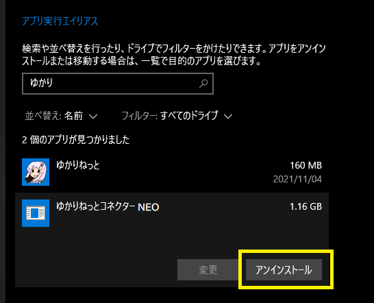

<!-- version-banner -->
!!! info ""
    ゆかコネNEO **v3.0** のドキュメントです。v2.3 をお使いの方は [v2.3 版のこのページ](../../v2.3/qa/reinstall.md) を、違いを知りたい方は [v2.3 から v3.0 への移行](../../mig/mig_neo_v3.0.md) をご覧ください。

!!! Warning "初期化すると"
    * あなたが実施した設定が消え、インストール初期状態に戻ります。
    * 設定を消したくない場合は、手順２からお試しください。

## 自動で初期化する場合

!!! Info "ツールをダウンロード"
    * 初期化ツールはこちらから落とします⇒[ダウンロード](https://machanbazaar.com/wp-content/uploads/2022/11/YNCNeo_ManualUninstall.zip)

### 1. ツールでファイルを消します

!!! Warning "初期化の注意点"
    * ファイルはすべてゴミ箱にはいります。意図しない削除が起きた場合はゴミ箱から戻してください。
    * インストールフォルダを手動変更している場合はうまくいかない場合があります。

* ツールの詳細事項を読んだうえで、ファイルを消します。

### 2. 再インストールする

* [ダウンロード画面](../../download.md)からダウンロードして導入しなおします。

!!! warning "v3.0 を入れるとき"
    * **v2.3 と同じフォルダに上書きしないでください。**中身の構成が変わっています
    * 展開後はおよそ 1GB です（.NET ランタイム同梱。v2.3 より小さくなっています）
    * 設定は `%LOCALAPPDATA%\YNC_Neo` 配下に残っているので、フォルダを入れ替えても消えません
    * 設定を引き継ぐときは「設定保存・復元」→ **「v2.3設定を移行」** を使ってください
      → [v2.3 から v3.0 への移行](../../mig/mig_neo_v3.0.md)

##　手動で初期化する場合
### 1. 設定を初期化します

!!! Info "この作業で使う「メンテナンスツール」の起動方法"
    スタートメニューの中にあります。（古いバージョンにはついてないので、ない場合はアップデートしましょう）
    

    ゆかコネNEO の中からは、左メニュー → **トラブルシュート** → **トラブルシュート** →
    **「プラグイン編集」** でも開けます（本体はいったん終了します）。
    実体は ``YNCNEO_Config.exe`` で、ゆかコネNEO を入れたフォルダの中にあります。

* メンテナンスツールで消すことができます。

### 2. アンインストール

* Windows のアプリケーション設定から削除を行います。

### 3. フォルダが残っていれば消す

* インストール先フォルダが残っていれば、削除します。

!!! Info "プログラムフォルダも消しましょう"
    |項目|デフォルトの場所|
    |:--|:-------------|
    |プログラム|C:\Program Files\YNC_Neo|

!!! Info "設定も消したい場合は、こちらも消します"
    |項目|デフォルトの場所|
    |:--|:-------------|
    |設定ファイル(v1)|マイドキュメント\YukarinetteConnector|
    |設定ファイル(v2)|%APPDATA%\YukarinetteConnector|

    * 設定を消したくない場合は設定ファイルフォルダは消さないください。

### 4. 再インストールする

* [ダウンロード画面](../../download.md)からダウンロードして導入しなおします。

!!! Warning "導入に関する注意"
    * バージョン1 とバージョン2 は仕組みが大きく異なるので上書きインストールで混ぜないでください。
    * 変更が大きい場合は上書きインストールすると不整合が起きる場合があります。その場合は一度消してから導入してください。