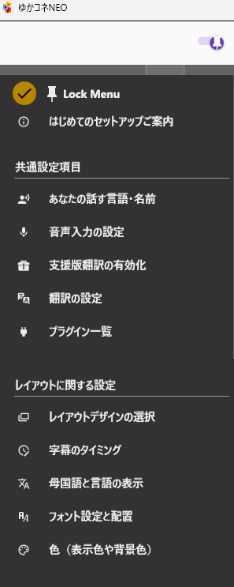
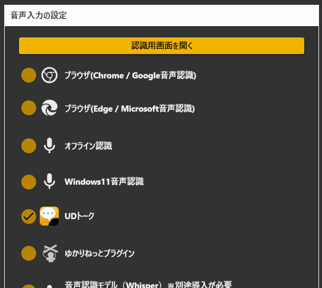
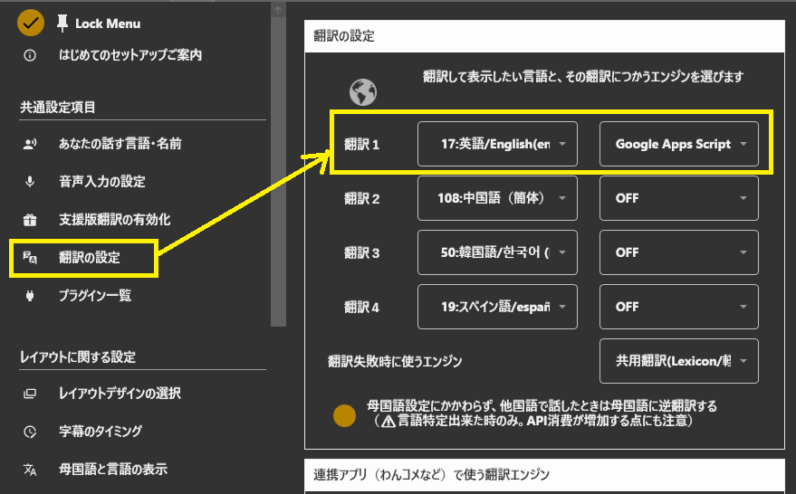
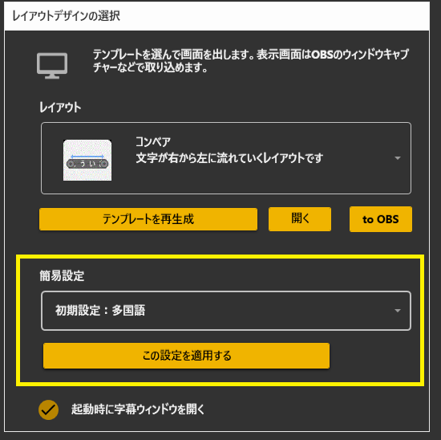
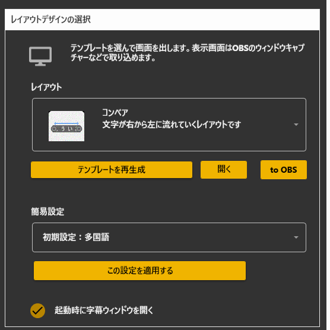

# 標準設定項目

<!-- version-banner -->
!!! info ""
    ゆかコネNEO **v3.0** のドキュメントです。v2.3 をお使いの方は [v2.3 版のこのページ](../../v2.3/startup/startup_basic.md) を、違いを知りたい方は [v2.3 から v3.0 への移行](../../mig/mig_neo_v3.0.md) をご覧ください。

このページは、**左メニューにある設定項目の説明**です。

- はじめて使う方は、先に[5分クイックスタート](../guide/quickstart.md)か[はじめての設定](../cs/cs_startup.md)をどうぞ
- 前半は「**これだけやれば字幕が出る**」、後半は「**項目ごとの詳しい説明**」です

---

# 前半：まずここだけ

## やることは 5 つだけ

左メニューを上から順に開いて、この 5 つを決めれば字幕が出ます。

| | 開く場所 | 決めること |
|:--|:--|:--|
| **1** | 共通設定項目 → **あなたの話す言語・名前** | 自分が話す言語と、画面に出す名前 |
| **2** | 共通設定項目 → **音声入力の設定** | 何で音声を聞き取るか（迷ったら「ブラウザ（Chrome）」） |
| **3** | 共通設定項目 → **翻訳の設定** | どの言語に翻訳するか（要らなければ飛ばせます） |
| **4** | レイアウトに関する設定 → **レイアウトデザインの選択** | 字幕の見た目 |
| **5** | レイアウトに関する設定 → **OBSからの参照設定** | 配信ソフトに貼るアドレスをコピー |

!!! tip "うまくいったか確かめる"
    左メニューのいちばん上の **コックピット** を開くと、
    「いま出ている字幕」と「配信ソフトに貼るアドレス」が 1 画面で見られます。
    字幕が出ていないときは **表示テスト** ボタンで試せます。

## 設定が見つからないとき

v3.0 には、設定を探すための入口が 3 つあります。

| 使うもの | 場所 | 使いかた |
|:--|:--|:--|
| **設定をさがす** | 左メニューの上のほうにある検索欄 | 項目名（例：`保持時間`）を入れて **Enter**。その設定まで画面が動いて、光ります |
| **全ての設定画面を表示** | 左メニュー「設定」の中 | すべての設定を 1 画面に並べます。ブラウザの検索（Ctrl+F）も使えます |
| **コックピット** | 左メニューの先頭 | 配信中によく使うものだけを集めた画面 |

!!! warning "v2.3 から来た方へ"
    v2.3 にあった「母国語と言語の表示」「フォント設定と配置」「色（表示色や背景色）」は、
    左メニューから無くなりました。**「レイアウトデザインの選択」の中**に移っています。
    → [v2.3 から v3.0 への移行](../../mig/mig_neo_v3.0.md)

## 見た目を変えたいとき

文字・色・配置・タイミングは、すべて **「レイアウトデザインの選択」** の中にあります。

1. 左メニュー → **レイアウトに関する設定** → **レイアウトデザインの選択**
2. **「見た目を調整する」** を押す（これを押すまで調整用のボタンは出てきません）
3. 上に出てくるボタンから、直したいものを選びます

| ボタン | 直せるもの |
|:--|:--|
| **テンプレ** | 字幕のデザイン（テンプレート）を選ぶ |
| **文字** | フォント種類・サイズ・寄せ方 |
| **色** | 文字色・背景色・縁取り |
| **配置** | 行間・段落間・文字間隔・枠の高さ・整形モード |
| **タイミング** | 保持時間・スクロール速度 |
| **表示内容** | 母国語をどこに出すか・言語名を出すか |

調整が終わったら **「調整を終える」**（元は「見た目を調整する」だったボタン）を押します。
押したときに復元ポイントが自動で作られるので、あとから戻せます。

!!! Info "調整しても変わらないとき"
    テンプレートによっては、その項目を持っていないことがあります
    （例：ウィンドウ枠の高さは「トークセッション」でしか効きません）。
    どのテンプレートで何が効くかは、後半の「反映される設定の対応表」を見てください。

---

# 後半：項目ごとの説明

ここから先は、設定項目を 1 つずつ説明します。
上から順に読む必要はありません。必要なところだけ見てください。

## 左メニューの全体図

<!-- TODO(screenshot): images/startup_menu1.png は v2.3.59 時点。v3.0 の左メニュー(コックピット/設定をさがし/OBSからの参照設定あり)で撮り直す -->
<!--  -->

設定は、画面左のメニューから選ぶと**右側に出てきます**。別ウィンドウは開きません。

|グループ|メニュー項目|内容|
|:--|:--|:--|
|（先頭）|コックピット|配信中によく使うものだけを 1 枚にまとめた画面|
||はじめてのセットアップご案内|3 ステップのセットアップウィザードを開きます|
||設定をさがす|項目名を入れて Enter を押すと、その設定まで移動します|
|**共通設定項目**|あなたの話す言語・名前|母国語と表示名|
||音声入力の設定|音声認識の種類と細かい調整|
||支援版翻訳の有効化|プロモーションコードの入力、翻訳残量の確認|
||翻訳の設定|翻訳先の言語と翻訳エンジン|
||プラグイン一覧|拡張機能の有効化と設定|
|**レイアウトに関する設定**|レイアウトデザインの選択|字幕の見せ方と、見た目の調整すべて|
||字幕のタイミング|保持時間・スクロール速度|
||OBSからの参照設定|配信ソフトに貼るアドレス（言語ごとの取り込みもここ）|
|**オプション設定**|ブラウザのオプション|字幕表示に使うブラウザの設定|
||翻訳（API、設定）|翻訳の節約設定・自分のAPIキー・翻訳キャッシュ|
||ネットワークの設定|通信の許可範囲・使うネットワーク|
||フォルダの指定|話し手の絵や外部ツールの場所|
||起動時設定|見た目のテーマ・スタートアップ登録・調査用ログ|
|**設定**|設定保存・復元|設定の保存／読み込み／プロファイル管理／v2.3設定の移行|
||全ての設定画面を表示|すべての設定を1画面にまとめて表示|
|**その他**|手動入力枠|キーボードから字幕を入れる|
||サポートｃｈを開く|サポート用Discordを開きます|
||マニュアルを開く|このマニュアルページを開きます|
||ゆかコネNEOについて|バージョン情報|
|**トラブルシュート**|動作チェック|各機能が動いているかをランプで確認|
||トラブルシュート|初期化やフォルダを開くなどの復旧メニュー|
||不具合レポートをする|うまく動かないときの報告|
||報告用ログファイルを作る|報告に添付するファイルを作ります|

!!!note "メニューの開け閉め"
    メニューは開いたり閉じたりできます。1 つずつ開いて作業すると、いまどこを設定しているかが分かりやすくなります。

## 1. あなたの話す言語・名前

* 自分が話す言語を設定します。ゆかコネNEOは、この言語を基準に翻訳をします。
* 表示上の名前を設定します。コラボレーション時の名前や、配信画面に出る名前として使われます。

|項目|意味|既定|
|:--|:--|:--|
|母国語設定にかかわらず、他国語で話したときは母国語に逆翻訳する|母国語以外の言葉で話したとき、母国語へ翻訳して表示します|OFF|

## 2. 音声入力の設定

<!-- TODO(screenshot): images/startup_menu5.png は v2.3.59 時点。Parapper / Windows11音声認識 を含めて撮り直す -->
<!--  -->

音声認識に何を使うかをえらびます。**一番簡単なのはブラウザ音声認識**です。

|種類|特徴|
|:---|:---|
|ブラウザ（Chrome / Google音声認識）|●Chromeとマイクがあれば認識ができます。 ●インターネット接続が必要です。 ●既定で選ばれています。|
|ブラウザ（Edge / Microsoft音声認識）|●Edgeとマイクがあれば認識ができます。 ●インターネット接続が必要です。 ●Chromeで思うように認識しないときに試してみてください。|
|オフライン|●インターネットがなくても認識できます。 ●認識精度が少し落ちます。|
|UDトーク|●商用向けの音声認識を採用しており認識精度が高く優秀です。 ●スマホかエミュレータでUDトークアプリを動かす事が必要です。|
|ゆかりねっとプラグイン|●ゆかりねっとの音声認識を利用します。 ●ボイスロイド等と連動する場合に効果的です。|
|音声認識モデル(Whisper)|●音声認識AIをパソコンにダウンロードして動かすパターンを使うときに選びます。 ●別途、実行ファイルの場所を「フォルダの指定」で設定します。|
|ゆーかねすぴれこ|●HARU_Keiさんが公開しているオフライン認識ツールと連携します。 ●別途ツールの導入と、「フォルダの指定」での設定が必要です。|
|Parapper|●Parakeet株式会社の軽量な音声認識ツールと連携します。 ●パソコンの中だけで認識できます。 ●別途ツールの導入と、「フォルダの指定」での設定が必要です。|
|Windows11音声認識|●Windows11に入っている音声認識を使います。 ●Windows側で音声認識を有効にしておく必要があります。|

!!! Info "カードに付いているバッジについて"
    それぞれの選択肢には、目印としてバッジが付いています。

    |バッジ|意味|
    |:--|:--|
    |簡単|マイクとブラウザだけで始められます|
    |スマホ利用|スマートフォンなど別の機器が必要です|
    |応用|少し設定に慣れてから使うのがおすすめです|
    |追加導入|別のソフトをインストールする必要があります|
    |限定機能|動作条件がかぎられています|

同じ画面にある、そのほかの設定です。

|種類|説明|
|:---|:---|
|UDトークとの接続パネル|UDトークのトークルームに接続するときの設定画面です|
|音声区切り|長く話したとき、どれぐらいの息継ぎの間を見て文を区切るか？を指定します。（100～10000ミリ秒。既定は3000）|
|起動時に音声認識ウィンドウを開く|ゆかコネNEOを立ち上げたときに、認識画面を自動で開きます|

### UDトークとの接続パネル

|項目|意味|
|:--|:--|
|使うネットワークの指定|複数のネットワークがある場合にどれを使うか選びます|
|招待確認 / 接続 / 切断|トークルームへの参加・退出を行います|
|ユーザID|自分のIDが表示されます（変更はできません）|
|認識結果が細分化されるのを抑制します|短く区切られすぎた認識結果をつなげて、読みやすくします|

!!! Info "音声区切りについて"
    * 音声区切りは、音声認識の間（ま）を見て強制的に文章を確定する手法です。
    * 音声認識エンジンそのものに手を入れるわけではないので、設定によってはうまく出ないことがあります。
    * 話しながら、一番自然に区切れる位置をチューニングしてみてください。
    * 特定の音声認識のときだけ使えるオプション機能です。

## 3. 翻訳の設定

<!-- TODO(screenshot): images/startup_menu4.png は v2.3.59 時点。Parapper翻訳を含めて撮り直す -->
<!--  -->

* 言語は４つまで選べます。
* 言語に合わせて翻訳エンジンも選んでください。

!!! warning "言語設定について"
    翻訳エンジンによっては、言語に対応していないことがあり、翻訳できないことがあります。その場合は別の翻訳エンジンを選んでください。

!!! Info "商用翻訳エンジンについて"
    翻訳エンジンは、「共用翻訳サーバ」以外は、個人で契約する必要があります。ただし、「みんなで支える翻訳支援」の仕組みがあり、そちらで支援いただくと多くの翻訳エンジンを利用することが可能になります。(その場合は「支援版翻訳の有効化」から手続きをしてください)

!!! Info "支援が必要なエンジンを選んだ場合"
    * 一覧の項目が選べなくなる（グレーアウトする）ことはありません。どのエンジンも選択そのものはできます。
    * 支援の条件を満たしていない状態で使うと、**翻訳を実行したときにエラーになる**か、無料の翻訳エンジンに切り替わって翻訳されます。
    * 支援の状態は「支援版翻訳の有効化」画面で確認できます。

!!! warning "v2.3 から移行した方へ"
    提供が終わったエンジン（**Google 無料翻訳** / **IBM Watson**）を選んでいた枠は、
    移行のときに「翻訳しない」に置き換わります。ここで選び直してください。

### 翻訳失敗時に使うエンジン

* 5つ目のエンジン選択欄です。指定したエンジンで翻訳できなかったときの、予備のエンジンを決めます。
* 既定は「共用翻訳(m2m100/無料)」です。

### 連携アプリで使う翻訳エンジン

* わんコメなど、ほかのアプリからの翻訳依頼に使うエンジンを、優先順位1～4の順に決められます。
* 先頭の「音声翻訳Nの設定を使います」を選ぶと、字幕用の設定と同じエンジンを使います。
* 字幕は高品質なエンジン、連携アプリは無料のエンジン、というような使い分けができます。

## 4. おすすめ設定（簡易設定）

<!-- TODO(screenshot): images/startup_menu11.png は v2.3.59 時点。簡易設定11件で撮り直す -->
<!--  -->

* おすすめ設定を取り込みます。一般的には「多言語」が使われています。
* 選んだあと、右の「この設定を適用する」を押すと反映されます。
* 適用する前に復元ポイントが作られるので、気に入らなければ戻せます。

## 5. レイアウトデザインの選択

<!-- TODO(screenshot): images/startup_menu3.png は v2.3.59 時点。レイアウト36種と「見た目を調整する」ボタンを含めて撮り直す -->
<!--  -->

* レイアウトを選んで、右横のボタンをおします。
* 選べるレイアウトの一覧は [レイアウトについて](startup_layout.md) をご覧ください。

|項目|意味|
|:--|:--|
|起動時に字幕ウィンドウを開く|ゆかコネNEOを立ち上げたときに、字幕画面を自動で開きます|
|テンプレートを再生成|字幕テンプレートを初期状態に戻します。表示がおかしくなったときに使います|
|見た目を調整する|文字・色・配置・タイミング・表示内容を調整するボタンを出します|

### 「見た目を調整する」で出てくるもの

<!-- TODO(screenshot): images/startup_design_chips.png (未撮影) 「見た目を調整する」を押した状態のボタン列 -->

| ボタン | 中身 |
|:--|:--|
| テンプレ | テンプレートの選択 |
| 文字 | フォントサイズ・フォント種類・文字配置 |
| 色 | 文字色・背景色・縁取り色・言語名の色・区切り線の色・縁取りサイズ |
| 配置 | 行間・段落間・文字間隔・ウィンドウ枠の高さ・整形モード |
| タイミング | 保持時間・スクロール速度・保持を待つかどうか |
| 表示内容 | 母国語の表示位置・母国語表示の仕方・言語名の表示・追加スタイルシート |

#### 文字

|項目|意味|範囲・既定|
|:--|:--|:--|
|フォントサイズ|文字の大きさ|2～200（既定32）|
|フォント種類|使うフォント|—|
|文字配置|左寄せ／中央／右寄せ|既定は左寄せ|

!!! info "フォントについて"
    * ブラウザによって、指定のフォントが採用されないことがあります。
    * 言語に応じたフォントを選ばないと文字化けすることがあります。
    * 「個別にフォントを調整する」をONにすると、翻訳1～翻訳4のフォントを別々に決められます（既定OFF）。

#### 色

|項目|意味|
|:--|:--|
|文字色|文字の色です|
|背景色|背景の色です（既定は緑／Lime）|
|縁取り色|文字のふちの色です（既定は黒）|
|言語名の色|言語名を出す設定のときの、文字色と背景色です|
|区切り線の色|リスト表示などで文と文の間に出る線の色です|
|縁取りサイズ|文字の縁取りをします。あまり大きくするとエッジが出たり、ふちがぼけるので注意|
|縁取り（内側）|縁取りをもう一段追加します。既定は0（使わない）。**上限が 20 になりました**|

!!! Tip "言語ごとに色を変えたい場合"
    * 「言語ごとに色を設定」をONにすると、言語ごとに文字色と縁取り色を決められます。
    * 「個別に縁取りを調整する」をONにすると、縁取りの太さも言語ごとに決められます。
    * どちらも既定はOFFです。

!!! warning "v2.3.128 以前から移行した方へ"
    「個別に縁取りを調整する」は、v2.3.128 以前は**保存されない不具合**がありました。
    移行のときに言語別の太さが残っていれば自動でONに戻しますが、
    そうでない場合は手でONにすると v2.3 で作った太さに戻ります。

#### 配置

|項目|意味|範囲・既定|
|:--|:--|:--|
|行間|文字の行間を設定します|最大10（既定2）|
|段落間|認識のかたまり毎の隙間です。リスト表示レイアウトなどで有効です|最大10（既定2）|
|文字間隔|文字ごとのすき間を設定します|最大2|
|ウィンドウ枠の高さ|表示内の枠の高さを設定します|50～1000（既定300）|
|整形モード|強制的に指定行数に絞り込みます。レイアウトによっては指定行数にならないことがあります|加工なし／1行／2行（既定は加工なし）|

#### 表示内容

|項目|意味|選択肢|
|:--|:--|:--|
|母国語の表示位置|翻訳文の上に出すか、下に出すかを選べます|上に表示する／下に表示する／表示しない|
|母国語表示の仕方|認識過程を出すか、文章確定後に出すかを選べます。過程を出すとリアルタイム感が出ますが、ちらつきも増えます|音声認識の過程を表示／音声認識の結果のみ表示|
|言語名の表示|字幕に言語名を添えるかどうか|ON／OFF（既定OFF）|

!!! Info "追加設定（スタイルシート）について"
    * 同じ画面に、字幕の見た目をCSSで直接調整できる欄があります。
    * 標準の設定項目では届かない細かい調整をしたい方向けの、上級者向け機能です。
    * 書き方を間違えると字幕が表示されなくなることがあります。困ったときは中身を空にして、既定の状態に戻してください。

## 6. 字幕のタイミング

左メニューの「字幕のタイミング」からも、「見た目を調整する」→「タイミング」からも同じ画面が開きます。

|項目|意味|
|:--|:--|
|保持時間|確定した字幕を何秒間キープするか？を設定します。（1～30秒。最大にすると消去しなくなります）|
|スクロール速度|字幕スクロールに対応しているレイアウトの場合は、速さを指定できます。**数字を大きくすると速くなります**|
|次の字幕が来ても保持時間経過まで表示切り替えを待つ|次の発話が来ても、いまの字幕を保持時間いっぱいまで残します（既定OFF）|

!!! Info "保持時間の数え方"
    * 保持時間は、**確定した字幕が画面に出た時点**から数えます。(v2.3.128～)
    * v2.3.127以前は翻訳が終わった時点から数えていたため、翻訳にかかった時間のぶんだけ、実際の表示が設定より長くなっていました。

!!! warning "レイアウトによっては効きません"
    保持を必要としないレイアウト（積み上げ型など）では、このチェックは効きません。
    v3.0 では、その場に「効かない」旨が表示されます。

!!! warning "読み上げと同期させている場合"
    字幕を読み上げの終わりに合わせる設定にしていると、
    **読み上げが遅れれば字幕も遅れます**。1 枠型のレイアウトでは、待ちが 8 件を超えると
    間の字幕が表示されずに飛びます。詳しくは[移行ページ](../../mig/mig_neo_v3.0.md)の「字幕と読み上げの同期について」をご覧ください。

## 7. OBSからの参照設定

v3.0 で左メニューに独立した画面です。配信ソフトに貼るアドレスがここにあります。

!!! tip "配信ソフトへ取り込む簡単な方法"
    * ブラウザ機能がついた配信ソフトをお使いの場合は、「to OBS」の所をマウスでつかみ、配信ソフトにドラック＆ドロップすることで取り込み作業が１発完了します。
    * うまくいかない場合は、アドレスが表示されているところをダブルクリックしてください。そうするとアドレスがコピーされます。あとはOBSなどのブラウザソースで表示してください。

!!! Info "文字がすごく小さく見える場合"
    * OBSに取り込んだときにサイズがOBSによって自動設定されているため小さくなっています。
    * OBSのブラウザソース→プロパティにある幅と高さを小さくしてみてください（たとえば 幅800,高さ300）

!!! Tip "言語ごとに別々に取り込みたい場合"
    「応用パターン（１言語ごとの取り込み）」を開くと、母国語・翻訳1～翻訳4を**それぞれ別のブラウザソースとして**取り込めます。言語ごとに位置やサイズを変えたいときに使います。

## 反映される設定の対応表

テンプレートによって、効く設定と効かない設定があります。

|   |多言語|リスト|ゲーム風|トークセッション|
|:-|:-----|:-----|:------|:--------------|
|縁取りサイズ|〇|〇|〇|〇|
|保持時間|〇|〇|〇|〇|
|行間|〇|〇|〇|〇|
|段落間|－|〇|－|－|
|文字間隔|〇|〇|〇|〇|
|ウィンドウ枠の高さ|－|－|－|〇|
|整形モード|〇|－|－|－|

## コックピット

<!-- TODO(screenshot): images/startup_cockpit.png (未撮影) コックピット画面 -->

左メニューの先頭にある、**配信中によく使うものだけを集めた画面**です（v3.0 で追加）。

| 区画 | 中身 |
|:--|:--|
| 字幕が出るか確かめる | いま出ている字幕を 1 秒ごとに表示します。**表示テスト**ボタンでダミー字幕を送れます |
| 配信ソフトに出す | ブラウザソースに入れるアドレスと、**アドレスをクリップボードにコピーする**ボタン |

!!! Info "状態ランプは置いていません"
    コックピットには動作状況のランプはありません。
    同じ判定を 2 か所に出すと、障害のときに頼る画面のほうが危うくなるためです。
    状態を見たいときは「動作チェック」を開いてください。

## クイックボタン

<!-- TODO(screenshot): images/startup_menu9.png は v2.3.59 時点。並びが変わっているため撮り直す -->
<!--  -->

画面上部に並ぶボタンです。

|項目|意味|
|:--|:--|
|☰（設定メニュー）|左のメニューを開いたり隠したりします|
|ホーム画面へ|メニューホームに戻ります|
|字幕ウィンドウを表示|字幕画面を表示します|
|音声認識画面|音声認識を起動します|
|ミュート|ONにすると字幕を消し、音声認識結果を出さなくなります|
|手動入力枠|キーボードから字幕を入力する画面を出します|
|＜ / ＞|前後のメニューページに移動します|
|戻る|１つ前のメニューに戻ります|
|マニュアルを開く|このマニュアルページを開きます|
|プラグイン一覧|拡張機能を有効化したり設定します|

右上の「…」を押すとオプションメニューが出ます。

|項目|意味|
|:--|:--|
|動作チェック|各機能が正しく動いているかをランプで確認できます|
|トラブルシュート|初期化などができるメニューを表示します|
|不具合レポートをする|うまく動かないときはこのレポートを提出してください|
|報告用ログファイルを作る|レポートを出すときにこのファイルを提出すると改善しやすいです|
|作者へフィードバックを送る|感想や要望を送れます|
|ゆかコネNEOについて|バージョンなどの情報を表示します|

!!! Info "以前の「…」メニューにあった項目について"
    * 「ユーザリスト」「ステータス」「動作状況」は、左メニューの「全ての設定画面を表示」から出る画面に移りました。
    * 「サポートｃｈをひらく」「マニュアルを開く」は左メニューの「その他」に移りました。

## 動作チェック

* 「動作チェック」を選び「チェックする」を押すと、各機能の状態をランプで確認できます。
* 翻訳1～4、翻訳サーバ、わんコメ翻訳、FANBOX支援、音声認識、入力モード、出力モード、ゆかりねっと連動、翻訳の呼び出しと最終処理が並びます。
* うまく動かないときは、まずここでどこが赤くなっているかを確認してください。

## 手動入力枠と入力リスト

* キーボードから字幕を入れられます。音声認識が使えない場面や、決まった文言を出したいときに使います。
* 「入力リスト」には定型文を5つ登録でき、ボタン1つで送れます。

---

## 関連ページ

* [オプション設定](startup_option.md) — ブラウザ／翻訳API／ネットワーク／フォルダ／起動時
* [レイアウト](startup_layout.md) — テンプレートの一覧
* [設定の保存・復元](startup_profile.md) — バックアップと v2.3 設定の移行
* [音声認識できないとき](startup_asr.md)
* [プラグイン一覧](../plugin/index.md)
