# レイアウトについて

<!-- version-banner -->
!!! info ""
    ゆかコネNEO **v3.0** のドキュメントです。v2.3 をお使いの方は [v2.3 版のこのページ](../../v2.3/startup/startup_layout.md) を、違いを知りたい方は [v2.3 から v3.0 への移行](../../mig/mig_neo_v3.0.md) をご覧ください。

標準で用意しているレイアウトは **50 種類以上**あります。さらに、演出重視の追加テンプレート集（ext-pack）が **40 本**同梱されています。
お好みのレイアウトを配信ソフトに取り込むことで簡単に字幕が出せます。

* 「レイアウトデザインの選択」画面のプルダウンから選びます。プルダウンはカテゴリごとに分かれているので、このページも同じ順番で並べています。
* 選んだあと、右横のボタンを押すと字幕画面が開きます。

!!! Tip "まず試すなら"
    * 迷ったら「**多言語**」を選んでください。いちばんよく使われている、汎用的なレイアウトです。
    * たくさん話す配信なら「**リスト**」、画面のすみに小さく置きたいなら「**ショート**」が向いています。

!!! Info "設定が反映されないレイアウトがあります"
    レイアウトによっては、フォントや色の設定項目が使われないことがあります。どの設定が効くかは [標準設定項目](startup_basic.md) の「反映される設定項目について」をご覧ください。

## 多言語

言語を縦や横に並べて表示します。言語は最大５つ並べられます。

|レイアウト|説明|
|:--|:--|
|多言語|よく使われる多言語表示です|
|多言語(横)|言語を横方向に並べます|
|オーロラガラス|装飾を削った磨りガラスの板です。内側を淡いオーロラが流れ、確定すると光の帯が一度だけ横切ります。ジャンルを選ばない定番|
|バブルガム|文字の形に沿った厚い白フチの塊です。背景を四角く覆わず文字だけを浮き上がらせます|
|アウトライン|塗りを持たず、太い色フチだけで文字を作ります。中が透けるので背景を隠しません。切り抜きやショート動画にそのまま重ねられます|
|キャンディポップ|太い白フチのステッカー文字です。確定の瞬間にキラ粒子が弾けます。言語ごとに色が変わります|
|コミック|漫画の効果音のような文字です。確定の瞬間に背後で集中線が弾けます。擬音の多い実況やリアクション配信向き|
|グミ|ぷるっとした立体感の文字です。確定するとぷるんと横に潰れて戻ります|
|断層|紙を斜めに裂いたような黒い板のすきまに本文を置きます。モノクロと朱の1色だけなので、どんな配信画面に重ねても濁りません|
|マーカー|蛍光ペンの帯が文字の後ろを左から右に走ります。言語の区別を帯の色で付けるので、本文は濃いまま読みやすさが保たれます|
|ネオンHUD|暗いガラス板に細いネオン枠。最新の発話だけを1枚のパネルに出し、確定した瞬間に本文が左からデコードして定着します|
|レトロ|シアンとマゼンタに色ズレした3枚重ねの文字です。レトロゲームやシンセ系の配信向き|
|墨流し|和紙のような地に墨書き。話者名は朱の落款、区切りは細い金線。演劇・朗読・和風ゲーム向き|

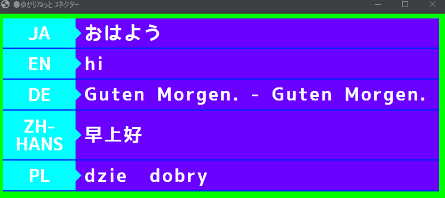

* 設定により、色や言語表示、枠を消すことができます。

## リスト

文章が流れて出ていく方式です。たくさん話す方はこちらのほうが視認性を確保できます。

|レイアウト|説明|
|:--|:--|
|リスト|上にスクロールしながら表示します|
|リスト（下スクロール）|下にスクロールしながら表示します|
|海外ドラマ|海外ドラマのような雰囲気で出します|
|海外ドラマ(リスト)|上にスクロールするタイプの海外ドラマ風表示です|
|スマート|余計な飾りを省いてシンプルに出していきます|
|ショート|1行に1文字ずつ流し、行が埋まると左へスクロールします。高さをとらないので、画面のすみに置く使い方に向いています|
|ショート(動き控えめ)|「ショート」と同じ見せ方ですが、文字が出るときの演出を抑えてちらつきを減らしています。横幅を超えたときだけ左へスクロールするので、画面の動きが気になるゲーム配信に向いています|
|スマート v2|「ショート(動き控えめ)」と同じ見せ方のまま、話した言葉と翻訳をそれぞれ別の行に出します。翻訳が出ても元の言葉が消えず、翻訳が複数あっても同時に流れるので、多言語を並べて見せたいときに向いています|
|マシュマロ|ぷにっと弾む角丸の吹き出しを縦に積みます。話者ごとに色が変わり、翻訳は吹き出しの下に小さな第2バブルとして出ます。雑談配信やコラボ向き|
|付箋|少し傾いた付箋をマスキングテープで貼っていきます。話者ごとに紙の色と傾きが変わり、消えるときはペリっとめくれて剥がれます|
|ねこみみ|丸枠の上に耳、横でしっぽが揺れます。話者ごとに色が変わり、確定の瞬間に耳がぴくっと動きます。キャラ性が強いので使える配信は選びます|

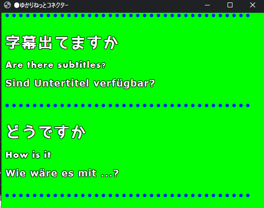

* 文字サイズ、区切り線の有無や色は設定で変更できます。
* 保持時間の設定をすると、過去の文章を消すことができます。

<!-- TODO: 「ショート」「ショート(動き控えめ)」のスクリーンショット未撮影。撮ったら images/startup_layout7.png / startup_layout8.png として置き、この節に追加する -->

## １行レイアウト

高さをとらない、1行だけのレイアウトです。画面の上端や下端に置く使い方に向いています。

|レイアウト|説明|
|:--|:--|
|コンベア|文字が右から左に流れていきます|
|コンベア縦ロール|文字が右から左に流れつつ、縦方向にも回転します|

## スクロール

|レイアウト|説明|
|:--|:--|
|スマートスクロール2|シンプルに表示し、画面幅を超えたらスクロールします|

## ゲーム

ゲームのようなウィンドウに文字が表示されます。

|レイアウト|説明|
|:--|:--|
|ゲームメッセージ風|RPGゲームっぽく出します|
|ゲーム風（カーソルあり）|RPG風の表示に、送りカーソルが付きます|
|ゲーム風（カーソルあり/Beepあり）|カーソルに加えて、文字送りの音が鳴ります|
|ゲーム風（横ならべ　左：母国語、右：翻訳１）|画面を左右に分割して並べます|
|ゲーム風（横ならべ　左：翻訳１、右：母国語）|上の左右を入れ替えたものです|

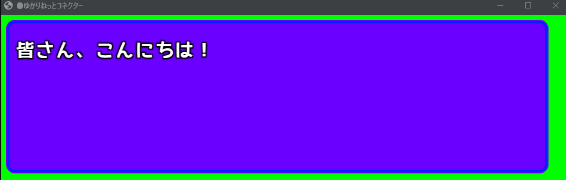

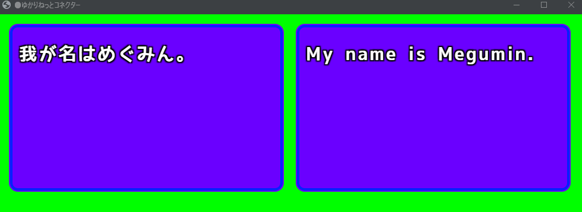

!!! Warning "横ならべは2言語までです"
    「横ならべ」のレイアウトは、**母国語＋1言語まで**しか表示できません。3言語以上出したい場合は「多言語」や「リスト」を使ってください。

## ゲーム(リスト)

|レイアウト|説明|
|:--|:--|
|リスト（横ならべ　左：母国語、右：翻訳１）|画面を左右に分割し、それぞれリスト表示します|
|リスト（横ならべ　左：翻訳１、右：母国語）|上の左右を入れ替えたものです|

* こちらも母国語＋1言語までの表示です。

## コラボレーション

コラボレーションなどの時に使います。顔、名前、文章がでます。話者が２名以上になると枠が増えます。

|レイアウト|説明|
|:--|:--|
|トークセッション|標準のトークセッション表示です|
|トークセッション（高さ広め）|1人あたりの枠を高くしたものです|
|トークセッション（枠は消えないVer）|発言がなくなっても枠を残します|
|トークセッション(母国語・翻訳１　別)|母国語と翻訳1を分けて表示します|
|トークセッション(横)　自分：左|自分を左、相手を右に置きます|
|トークセッション(横)　自分：左、枠自動消去|上に加えて、発言がないと枠が消えます|
|トークセッション(横)　自分：右|自分を右、相手を左に置きます|
|トークセッション(横)　自分：右、枠自動消去|上に加えて、発言がないと枠が消えます|

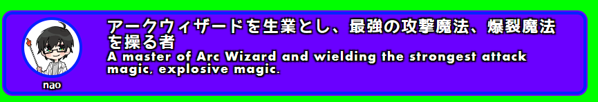

* 保持時間の設定で枠や文字の動作が変わります。
* 保持時間を最大化すると、消去動作をしなくなります。
* 話し手の顔として使う絵は「フォルダの指定」画面の「話し手のイメージデータ」で設定します。詳しくは [オプション設定](startup_option.md) をご覧ください。

## 遊び

演出重視のレイアウトです。

|レイアウト|説明|
|:--|:--|
|電光掲示板|駅の案内表示のように出します|
|自由落下(単語)|言葉が単語ごとに落下します|
|自由落下(ブロック)|言葉がかたまりで落下します|

## サンプル

自分でレイアウトを作りたい方向けの、シンプルな作例です。

|レイアウト|説明|
|:--|:--|
|ベーシック|最小限の作りのテンプレートです|
|RPG バウンス|1文字ずつ跳ねながら表示します|
|RPG スムース|1文字ずつスライドしながら表示します|

## 個別カスタマイズ

特定の困りごとに合わせて調整したレイアウトです。

|レイアウト|説明|
|:--|:--|
|リスト(多行時間延長あり)|上にスクロールしながら表示します。文字量が増えたら、消えるまでの時間が自動で延びます|
|外部連携レイアウト(リスト)|ほかのツールと組み合わせて使う前提のリスト表示です|
|おちつきテロップ(文字送り抑制版)|文字がなるべく画面に残るようにしながら表示します|

## 追加テンプレート集（ext-pack）

!!! Tech "使用条件"
    * ゆかコネNEO v3.0～（v2.3 にも同名のものがありましたが、v3.0 で全面的に作り直されています）

ゆかコネNEO を入れたフォルダの中の **`ext-pack`** に、演出重視のテンプレートが **40 本**入っています。
使いたいものを取り込むと、レイアウトの一覧に出てきます。

### 入っているもの

| テンプレート | 系統 | 内容 |
|:--|:--|:--|
|オーロラ|自然|幻想的なオーロラのような光のエフェクト|
|コミックバブル|コミック|アメコミ風の吹き出しデザイン|
|サイバーパンクグリッド|SF|サイバーパンク風のグリッドとネオン|
|ファイアテキスト|炎|燃える炎のようなテキスト|
|フローティングバブル|ファンタジー|浮遊する泡のようなメッセージボックス|
|ガラスモーフィズム|モダン|透明感のあるガラス風。ブラーとグラデーション|
|ホログラム|SF|未来的なホログラム風の立体表現|
|アイスクリスタル|氷|氷の結晶のような冷たいエフェクト|
|リキッドメタル|メタル|液体金属のような流動的な反射|
|マトリックス雨|SF|デジタル雨とデコードアニメーション|
|ネオングロー|エフェクト|ネオンサイン風。光る縁取り|
|折り紙フォールド|和風|折り紙が展開するようなアニメーション|
|ペーパーカード|紙のカード風|舞い散る紙のカードのようなメッセージボックス|
|パーティクル爆発|エフェクト|華やかなパーティクル爆発|
|ピクセルアート|ゲーム|レトロゲーム風のドット絵|
|レインボーウェーブ|カラフル|虹色に輝く波打つエフェクト|
|レトロターミナル|レトロ|端末風。スキャンラインとタイプライター効果|
|タイプライター|クラシック|クラシックなタイプライター風のタイピング演出|
|ビンテージTV|レトロ|ブラウン管テレビ風。ノイズとスキャンライン|
|水彩スプラッシュ|アート|水彩絵の具のような滲みエフェクト|
|スマート○○（20 本）|リスト|「スマート」と同じ形で、文字の出かたの演出だけが違うシリーズ。バウンス／クリスタル／エラスティック／フリップ／グリッチ／グロー／グラデーション／ホログラム／リキッド／マトリックス／ネオン／パーティクル／パルス／レインボー／ローテート／スケール／シェイク／スライド／タイプライター／ウェーブ|

### v3.0 での変更

!!! warning "一度でも ext-pack を使ったことがある方へ"
    40 本すべてを作り直し、**3 本を削除**しました。**レイアウトを選び直してください。**

    | 削除されたもの | 理由 |
    |:--|:--|
    |`ListAddTime`|標準テンプレートとフォルダ名まで同じで、起動時の再同期で必ず上書きされていました|
    |`SmartScroll`|同上|
    |`Smart_Vue`|標準の「スマート」と内部 ID が衝突し、レイアウト名の復元が別のテンプレートへ飛んでいました|

**直ったこと**

* 文字サイズ・行間の設定が最初から効かなかった（40 本すべてにありました）
* 翻訳の行に設定が届かなかった（2 言語目以降が未実装でした）
* 認識・翻訳・読み上げまで一緒に止まることがあった
* インターネットにつながっていないと真っ白になった（外部サイトから部品を読んでいました）
* OBS で下のゲーム画面が見えなかった（背景を不透明に塗っていました）
* 使っていなくても CPU を食い続けた（終わらないアニメーションが入っていました）

## テンプレートの配色を取り込む

!!! Tech "使用条件"
    * ゆかコネNEO v3.0～

「見た目を調整する」→「色」に **「テンプレートの配色を取り込む」** ボタンがあります。

* いま選んでいるテンプレートが持っている配色を、色の設定へ写します
* 工場出荷値からではなく、**そのテンプレートの見た目を出発点にして**色を変えられます
* 文字そのものは変わりません

## わんコメ連携

* わんコメと連携させることで、わんコメが提供しているレイアウトをつかったエンタテインメント字幕を演出することが可能です。

* 以下、わんコメに標準搭載されているテンプレートのサンプルです。

* わんコメには、Pro版とそれ以外があります。Pro版のほうが応答が速く表示されます。

* 使うためには若干の設定が必要です。[設定方法](../plugin/plugin_OCTemplateGen.md) を参照してください。

<!-- TODO: 以下のわんコメテンプレートのスクリーンショットは2022年撮影。わんコメ側のテンプレートも更新されている可能性があるため確認・撮り直しが必要 -->

### audience
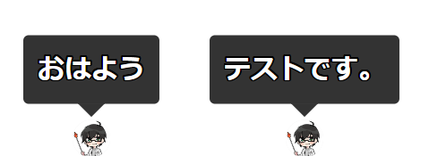

### BASIC
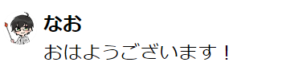

### cheer
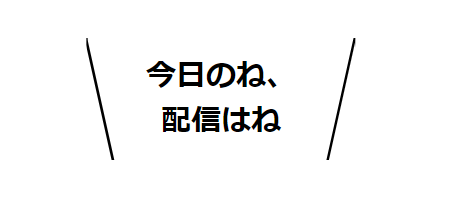

### cool-pop
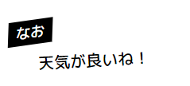

### flipboard
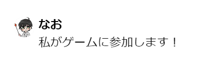

### jugon
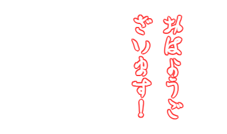

### ktx-quick-starter
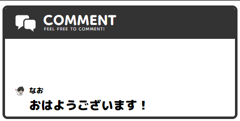

### line / line-right
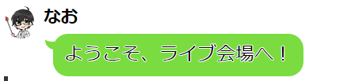

### neon
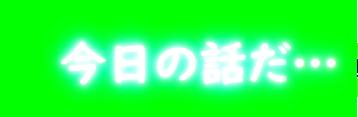

### newsticker
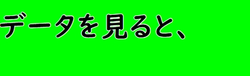

### persona / persona-right
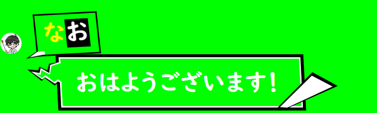

### rpg
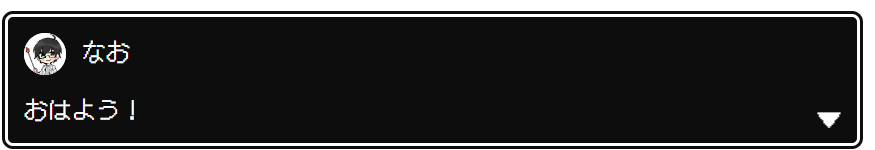

### slim
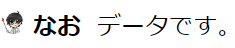

### vertical
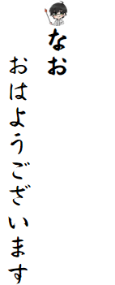

### yurucamp / yurucamp-right
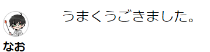

## 廃止されたレイアウト

* 「多言語（縁取りくっきり）」と「リスト（縁取り）」は、一覧から削除されました。選択できません。
* 縁取りをはっきり見せたい場合は、「レイアウトデザインの選択」→「見た目を調整する」→**「色」**にある縁取りサイズと、縁取り（内側）で調整してください。
* v3.0 では**縁取り（内側）の上限が 4 から 20 に広がりました**。テンプレートが想定している太さが上限で潰れてしまう問題が直っています。
